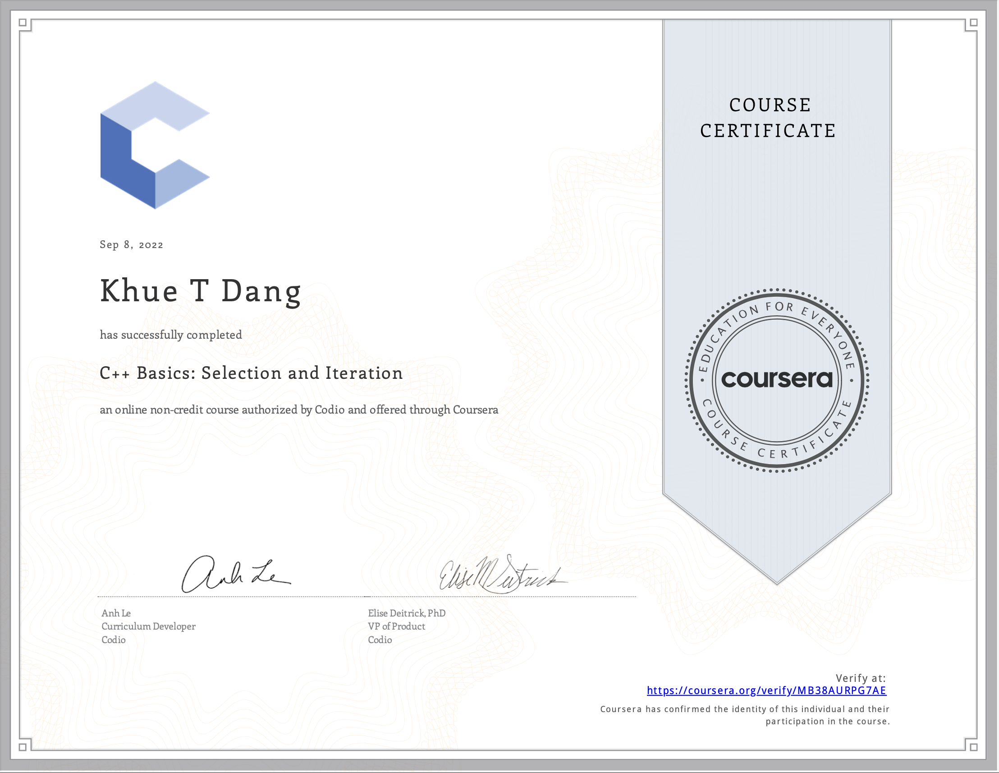

# C++ Basics: Selection and Iteration

- This directory contains all of my assignments from the Coursera Course: [C++ Basics: Selection and Iteration](https://www.coursera.org/learn/codio-cpp-basics?specialization=hands-on-cpp)

# Table of Content
- Week 1: [Basic Skills - Writing your first program!](https://github.com/ginny100/Programming-in-C-plus-plus-A-Hands-on-Introduction/tree/master/Course%201%20-%20C%2B%2B%20Basics%20-%20Selection%20and%20Iteration/Week%201%20-%20Basic%20Skills%20-%20Writing%20your%20first%20program!)
    - Lesson 1: [Printing](https://github.com/ginny100/Programming-in-C-plus-plus-A-Hands-on-Introduction/tree/master/Course%201%20-%20C%2B%2B%20Basics%20-%20Selection%20and%20Iteration/Week%201%20-%20Basic%20Skills%20-%20Writing%20your%20first%20program!/Lesson%201%20-%20Printing)
    - Lesson 2: [Variables](https://github.com/ginny100/Programming-in-C-plus-plus-A-Hands-on-Introduction/tree/master/Course%201%20-%20C%2B%2B%20Basics%20-%20Selection%20and%20Iteration/Week%201%20-%20Basic%20Skills%20-%20Writing%20your%20first%20program!/Lesson%202%20-%20Variables)
    - Lesson 3: [Lab - Review Content and Practice](https://github.com/ginny100/Programming-in-C-plus-plus-A-Hands-on-Introduction/tree/master/Course%201%20-%20C%2B%2B%20Basics%20-%20Selection%20and%20Iteration/Week%201%20-%20Basic%20Skills%20-%20Writing%20your%20first%20program!/Lesson%203%20-%20Lab%20-%20Review%20Content%20and%20Practice)
    - Lesson 4: [Coding Exercises](https://github.com/ginny100/Programming-in-C-plus-plus-A-Hands-on-Introduction/tree/master/Course%201%20-%20C%2B%2B%20Basics%20-%20Selection%20and%20Iteration/Week%201%20-%20Basic%20Skills%20-%20Writing%20your%20first%20program!/Lesson%204%20-%20Coding%20Exercises)
- Week 2: [Operators](https://github.com/ginny100/Programming-in-C-plus-plus-A-Hands-on-Introduction/tree/master/Course%201%20-%20C%2B%2B%20Basics%20-%20Selection%20and%20Iteration/Week%202%20-%20Operators)
    - Lesson 1: [Arithmetic Operators](https://github.com/ginny100/Programming-in-C-plus-plus-A-Hands-on-Introduction/tree/master/Course%201%20-%20C%2B%2B%20Basics%20-%20Selection%20and%20Iteration/Week%202%20-%20Operators/Lesson%201%20-%20Arithmetic%20Operators)
    - Lesson 2: [Boolean Operators](https://github.com/ginny100/Programming-in-C-plus-plus-A-Hands-on-Introduction/tree/master/Course%201%20-%20C%2B%2B%20Basics%20-%20Selection%20and%20Iteration/Week%202%20-%20Operators/Lesson%202%20-%20Boolean%20Operators)
    - Lesson 3: [Lab - Review Content and Practice](https://github.com/ginny100/Programming-in-C-plus-plus-A-Hands-on-Introduction/tree/master/Course%201%20-%20C%2B%2B%20Basics%20-%20Selection%20and%20Iteration/Week%202%20-%20Operators/Lesson%203%20-%20Lab%20-%20Review%20Content%20and%20Practice)
    - Lesson 4: [Coding Exercises](https://github.com/ginny100/Programming-in-C-plus-plus-A-Hands-on-Introduction/tree/master/Course%201%20-%20C%2B%2B%20Basics%20-%20Selection%20and%20Iteration/Week%202%20-%20Operators/Lesson%204%20-%20Coding%20Exercises)
- Week 3: [Conditionals](https://github.com/ginny100/Programming-in-C-plus-plus-A-Hands-on-Introduction/tree/master/Course%201%20-%20C%2B%2B%20Basics%20-%20Selection%20and%20Iteration/Week%203%20-%20Conditionals)
    - Lesson 1: [If Statement](https://github.com/ginny100/Programming-in-C-plus-plus-A-Hands-on-Introduction/tree/master/Course%201%20-%20C%2B%2B%20Basics%20-%20Selection%20and%20Iteration/Week%203%20-%20Conditionals/Lesson%201%20-%20If%20Statement)
    - Lesson 2: [If Else Statement](https://github.com/ginny100/Programming-in-C-plus-plus-A-Hands-on-Introduction/tree/master/Course%201%20-%20C%2B%2B%20Basics%20-%20Selection%20and%20Iteration/Week%203%20-%20Conditionals/Lesson%202%20-%20If%20Else%20Statement)
    - Lesson 3: [Switch Case Statement](https://github.com/ginny100/Programming-in-C-plus-plus-A-Hands-on-Introduction/tree/master/Course%201%20-%20C%2B%2B%20Basics%20-%20Selection%20and%20Iteration/Week%203%20-%20Conditionals/Lesson%203%20-%20Switch%20Case%20Statement)
    - Lesson 4: [Lab - Review Content and Practice](https://github.com/ginny100/Programming-in-C-plus-plus-A-Hands-on-Introduction/tree/master/Course%201%20-%20C%2B%2B%20Basics%20-%20Selection%20and%20Iteration/Week%203%20-%20Conditionals/Lesson%204%20-%20Lab%20-%20Review%20Content%20and%20Practice)
    - Lesson 5: [Coding Exercises](https://github.com/ginny100/Programming-in-C-plus-plus-A-Hands-on-Introduction/tree/master/Course%201%20-%20C%2B%2B%20Basics%20-%20Selection%20and%20Iteration/Week%203%20-%20Conditionals/Lesson%205%20-%20Coding%20Exercises)
- Week 4: [Loops](https://github.com/ginny100/Programming-in-C-plus-plus-A-Hands-on-Introduction/tree/master/Course%201%20-%20C%2B%2B%20Basics%20-%20Selection%20and%20Iteration/Week%204%20-%20Loops)
    - Lesson 1: [For Loops](https://github.com/ginny100/Programming-in-C-plus-plus-A-Hands-on-Introduction/tree/master/Course%201%20-%20C%2B%2B%20Basics%20-%20Selection%20and%20Iteration/Week%204%20-%20Loops/Lesson%201%20-%20For%20Loops)
    - Lesson 2: [While Loops](https://github.com/ginny100/Programming-in-C-plus-plus-A-Hands-on-Introduction/tree/master/Course%201%20-%20C%2B%2B%20Basics%20-%20Selection%20and%20Iteration/Week%204%20-%20Loops/Lesson%202%20-%20While%20Loops)
    - Lesson 3: [Nested Loops](https://github.com/ginny100/Programming-in-C-plus-plus-A-Hands-on-Introduction/tree/master/Course%201%20-%20C%2B%2B%20Basics%20-%20Selection%20and%20Iteration/Week%204%20-%20Loops/Lesson%203%20-%20Nested%20Loops)
    - Lesson 4: [Lab - Review Content and Practice](https://github.com/ginny100/Programming-in-C-plus-plus-A-Hands-on-Introduction/tree/master/Course%201%20-%20C%2B%2B%20Basics%20-%20Selection%20and%20Iteration/Week%204%20-%20Loops/Lesson%204%20-%20Lab%20-%20Review%20Content%20and%20Practice)
    - Lesson 5: [Coding Exercises](https://github.com/ginny100/Programming-in-C-plus-plus-A-Hands-on-Introduction/tree/master/Course%201%20-%20C%2B%2B%20Basics%20-%20Selection%20and%20Iteration/Week%204%20-%20Loops/Lesson%205%20-%20Coding%20Exercises)

# Proof of Completion

