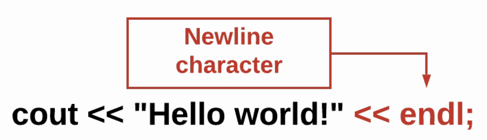

# Printing

## Learning Objectives: Printing

- Use the cout command to write text to the console
- Add a newline character by using the `endl` command
- Create single-line and multi-line comments by using `//` and `/* */` respectively

## Printing to the Console

### Printing to the Console

Run the following command in a C++ text editor
```cpp
cout << "Hello world!";
```

The reason you were able to see the words appear is because of the `cout` command followed by the `<<` and finally what you want to print `"Hello world";`. __cout__ is short for _characters out_ and is used to output your desired text.

Change your desired output to look like this and TRY IT again.
```cpp
"My name is Codio."
```

> <b>Printing: Reading Question 1</b>
> 
> What is wrong with the code snippet below?
> ```cpp
> cout << Hello world!;
> ```
> 
> - Capitalize `cout`
> - Use `>>` instead of `<<`
> - Missing `" "` around `Hello world!`
> - Remove the `;` at the end of the code
>
> > <b>Answer:</b>
> > 
> > Missing `" "` around `Hello world!`
> 
> > <b>Rationale:</b>
> > 
> > Quotation marks are needed around your desired output in order for it to print.

## Printing

### Printing without the Newline Character

The `cout` command does not add a newline character. The code below will print the two words on the same line without a space. Copy the code below into a C++ text editor and then run it to see the output.
```cpp
cout << "Hello";
cout << "world!";
```

### Adding the Newline Character

The text in red shows the `endl` command which adds the newline character. (The newline character is what is inserted when you press `“Enter”` or `“Return”`).



Add a second line by using the `cout << endl;` command under `"cout << "world!";`. Then enter the ouput command to print `My name is Codio.` Finally, run the code to see the resulting output.
```cpp
cout << "Hello";
cout << "world!";
cout << endl;
cout << "My name is Codio." << endl;
```

> <b>What happens if you:</b>
> 
> - Add a `space` after `Hello` and before the closing `"`
> - Add `<< endl;` after `cout << "Hello ";`
> - Delete `cout << endl;` under `cout << "world!";`

> <b>Printing: Reading Question 2</b>
> 
> Select __all__ of the following commands that add a newline character?
> 
> - ```cpp
>   cout << "Hello";
>   ```
> - ```cpp
>   cout << "Hello" << endl;
>   ```
> - ```cpp
>   cout << "Hello";
>   cout << endl;
>   ```
>
> > <b>Answer:</b>
> > 
> > > ```cpp
> > > cout << "Hello" << endl;
> > > ```
> >
> > > ```cpp
> > > cout << "Hello";
> > > cout << endl;
> > > ```
>
> > <b>Rationale:</b>
> > 
> > Both choices #2 and #3 are correct and will produce the same output. `Hello` will be printed followed by a newline character.


## Comments

### Comments

You may have wondered why a couple of lines of code are a different color (in the below example, light brown, but it depends on the Theme you have picked):


In C++, to write notes in code without affecting its function, we can use `//` to make a __single-line comment__.

Comments can also be used to help you fix your code. You can “comment out” lines of code that are not working or you suspect are causing problems.

> <b>What happens if you:</b>
> 
> - Change `cout << "Red"` to `cut << "Red"`
> - Add `//` in front of `cut << "Red"`

### Block Comments

To make a __block comment__ you can either make multiple single-line comments using `//` or wrap the set of lines in `/*` and `*/`.

```cpp
/*
This is the start of a multi-line comment.
You can end the comment with a star(*) followed by a forward slash(/).
*/
//You can also do a multi-line comment
//like this!

cout << "Notice how the comments above are lightly faded.";
cout << "Most IDEs automatically lighten the comments.";
cout << "This is a common feature known as syntax highlighting.";
```

#### What is an IDE?

_An integrated development environment, or IDE, is a computer program that makes it easier to write other computer programs. They are used by computer programmers to edit source code, and can be easier to use than other text editors for new programmers. They can have compilers so programmers don’t have to open other programs to compile the source code. They also often have syntax highlighting. ... It also may have predictive coding that can finish lines with syntax such as brackets or semicolons and can suggest variables to be used. It also may have debuggers that can step through lines, take breaks and inspect variables._
__Source: Simple Wikipedia__

> <b>Printing: Reading Question 3</b>
> 
> Fill in the blanks below about comments in C++.
> 
> In C++, the `//` symbol means a ________ comment, and the `/*` and `*/` symbols mean a ________ comment.
> 
> > <b>Answer:</b>
> > 
> > In C++, the `//` symbol means a <u>single-line</u> comment, and the `/*` and `*/` symbols mean a <u>multi-line</u> comment.
> > 
>
> > <b>Rationale:</b>
> > 
> > In C++, the `//` symbol is used for a single-line comment. The comment begins at the `//` and goes on until the end of the line. The `/*` and `*/` symbols are used for multi-line comments. You must start with the `/*` and end with the `*/`. Everything between the start and end symbols will be considered the comment.

## Formative Assessment 1

> <b>Printing Statement</b>
> 
> What does the `cout <<` statement do?
> - Sends your output to the printer
> - Sends your output to a file
> - Sends your output to the screen
> - Sends your output to the compiler
>
> > <b>Answer:</b>
> > 
> > Sends your output to the screen
> > 
>
> > <b>Rationale:</b>
> > 
> > The cout `<<` command sends your output to your computer’s default output which is the computer console or terminal.

## Formative Assessment 2

> <b>Printing with the Newline Character</b>
> 
> Fill in the blanks with the missing commands that will print the text `Hi!` __with__ a newline character. __DO NOT__ include any leading or trailing __spaces__ when printing `Hi!`.
> 
> `cout << _____ << _____`
>
> > <b>Answer:</b>
> > 
> > cout << <u>"Hi!"</u> << <u>endl;</u>
> > 
>
> > <b>Rationale:</b>
> > 
> > The `"Hi!"` will print the text `Hi!` and the `endl;` will add a newline character. __Don’t forget to include the `;` after `endl`.__