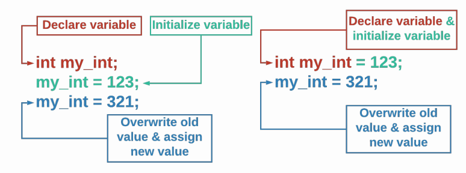

# Variables

## Learning Objectives: Variables

- Understand the rules of naming a variable
- Assign/overwrite a value to a variable
- Understand four basic data types: integers (`int`s), `float`s, boolean (`bool`), and `string`s

## Variables

### What Is a Variable?

In computer science, we often need to use data. __Variables__ are used to store a value for a particular type of data.

#### Each variable in C++ has:

1. a data type
2. a name
3. a value

### Three Actions for Variables

There are a few different actions taken involving variables:
1. __Declaring__ - when you set or declare the _data type_ and _name_ of the variable. These two properties of a variable do _not_ change.
2. __Assigning__ - when you set the _value_ of the variable. The value of a variable _can_ change.
3. __Accessing__ - when you retrieve the _value_ of the variable by calling its _name_.

You _must_ declare and assign a variable before you can access it.

> <b>Variables</b>
> 
> Select __all__ of the properties of a variable below that __do not__ change?
> 
> - data type
> - name
> - value
> 
> > <b>Answer:</b> 
> > 
> > data type, name
> 
> > <b>Rationale:</b>
> > 
> > For each variable, the data type and name of the variable never change. The value can be re-assigned or changed as many times as you want!

## Data Types: Integers

### Integers

Integers (often called `int`s) are whole numbers. They can be positive or negative. Do _not_ use a `comma` when typing large numbers.

Copy the code below into a C++ text editor then run it.

```cpp
int number;
number = 50;
cout << number << endl;
```

Next, let’s modify the code to look like what’s below and then TRY IT again.

```cpp
int number = 50;
cout << number << endl;
```

> You may have noticed that we can declare a variable name and assign it a value all in one step by using `int number = 50;` instead of `int number;` followed by `number = 50;`. Both ways will produce the same result.

#### 5 vs. "5"

`5` is not the same thing as `"5"`. The first one is an `integer`, the second is a `string`. You will see in a later lesson the different operations you can perform on strings and numbers. Treating a string as a number can cause errors.

> <b>What happens if you:</b>
> - Change the variable to `5000`?
> - Change the variable to `5,000`?
> - Change the variable to `050`?
> - Change the variable to `"5000"` (with double quotes)?

> <b>Integers</b>
> 
> Which of the following values for `number` will produce the output `1000000` when printed using `cout << number << endl;`?
> - `int number = "1000000";`
> - `int number = 1000000;`
> - `int number = 1,000,000;`
> - `int number = 01000000;`
> 
> > <b>Answer:</b>
> > 
> > `int number = 1000000;`
>
> > <b>Rationale:</b>
> > 
> > Only choice #2 is correct. Choices #1 and #3 will result in an error message and choice #4 will output `262144`.
> > 
> > The reason for `262144` being printed is due to the fact that __octal__ numbers start with a `0`. Thus, the system converts `01000000` from an octal number to a decimal number which equals `262144`.

## Data Types: Floating Point Numbers

### Floating Point Numbers

Floating point numbers (often called floats) are numbers with a decimal.

They can be positive or negative. Copy the code below and TRY IT.

```cpp
double decimal = 0.5;
cout << decimal << endl;
```

### Why Use Double Instead of Float?

In C++, there is a data type called __float__, but as it only uses `4 bytes`, it is insufficient for most math. Instead, we use __double__ which uses `8 bytes` or double the space of a float.

> <b>What happens if you:</b>
> 
> - Change the variable to `50.`?
> - Change the variable to `.001`?

> <b>Numbers: Int vs. Double</b>
> 
> Fill in the following with the appropriate vocabulary to explain the difference between a double and an int.
> 
> A ______ is a __________________ meaning it has a ______, where an ____ is a ___________ meaning it does not have a decimal.
> 
> > <b>Answer:</b>
> > 
> > A <u>double</u> is a <u>floating point number</u> meaning it has a <u>decimal</u>, where an <u>int</u> is a <u>whole number</u> meaning it does not have a decimal.
>
> > <b>Rationale:</b> 
> > 
> > A `double` is a floating point number or a rational number meaning it has a decimal or represents a fraction, where an `int` (short for integer) is a whole number meaning it does not have a decimal.
> >
> > Both can be positive or negative!

## Data Types: Boolean

### Boolean

A boolean variable (declared as a `bool`) can only take on the value of `true` or `false`. You will see how boolean values are used when we talk about conditionals and while loops. Copy the code below and TRY IT.

```cpp
bool thisIsFun = true;
cout << boolalpha << thisIsFun << endl;
```

> <b>What happens if you:</b>
> 
> - Change the variable to `false`?
> - Remove the `boolalpha <<` command?
> - Change the variable to `True`?
> - Change the variable to `False`?
> - Change the variable to `TRUE`?

> You may have noticed that printing a boolean of `true` resulted in a `1` and a boolean of `false` resulted in a `0` when you remove the `boolalpha <<` command. In C++, the boolean value of `true` is associated with the integer `1` while the boolean value of `false` is associated with the integer `0`. Assigning the value of uppercase `True` or `False` to a boolean variable will cause an error message to appear.

> <b>Boolean</b>
> 
> What is the general rule for boolean values in C++?
> - Boolean values are case sensitive and must be lowercase.
> - Boolean values are not case sensitive and can be either uppercase or lowercase.
> - Boolean values are case sensitive and must be uppercase.
> - Boolean values are case sensitive and must be all capitalized.
> 
> > <b>Answer:</b>
> > 
> > Boolean values are case sensitive and must be lowercase.
>
> > <b>Rationale:</b>
> > 
> > Boolean values in C++ are case sensitive and must be in all lowercase letters: `true` or `false`.

## Data Types: Strings

### Strings

A `string` is a collection of text, numbers, or symbols. Strings are always surrounded by quotation marks. Copy the code below and TRY IT.

```cpp
string words = "This is a string.";
cout << words << endl;
```

> <b>What happens if you:</b>
> 
> - Forget one of the `"` quotation marks?
> - Forget both `" "` quotation marks?
> - Use single (`'`) quotation marks?
> - Use uppercase `String` instead of lowercase `string`?

Notice that when you print a string, the quotation marks are not printed.

> <b>Strings</b>
> 
> Select the correct line of code to declare and assign the var variable.
> - ```cpp
>   String var = "this is a string";
>   ```
> - ```cpp
>   string var = 'this is a string';
>   ```
> - ```cpp
>   string var = "this is a string";
>   ```
> 
> > <b>Answer:</b>
> > 
> > ```cpp
> > string var = "this is a string";
> > ```
> >
>
> > <b>Rationale:</b>
> > 
> > In C++, `string` must be in lowercase. The string must also be surrounded by double quotation marks `"`.

## Declaring Variables

### Declaring a Variable

Declaring a variable has two parts - setting or declaring the __data type__ and the __name__ of the variable. These two properties of a variable do __not__ change.

To declare a variable, type the data type and name of the variable you want to create, and a `;` (semi-colon). Copy the code below and TRY IT.

```cpp
string my_var;
```

You will notice we are not printing anything - that is because no value has been assigned yet. Thus, the message `Command was successfully executed.` appears when you run the code. The declaration step only sets aside empty memory.

#### Challenge

> <b>What happens if you:</b>
> 
> - Create two variables with the same type and name?
> - Create two variables with the same name but different capitalization (i.e. `my_var` and `My_var`)?
> - Create two variables of different types with the same name?

### Variable Naming Rules

Here are the rules for naming a variable.

| Rule                                                           | Correct                    | Incorrect                  |
|----------------------------------------------------------------|----------------------------|----------------------------|
| Start with a letter or underscore                              | `variable`, `_variable`    | `1variable`                |
| Remainder of variable name is letters, numbers, or underscores | `var_i_able`, `var1able`   | `var-i-able`, `var!able`   |
| Cannot use a C++ keyword                                       | `my_class`                 | `class`                    |
| Variables are case sensitive                                   | `variable`, `Variable`, and `VARIABLE` are all different variables |

### What Are C++ Key Words?

C++ keys words are words that are reserved for specific functions or tasks within C++ programs. These words __cannot__ be used to name variables and will result in errors if they are not handled correctly.

#### List of C++ key words

|                  |                  |                  |                  |                  |
|------------------|------------------|------------------|------------------|------------------|
| and              | and_eq           | asm              | auto             | bitand           |
| bitor            | bool             | break            | case             | catch            |
| char             | class            | compl            | const            | const_cast       |
| continue         | default          | delete           | do               | double           |
| dynamic_cast     | else             | enum             | explicit         | extern           |
| false            | float            | for              | friend           | goto             |
| if               |inline            | int              | long             | mutable          |
| namespace        | new              | not              | not_eq           | operator         |
| or               | or_eq            | private          | protected        | pubic            |
| register         | reinterpret_cast | return           | short            | signed           |
| sizeof           | static           | static_cast      | struct           | switch           |
| template         | this             | throw            | true             | try              |
| typedef          | typeid           | typename         | union            | unsigned         |
| using            | virtual          | void             | volatile         | wchar_t          |
| while            | xor              | xor_eq           |                  |                  |

> <b>Declaring Variables</b>
> 
> Which of the following code snippets contains correct variable declarations?
> - ```cpp
>   int var;
>   string var;
>   ```
> - ```cpp
>   string var;
>   string var;
>   ```
> - ```cpp
>   string var;
>   int var 2;
>   ```
> - ```cpp
>   string var;
>   int Var;
>   ```
> 
> > <b>Answer:</b>
> > 
> > ```cpp
> > string var;
> > int Var;
> > ```
> 
> > <b>Rationale:</b>
> > 
> > C++ does not allow different variables to have the same name - regardless of data type.
> > 
> > Additionally, C++ does not allow spaces in variable names - either use `camelCase` or `snake_case` to separate words.
> > 
> > Since C++ variables are case sensitive, `var` and `Var` are different variables.

## Initializing, Assigning, and Assessing

### Initializing & Assigning Values

We call the process of setting the __initial__ value of a variable __initialization__.

Recall that you can do this separately after the declaration or combine it
into the same statement as the declaration.



Since the value stored in a variable can change, we call changing the value __assigning__ or __re-assigning__. Use the assignment operator, `=`, to give a variable a new value.

### Accessing Variables

Copy the code below and TRY IT to see the results of the `cout` commands.

```cpp
int my_int = 123;
cout << my_int << endl;
my_int = 321;
cout << my_int << endl;
```

When we use a variable’s name to get the value like in the `cout` statements above, we say we are __accessing__ the variable.

> <b>Declaring, Initializing, and Assigning Variables</b>
> 
> Construct a program that initializes the variable `my_var` to 5 and prints it out.
> 
> Then, re-assigns `my_var` to 10 and prints it out.
> 
> The output of the code you are constructing looks like:
> ```
> 5
> 10
> ```
> __You will not need to use all of the blocks.__
> 
> - ```cpp
>   my_var = "10";
>   ```
> - ```cpp
>   int my_var = 10;
>   ```
> - ```cpp
>   my_var = 5;
>   ```
> - ```cpp
>   cout << my_var << endl>;
>   ```
> - ```cpp
>   cout << my_var << endl>;
>   ```
> - ```cpp
>   int my_var = 5;
>   ```
> - ```cpp
>   my_var = 10;
>   ```
> 
> > <b>Answer:</b>
> > 
> > ```cpp 
> > int my_var = 5;
> > cout << my_var << endl>;
> > my_var = 10;
> > cout << my_var << endl>;
> > ```
> 
> > <b>Rationale:</b> 
> > 
> > You will need to declare and assign the appropriate data type and variable to `5` first.
> > 
> > You cannot assign a string (`"10"`) to an `int`.
> > 
> > You cannot re-declare a variable when you reassign (`int my_var = 10;`).

## Formative Assessment 1

> <b>Variable Names</b>
> 
> Which of the following is a correct variable name?
> - 1st_variable
> - variable_1
> - variable_1!
> - -1-variable-
> 
> > <b>Answer:</b>
> > 
> > variable_1
>
> > <b>Rationale:</b>
> > 
> > Here are the basic rules for variable names:
> > 1. Start with a letter or underscore
> > 2. Remainder of variable name is letters, numbers, or underscores
> > 3. Cannot use a C++ keyword
> > 4. Variables are case sensitive


## Formative Assessment 2

> <b>Data Types</b>
> 
> What are the four basic data types used in C++?
> - short
> - int
> - long
> - double
> - letter
> - number
> - string
> - bool
> - bits
> 
> > <b>Answer:</b>
> > 
> > int, double, string, bool
>
> > <b>Rationale:</b>
> > 
> > The four basic data types that you have learned so far are:
> > - int - integers (no decimal)
> > - double - numbers with a decimal
> > - bool - true or false (boolean)
> > - string - collections of letters, numbers, and symbols