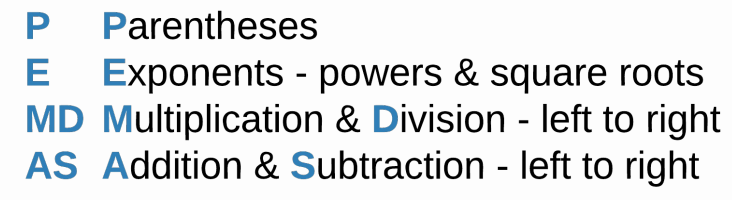

# Arithmetic Operators

## Learning Objectives: Arithmetic Operators

- Recognize the symbols for arithmetic operators
- Use the `printf()` command to print doubles and integers
- Demonstrate how to increment and decrement a variable
- Perform string concatenation
- Apply PEMDAS rules to arithmetic operations

## Addition

### The Addition (+) Operator

The __addition__ operator works as you would expect with numbers. Try out the code below in a C++ text editor
```cpp
cout << 7 + 3 << endl;
```

You can also add 2 variables together. Modify the code to look like what’s below and then run it again.
```cpp
int a = 7;
int b = 3;
cout << a + b << endl;
```

> <b>What happens if you:</b>
>
> - Make `a` of type double (e.g. `double a = 7.0;`)?
> - Change `a` to double `a = 7.1;`?
> - Make `b` a negative number (e.g. `int b = -3;`)?
> - Make `b` an explicitly positive number (e.g. `int b = +3;`)?

> <b>IMPORTANT</b>
>
> You may have noticed that when you add an int of `3` to a double of `7.1` you get `10.1`. However, when you add an int of `3` to a double of `7.0`, you get `10` instead of `10.0`. This occurs because by default `cout` does not print zeros after a decimal point _unless_ those zeros are enclosed by
other non-zero digits.
>
> Examples:
> 
> - `cout << 7 + 3.14;` prints 10.14
> - `cout << 7.0 + 3.00;` prints 10
> - `cout << 7.00 + 3.01400;` prints 10.014
>
> __==Note==__ that when an int and a double are added together, the result will be a `double` because the program will take on the data type that is more _flexible_.

> <b>Adding an Int to a Double</b>
> 
> What is __printed__ with `cout` when you add an int of `3` and a double of `7.0100` together?
> - An error message
> - An int of `10`
> - A double of `10.01`
> - A double of `10.0100`
> 
> > <b>Answer:</b>
> > 
> > A double of `10.01`
>
> > <b>Rationale:</b>
> > 
> > Since `cout` excludes all zeros after a decimal point unless they are enclosed by non-zero digits, the last two zeros will not be printed and the result will show `10.01`.

## Printing Floating Point Numbers

### cout

The `cout` command is considered to be _non-specific_ because you can use the same syntax for all of your printing needs (e.g. `cout << 1;`, `cout << "Hello";`, and `cout << true;`). However, for printing certain numbers, it is not always clear if what’s printed is an `int` or a `double` sometimes.
```cpp
int a = 1;
double b = 1.0;
cout << a << endl;
cout << b << endl;
```

Even though you are printing a `double` of `1.0`, the system will disregard the decimal and the trailing zero when `cout` is used. There is another print command called `printf()` that also prints text to the console.

### printf()

`printf()` originates from the C language and, unlike the `cout` command, it is considered to be _specific_. This means that you must specify what _type of data_ you want to print before you can use the command successfully.
```cpp
int a = 1;
double b = 1.0;
cout << a << endl;
cout << b << endl;
printf("%d \n", a);
printf("%f \n", b);
```

> <b>What happens if you:</b>
> 
> - Remove the `\n` from `printf("%d \n", a);`?
> - Replace `%d` with `%f` in `printf("%d \n", a);`?
> - Replace `%f` with `%d` in `printf("%f \n", b);`?

> <b>IMPORTANT</b>
>
> When `printf()` is used, a _specifier_ is needed in order to tell the system what type of data you want to print. The `%d` tells the system to print an integer and `%f` tells the system to print a floating point number. If you use an incorrect specifier, you will receive an error message. By default, floating point numbers contain six zeros after the decimal
point if they are printed using `printf()`.

The `\n` in `printf()` is equivalent to `endl`. They both print a newline character. Removing the `\n` from `printf("%d \n", a);` will delete the newline character and cause the variables `a` and `b` to be printed sideby-side.

### cout vs. printf()

Unless you want to be _specific_ with how your data is printed, you should always default to using _cout_. Only use _printf()_ when formatting is important.

> <b>cout vs. printf()</b>
> 
> Which of the following programs will print `2.000000` to the console?
> - ```cpp
>   int a = 10;
>   int b = 5;
>   cout << a / b << endl;
>   ```
> 
> - ```cpp
>   int a = 10;
>   double b = 5.0;
>   cout << a / b << endl;
>   ```
> 
> - ```cpp
>   int a = 10;
>   double b = 5.0;
>   printf("%d \n", a / b);
>   ```
> 
> - ```cpp
>   int a = 10;
>   double b = 5.0;
>   printf("%f \n", a / b);
>   ```
>
> > <b>Answer:</b>
> > 
> > - ```cpp
> >   int a = 10;
> >   double b = 5.0;
> >   printf("%f \n", a / b);
> >   ```
>
> > <b>Rationale:</b>
> > 
> > Only choice #4 is correct.
> > - Choices #1 & #2 use the `cout` command which will not print the decimal point nor any trailing zeros.
> > - Choice #3 uses the `%d` specifier which indicates an integer, not a double, so an error will be returned.

## Incrementing Variables

### Incrementing Variables

__Incrementing__ a variable means to increase the value of a variable by a set amount. The most common incrementation you will see is when a variable increments itself by the value of 1.
```cpp
int a = 0;
a = a + 1;
cout << a << endl;
```

### How to Read a = a + 1

The variable `a` appears twice on the same line of code. But each instance of `a` refers to something different.


### The ++ and += Operators

Since incrementing is such a common task for programmers, many
programming languages have developed a shorthand for `a = a + 1`. The result is `a++` which does the same thing as `a = a + 1`.
```cpp
int a = 0;
int b = 0;
a = a + 1;
b++;
cout << a << endl;
cout << b << endl;
```

In the cases where you need to increment by a different number, you can specify it by using the `+=` operator. You can replace `b++;` with `b+=1;` in the code above and still get the same result.

> <b>What happens if you:</b>
> 
> - Replace `b++` in the code above with `b+=2`?
> - Replace `b++` in the code above with `b+=-1`?
> - Replace `b++` in the code above with `b-=1`?

> <b>Incrementing</b>
> 
> Select each of the choices below that increments the variable `a` by the value of `1`.
> - `a++;`
> - `a = 1;`
> - `a+=1;`
> - `a = a + 1;`
> 
> > <b>Answer:</b> 
> > 
> > - `a++;`
> > - `a+=1;`
> > - `a = a + 1;`
> 
> > <b>Rationale:</b>
> > 
> > Choices 1, 3, and 4 all increment the variable `a` by the value of `1`.

## String Concatenation

### String Concatenation

__String concatenation__ is the act of combining two strings together. This is done with the `+` operator.
```cpp
string a = "This is an ";
string b = "example string";
string c = a + b;
cout << c << endl;
```

> <b>What happens if you:</b>
> 
> - Concatenate two strings without an extra space (e.g. remove the space after an in `string a = "This is an";`)?
> - Use the `+=` operator instead of the `+` operator (e.g. `a+=b` instead of `a + b`)?
> - Add `3` to a string (e.g. `string c = a + b + 3;`)?
> - Add `"3"` to a string (e.g. `string c = a + b + "3";`)?

> <b>String Concatenation</b>
> 
> Construct a program that will print:
> `I understand string concatenation!` from the following lines
> 
> - ```cpp
>   cout << b << endl;
>   ```
> - ```cpp
>   cout << a + b << endl;
>   ```
> - ```cpp
>   string b = a + "string concatenation!";
>   ```
> - ```cpp
>   string a = "I understand";
>   ```
> - ```cpp
>   string b = a + " string concatenation!";
>   ```
> - ```cpp
>   string a = 'I understand ';
>   ```
> 
> > <b>Answer:</b> 
> > 
> > ```cpp
> > string a = "I understand";
> > string b = a + " string concatenation!";
> > cout << b << endl;
> > ```
>
> > <b>Rationale:</b>
> > 
> > In C++, strings must use double quotes (`"`) - not single quotes (`'`). Also, spaces are very important when printing strings.

## Subtraction

### Subtraction

Try out the code below
```cpp
int a = 10;
int b = 3;
int c = a - b;
cout << c << endl;
```

> <b>What happens if you:</b>
> 
> - Assign `b` to `-3`?
> - Assign `c` to `a - -b`?
> - Assign `b` to `3.1`?
> - Change `b` to `bool b = true;`?

> <b>IMPORTANT</b>
>
> Did you notice that you were able to subtract a `bool` from an `int`? Recall that a `bool` of `true` is actually an integer of `1` and `false` is actually `0`. Thus, the system is able to add and subtract `bool`s and `int`s. In addition, assigning `b` which is of type `int` to `3.1` will force the variable to adopt the integer value of `3` instead. Remember that all `int`s disregard decimal places.

### The -- and -= Operators

__Decrementing__ is the opposite of incrementing. Just like you can increment with `++`, you can decrement using `--`.
```cpp
int a = 10;
a--;
cout << a << endl;
```

Like `+=`, there is a shorthand for decrementing a variable, `-=`. For example, if you want to decrement the variable `a` by `2` instead of `1`, replace `a--` with `a-=2`.

### Subtraction and Strings

You might be able to concatenate strings with the `+` operator, but you cannot use the `-` operator with them.

> <b>Decrementing</b>
> 
> Complete the code below by selecting the correct choices according to the comments provided.
> ```cpp
> int a = 42;
> int b = 2;
> //decrement a by 1
> ______
> //decrement a by b
> ______
> ```
> 
> > <b>Answer:</b> 
> > 
> > ```cpp
> > int a = 42;
> > int b = 2;
> > //decrement a by 1
> > a--;
> > //decrement a by b
> > a-=b;
> > ```
>
> > <b>Rationale:</b>
> > 
> > To decrement by 1, you use the `--` operator. To decrement or subtract by any other number, you use `-=`.

## Division

### Division

Division in C++ is done with the `/` operator
```cpp
double a = 25.0;
double b = 4.0;
printf("%f \n", a / b);
```

> <b>What happens if you:</b>
> 
> - Assign `b` to `0.0`?
> - Assign `b` to `0.5`?
> - Change the code to…
>   ```cpp
>   double a = 25.0;
>   double b = 4.0;
>   a /= b;
>   printf("%f \n", a);
>   ```

#### Hint(s)

`/=` works similarly to `+=` and `-=`.

> <b>IMPORTANT</b>
>
> Division by zero is _undefined_ in mathematics. In C++, dividing by an __integer__ of `0` results in an error message. However, dividing by a __double__ of `0.0` results in `inf` which is short for _infinity_.

### Integer Division

Normally, you use `double` in C++ division since the result usually involves decimals. If you use integers, the division operator returns an `int`. This “integer division” does not round up, nor round down. It removes the decimal value from the answer.


```cpp
int a = 5;
int b = 2;
cout << a / b << endl;
```

> <b>Division</b>
> 
> Which of the following statements about division in C++ is __FALSE__?
> - You can use the division operator with `int`s.
> - You can use the division operator with `double`s.
> - Division with `int`s and division with `double`s always yield the same results.
> - Dividing by `0.0` returns `inf` as an answer.
> 
> > <b>Answer:</b>
> > 
> > Division with `int`s and division with `double`s always yield the same results.
>
> > <b>Rationale:</b>
> > 
> > `int`s and `double`s behave differently with the division operator. Using `double`s will result in a decimal whereas `int`s will result in a whole number with the decimal removed. This means that `10/3` is either a `double` of `3.3333...` or an `int` of `3` based on the declared data type.

## Modulo

### Modulo

__Modulo__ is the mathematical operation that performs division but returns the remainder. The modulo operator is `%`.


```cpp
int modulo = 5 % 2;
cout << modulo << endl;
```

> <b>What happens if you:</b>
> 
> - Assign `modulo` to `5 % -2`?
> - Assign `modulo` to `5 % 0`?
> - Assign `modulo` to `5 % 2.0`?

> <b>Modulo</b>
> 
> What does modulo (`%`) do?
> - Determines if a number is even or odd
> - Is another name for division
> - Determines the percentage of two numbers
> - Returns the remainder after division is performed
> 
> > <b>Answer:</b>
> > 
> > Returns the remainder after division is performed
>
> > <b>Rationale:</b>
> > 
> > Modulo is the remainder after division is performed. So division is a part of modulo, but modulo is not division. Modulo can be used to determine if a number is even or odd, but modulo can do more than that. Finally, the `%` is used with modulo, but modulo does not deal with percentages.

## Multiplication

### Multiplication

C++ uses the `*` operator for multiplication.
```cpp
int a = 5;
int b = 10;
cout << a * b << endl;
```

> <b>What happens if you:</b>
> 
> - Assign `b` to `0.1`?
> - Assign `b` to `-3`?
> - Change the code to…
    ```cpp
    int a = 5;
    int b = 10;
    a*=b;
    cout << a << endl;
    ```

#### Hint(s)

`*=` works similarly to `+=`, `-=`, and `/=`.

> <b>Multiplication</b>
> 
> Select each of the choices below where the product (or multiplication) of `a` and `b` is printed.
> - ```cpp
>   cout << (a x b) << endl;
>   ```
> - ```cpp
>   cout << (a * b) << endl;
>   ```
> - ```cpp
>   cout << (a**b) << endl;
>   ```
> - ```cpp
>   cout << (a*=b) << endl;
>   ```
> 
> > <b>Answer:</b> 
> > 
> > - ```cpp
> >   cout << (a * b) << endl;
> >   ```
> > - ```cpp
> >   cout << (a*=b) << endl;
> >   ```
> 
> > <b>Rationale:</b>
> > 
> > `x` is not equivalent to the multiplication operator in C++ . The operator `**` is not valid in C++ . Only choices #2 and #4 will result in the product of `a` and `b` being printed to the console.

## Order of Operations

### Order of Operations

C++ uses the `PEMDAS` method for determining order of operations.



By default, there are no operators for __exponents__ and __square roots__. Instead, functions such as `pow( , )` and `sqrt()` are used to calculate powers and square roots respectively. In order to use these functions, they must be
imported by including `#include <cmath>` at top of the program header. For exponents, the _base_ number goes before the `,` in `pow( , )` and the _exponent_ goes after the `,`. For example, `pow(4, 2)` calculates $4^2$ and `pow(4, 0.5)`
calculates $4^{0.5}$ or $4^{1/2}$. For square roots, the number goes inside the `()` in `sqrt()`. An example is `sqrt(4)` which calculates $\sqrt{4}$.
```cpp
cout << pow(2, 2) << endl;
cout << pow(25, (1 / 2)) << endl;
cout << pow(25, (1.0 / 2.0)) << endl;
cout << sqrt(25) << endl;
```

#### `pow(25, (1 / 2))` vs. `pow(25, (1.0 / 2.0))`

`pow(25, (1 / 2))` results in `1` because integer division is performed within `(1 / 2)`. 1 divided by 2 returns in an integer of 0 and $25^0$ computes to 1. On the other hand, `pow(25, (1.0 / 2.0))` involves double division which is
why `5` was computed.

The code below should output `10.000000`
```cpp
int a = 2;
int b = 3;
int c = 4;
double result = 3 * a - 2 / (b + 5) + c;
printf("%f \n", result);
```

#### Explanation

- The first step is to compute `b + 5` (which is `8`) because it is surrounded by parentheses.
- Next, do the multiplication and division going from left to right: `3 * a` is `6`.
- `2` divided by `8` is `0` (remember, the `/` operator returns an `int` when you use two `int`s so `0.25` becomes `0`).
- Next, perform addition and subtraction from left to right: `6 - 0` is `6`.
- Finally, add `6` and `4` together to get `10`.
- Since result is of type `double`, `10.000000` is printed.

> <b>Mental Math</b>
> 
> - `5 + 7 - 10 * 4 / 2`
>     ```
>     Solution
>     -8
>     ```
> 
> - `5 * 8 - 7 % 2 - 18 * -1`
>     ```
>     Solution
>     57
>     ```
> 
> - `9 / 3 + (100 % 100) - 3`
>     ```
>     Solution
>     0
>     ```
> 
> - `12 - 2 * pow(2, 3) / (4 + 4)`
>     ```
>     Solution
>     10
>     ```

> <b>Order of Operations</b>
> 
> At what priority level does C++ perform modulo (`%`) operations?
> - Parentheses
> - Exponents
> - Multiplication & Division
> - Addition & Subtraction
> 
> > <b>Answer:</b>
> > 
> > Multiplication & Division
>
> > <b>Rationale:</b>
> > 
> > Modulo is a type of division, so it is performed along with the `/` and `*` operators in order from left to right.

## Type Casting

### Type Casting

__Type casting__ (or type conversion) is when you change the data type of a variable.
```cpp
int numerator = 40;
int denominator = 25;
int number = 0;
cout << boolalpha << (bool) number << endl;
cout << numerator / denominator << endl;
cout << (double) numerator / denominator << endl;
```

`numerator` and `denominator` are integers, but (`double`) converts `numerator` into a double. You can use `(double)`, `(int)`, and `(bool)` to cast any double, integer, or boolean between each other. Note that casting an integer of `0` or
a double of `0.0` to a boolean will result in `false`. Any other integer or double values will result in `true`.

> <b>What happens if you:</b>
> 
> - Assign `number` to 5?
> - Cast only `denominator` to a `double`?
> - Cast both `numerator` and `denominator` to a double?
> - Cast the result to a double (e.g. `(double) (numerator / denominator`)?
> - Change the code to…
>     ```cpp
>     int numerator = 40;
>     int denominator = 25;
>     int number = 5;
>     cout << boolalpha << (bool) number << endl;
>     cout << numerator / denominator << endl;
>     cout << (double) numerator / denominator << endl;
>     printf("%d \n", numerator / denominator);
>     printf("%f \n", (double) numerator / denominator);
>     printf("%f \n", (double) (numerator / denominator));
>     ```

#### More information

If either or both numbers in C++ division are `double`s, then double division will occur. In the last example, `numerator` and `denominator` are both `int`s when the division takes place which results in an `int` of `1`. An integer of `1` converted to a `double` is `1.000000` but `cout` removes the decimal point and all of the trailing zeros.

### Data Type Compatibility

Do you know why the code below will not work?
```cpp
int a = 5;
string b = "3";
cout << a + b << endl;
```

In C++, you can add a combination of `int`s, `double`s, and `bool`s together. Remember that a boolean is either `1` if it’s `true` or `0` if it’s `false`. In the example above, adding a string to an integer results in an error. That’s because a `string` has no numerical value and can only be added to other `string`s. However, you can convert the string `b` to an integer to fix the problem by using `stoi()`. `stoi()` acts as a __function__ to convert a string into an integer. The string or string variable goes into the `()` to be converted. See below for a list of type-conversion functions.
```cpp
int a = 5;
string b = "3";
string c = "3.14";
bool d = true;
cout << a + stoi(b) << endl;
```

#### List of commonly used type-conversion functions

| Function      | Input Type              | Output Type | Example                                                    |
|---------------|-------------------------|-------------|------------------------------------------------------------|
| `stoi()`      | string                  | int         | `stoi("10")`                                               |
| `stod()`      | string                  | double      | `stoi("12.34")`                                            |
| `to_string()` | int, double, or boolean | string      | `to_string(10)`, `to_string(12.34)`, or `to_string(false)` |

> <b>What happens if you:</b>
> 
> - Replace `stoi(b)` with `stoi(c)`?
> - Replace `stoi(b)` with `stod(c)`?
> - Replace `stoi(b)` with `to_string(d)`?
> - Replace `a + stoi(b)` with `b + to_string(d)`?

> <b>IMPORTANT</b>
>
> You can convert the string `"3.14"` to an integer using `stoi()` which will result in an int of `3`. To retain the decimal places, use `stod()` instead. In addition, the `to_string()` function will convert a boolean into the string form of its numerical value. `to_string(true)` will convert `true` to `"1"` instead of `1`. This is why adding `b`, which is a string of `"3"`, to `to_string(d)` resulted in the string of `"31"`.

> <b>Data Conversion</b>
> 
> Construct a program using the code snippets below to produce the following output:
>
> `false`
> - ```cpp
>   int a = 1;
>   ```
> - ```cpp
>   bool a = true;
>   ```
> - ```cpp
>   cout << boolalpha << (bool) (double) a << endl;
>   ```
> - ```cpp
>   cout << boolalpha << (double) (int) a << endl;
>   ```
> - ```cpp
>   double a = 0.01;
>   ```
> - ```cpp
>   cout << boolalpha << (bool) (int) a << endl;
>   ```
> 
> > <b>Answer:</b>
> > 
> > ```cpp
> > double a = 0.01;
> > cout << boolalpha << (bool) (int) a << endl;
> > ```
> 
> > <b>Rationale:</b>
> > 
> > In order for the system to print `false`, `a` must be a `bool` in its final casting. That eliminates `cout << boolalpha << (double) (int) a << endl;` as a possibility. `bool a = true;` can be eliminated because `a` will always be `true` regardless of which `cout` command comes next. `int a = 1;` can also be eliminated because casting it to an `int` or `double` will not change its numerical value of `1`. This means that `double a = 0.01;` must be part of the answer. Casting a double of `0.01` to a boolean will result in `true` but casting it to an integer first will force it to become `0`. A boolean of an integer of `0` will produce `false`. Thus the only correct combination is:
> > ```cpp
> > double a = 0.01;
> > cout << boolalpha << (bool) (int) a << endl;
> > ```

## Formative Assessment 1

> <b>PEMDAS Calculations</b>
> 
> What is the value of the variable `answer` when it is printed?
> ```cpp
> int answer = -10 + sqrt(25) * 5 / (125 % 100);
> cout << answer << endl;
> ```
> 
> > <b>Answer:</b>
> > 
> > -9
>
> > <b>Rationale:</b>
> > 
> > The calculations are performed as follow:
> > 1. Parentheses: (125 % 100) = 25
> >    - -10 + sqrt(25) * 5 / 25
> > 2. Exponents: sqrt(25) = 5
> >    - -10 + 5 * 5 / 25
> > 3. Multiplication & Division: 5 * 5 / 25 = 1
> >    - -10 + 1
> > 4. Addition & Subtraction: -10 + 1 = -9
> >    - -9

## Formative Assessment 2

> <b>Modulo Calculations</b>
> 
> Assuming all numbers below are of type `int`, which of the following is __NOT__ correct?
> - 6 % 4 = 2
> - 1 % 0 = 1
> - 0 % 2 = 0
> - 15 % 4 = 3
> 
> > <b>Answer:</b>
> > 
> > 1 % 0 = 1
>
> > <b>Rationale:</b>
> > 
> > Because modulo is a type of division, you cannot modulo divide by 0. Similar to `/ 0`, `% 0` produces an error.