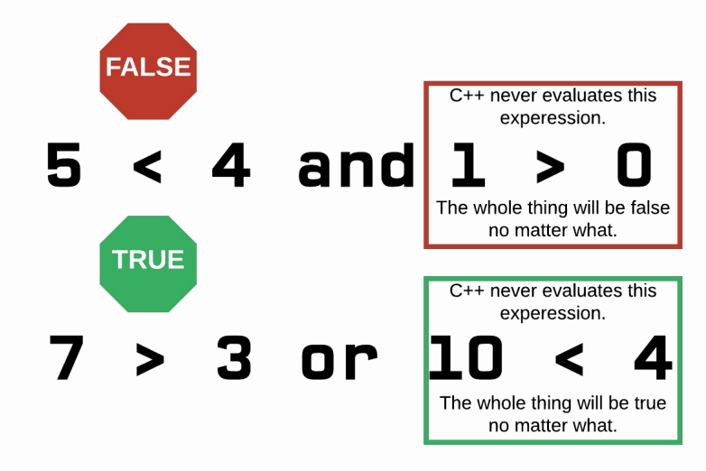

# Boolean Operators

## Learning Objectives: Boolean Operators

- Recognize the difference between `=` and `==`
- Understand the `&&` and `||` operators’ functions
- Evaluate boolean expressions

## Equal To & Not Equal To

__Boolean operators__ are operators that return a boolean value (true or false).

### Equal To

C++ uses the `==` operator to determine _equality_. Beginners often confuse the `=` and the `==` operators. Remember, `=` is the assignment operator.
```cpp
int a = 5;
int b = 5;
cout << boolalpha << (a == b) << endl;
```

> <b>What happens if you:</b>
>
> - Assign `b` to `1`?
> - Change `a` to `bool a = true;` and `b` to `bool b = false;`?

### Not Equal To

The `!=` operator checks to see if two values are _not equal_.
```cpp
int a = 5;
int b = 5;
cout << boolalpha << (a != b) << endl;
```

> <b>What happens if you:</b>
>
> - Assign `b` to `1`?
> - Change `a` to `bool a = true;` and assign `b` to `1`?
> - Change `b` to `bool b = false;`?

> <b>Equality</b>
> 
> Enter the appropriate __operator symbol__ for each definition.
> 
> - This operator checks if two values are __equal__: ____
> - This operator __assigns__ a value to a variable: ____
> - This operator checks if two values are __not equal__: ____
> 
> > <b>Answer:</b> 
> > 
> > This operator checks if two values are equal: <u>==</u>
> > This operator assigns a value to a variable: <u>=</u>
> > This operator checks if two values are not equal: <u>!=</u>
> 
> > <b>Rationale:</b> 
> > 
> > - The `=` operator assigns a value to a variable
> > - The `==` operator checks equality between two values
> > - The `!=` operator checks inequality between two values

## Less Than & Less Than or Equal To

### Less Than

The `<` operator is used to check if one value is _less than_ another value.
```cpp
int a = 5;
int b = 7;
cout << boolalpha << (a < b) << endl;
```

> <b>What happens if you:</b>
>
> - Assign `b` to `1`?
> - Assign `b` to `5`?
> - Assign `b` to `false`?

#### Hint(s)

It is possible to declare and assign `int b = false;` because `false` is just a value of `0`. Since `5` is not less than `0`, `false` is returned.

### Less Than or Equal To

The `<=` operator is used to check if one value is _less than or equal to_ another value.
```cpp
int a = 5;
int b = 7;
cout << boolalpha << (a <= b) << endl;
```

> <b>What happens if you:</b>
>
> - Assign `b` to `1`?
> - Assign `b` to `5`?
> - Assign `a` to `false` and assign `b` to `true`?

#### Hint(s)

`false` is less than `true` because `0` is less than `1`.

> <b>Less Than or Equal To True</b>
> 
> Select __all__ of the conditions below that cause the expression `a <= b` to equate to `true`?
> - If `a` is less than `b`
> - If `a` is greater than `b`
> - If `a` is equal to `b`
> - If `a` is both less than and equal to `b`
> 
> > <b>Answer:</b> 
> > 
> > - If `a` is less than `b`
> > - If `a` is equal to `b`
>
> > <b>Rationale:</b> 
> > 
> > - There are two conditions that would cause `a <= b` to be `true`. One is if `a` is less than `b` and the other is if `a` is equal to `b`. As long as one of those conditions is true, then `a <= b` will be `true`.
> >
> > - __Note__ that `a` cannot be both less than and equal to `b` at the same time.

## Greater Than & Greater Than or Equal To

### Greater Than

The `>` operator is used to check if one value is _greater_ than another value.
```cpp
int a = 9;
int b = 17;
cout << boolalpha << (a > b) << endl;
```

> <b>What happens if you:</b>
>
> - Assign `b` to `1`?
> - Assign `b` to `9`?
> - Assign `b` to `false`?
> - Assign `b` to `true`?

#### Hint(s)

`9` is both greater than the value of `false`, which is `0`, and the value of `true`, which is `1`.

### Greater Than or Equal To

The `>=` operator is used to check if one value is _greater than or equal_ to another value.
```cpp
int a = 9;
int b = 17;
cout << boolalpha << (a >= b) << endl;
```

> <b>What happens if you:</b>
>
> - Assign `b` to `1`?
> - Assign `b` to `9`?
> - Assign `a` to `true` and assign `b` to `false`?

#### Hint(s)

`true` is greater than `false`.

> <b>Greater Than or Equal To True</b>
> 
> Select __all__ of the expressions below that are true.
> - 19 >= 19
> - 18.9 >= 19
> - -19 >= 19
> - 19 >= 9
> 
> > <b>Answer:</b>
> > 
> > - 19 >= 19
> > - 19 >= 9
> 
> > <b>Rationale:</b>
> > 
> > The `>=` operator only returns `true` if the first number is greater than or equal to the second number. So the following statements would evaluate to true: `19 >= 19` and `19 >= 9`

## And

### The && Operator

The `&&` (and) operator allows for compound (more than one) boolean expressions. __All__ boolean expressions __must__ be true in order for the whole thing to be true. If at least __one__ boolean expressions is false, then the whole thing is false.
```cpp
bool a = true;
bool b = true;
bool c = false;
cout << boolalpha << (a && b) << endl;
```

#### How do I type &&?

It is located towards the top of the keyboard, on the same key as the number `7`. Hold `shift` and press the `7` key to type `&`.

> <b>What happens if you:</b>
>
> - Replace `(a && b)` in the code above with `(a && c`)?
> - Replace `(a && b)` in the code above with `(b && c)`?

### Multiple && Statements

You can chain several `&&` expressions together. They are evaluated in a leftto-right manner.
```cpp
bool a = true;
bool b = true;
bool c = false;
cout << boolalpha << (a && b && c) << endl;
```

> <b>What happens if you:</b>
>
> - Replace `(a && b && c)` in the code above with `(a && b && a && b && a)`?
> - Replace `(a && b && c)` in the code above with `(a && b && a && b && c)`?

#### Hint(s)

`c` is the only variable is that is `false`. Thus, if `c` is involved in an `&&` expression, the entire thing will evaluate to `false`. Any combinations of `a`s and/or `b`s will result in `true`.

> <b>Evaluating && Expressions</b>
>
> Fill in the blanks for the following two statements.
> 
> For an overall `&&` expression to be true, all of its boolean expressions must be _____.
> 
> For an overall `&&` expression to be false, one or more of its boolean expressions need to be _____.
> 
> > <b>Answer:</b>
> > 
> > For an overall `&&` expression to be true, all of its boolean expressions must be <u>true</u>.
> > 
> > For an overall `&&` expression to be false, one or more of its boolean expressions need to be <u>false</u>.
>
> > <b>Rationale:</b> 
> > 
> > All of the boolean expressions must be true for the overall `&&` expression to evaluate to `true`.
> > 
> > One or more boolean expressions need to be false for the overall `&&` expression to evaluate to `false`.

## Or

### The || Operator

The `||` (or) operator allows for compound (more than one) boolean expressions. If at least __one__ boolean expression is true, then the whole thing is true. To be false, __all__ boolean expressions __must__ be false.
```cpp
bool a = true;
bool b = true;
bool c = false;
bool d = false;
cout << boolalpha << (a || b) << endl;
```

#### How do I type ||?

It is towards the right-hand side, below the `backspace` or `delete` key and above the `enter` or `return` key. The `|` symbol is located on the same key as the `</code>` symbol. Hold `shift` and press the `</code>` key to type `|`.

> <b>What happens if you:</b>
>
> - Replace `(a || b)` in the code above with `(a || c)`?
> - Replace `(a || b)` in the code above with `(c || d)`?

### Multiple || Statements

You can chain several `||` expressions together. They are evaluated in a left-toright manner.
```cpp
bool a = true;
bool b = true;
bool c = false;
cout << boolalpha << (a || b || c) << endl;
```

> <b>What happens if you:</b>
>
> - Replace `(a || b || c)` in the code above with `(a || c || c || c || c)`?
> - Replace `(a || b || c)` in the code above with `(c && c && c && c && c)`?

> <b>Evaluating || Expressions</b>
>
> Fill in the blanks for the following two statements.
> 
> For an overall `||` expression to be false, all of its boolean expressions must be _____.
> 
> For an overall `||` expression to be true, at least one of its boolean expressions needs to be _____.
> 
> > <b>Answer:</b>
> > 
> > For an overall `||` expression to be false, all of its boolean expressions must be <u>false</u>.
> > For an overall `||` expression to be true, at least one of its boolean expressions needs to be <u>true</u>.
>
> > <b>Rationale:</b> 
> > 
> > All of the boolean expressions must be false for the overall `||` expression to evaluate to `false`.
> > One or more boolean expressions need to be true for the overall `||` expression to evaluate to `true`.

## Not

### The ! Operator

The `!` (not) operator produces the _opposite_ result of the boolean expression that it modifies.
```cpp
cout << boolalpha << (! true) << endl;
```

#### Challenge

> <b>What happens if you:</b>
>
> - Replace `(! true)` in the code above with `(! true && false)`?
> - Replace `(! true)` in the code above with `(! (true && false))`?
> - Replace `(! true)` in the code above with `(! ! true)`?

#### Hint(s)

The `!` operator works similarly to how a `-` (negative) sign works in mathematics. The `-` of a positive number is a negative number and the `-` of a negative number is a positive number.

### Order of Boolean Operators

Much like how arithmetic operators are evaluated in a certain order, boolean operators also work according to their priority level. Boolean operations are evaluated in the following order from highest to lowest priority:
1. Parentheses `()`
2. Not `!`
3. And `&&`
4. Or `||`

> <b>Evaluating ! Expressions</b>
>
> Evaluate the two expressions below using either __lowercase__ `true` or `false`.
>
> - `(5 != 4)` returns ____.
> - `(! (5 == 4))` returns ____.
> 
> > <b>Answer:</b>
> > 
> > - `(5 != 4)` returns <u>true</u>.
> > - `(! (5 == 4))` returns <u>true</u>.
>
> > <b>Rationale:</b>
> > 
> > Both expressions evaluate to `true`. In the second case, `(5 == 4)` first evaluates to `false` and then `(! (false))` evaluates to `true`.

## Short Circuiting

### Short Circuiting

If C++ can determine the result of a boolean expression before evaluating
the entire thing, it will stop and return the value.



```cpp
cout << boolalpha << (false && /*C++ never reaches this line*/ true) << endl;
cout << boolalpha << (true || /*C++ never reaches this line*/ false) << endl;
```

> <b>Short Circuiting</b>
>
> Complete the text
> 
> <b>Or Operator</b>
>
> When using the `||` operator, C++ checks to see if the first boolean expression is _____. If it is _____, C++ returns _____ and ignores the remaining boolean expression(s).
> 
> <b>And Operator</b>
>
> When using the `&&` operator, C++ checks to see if the first boolean expression is _____. If it is _____, C++ returns _____ and ignores the remaining boolean expression(s).
> 
> > <b>Answer:</b>
> >
> > <b>Or Operator</b>
> >
> > When using the `||` operator, C++ checks to see if the first boolean expression is <u>true</u>. If it is <u>true</u>, C++ returns <u>true</u> and ignores the remaining boolean expression(s).
> > 
> > <b>And Operator</b>
> >
> > When using the `&&` operator, C++ checks to see if the first boolean expression is <u>false</u>. If it is <u>false</u>, C++ returns <u>false</u> and ignores the remaining boolean expression(s).
> 
> > <b>Rationale:</b>
> >
> > If the first boolean expression for the `||` operator is true, then the entire thing is `true`. The remaining boolean expression(s) is ignored.
> > 
> > If the first boolean expression for the `&&` operator is `false`, then the entire thing is false. The remaining boolean expression(s) is ignored.

## Formative Assessment 1

> <b>Evaluating Boolean Expressions</b>
> 
> Using your knowledge of boolean operators, choose the answer that correctly evaluates the expression below:
> 
> `( 5 != 4 ) && ( 3 > 0 ) && ( ! (2 == 3) ) || #unknown condition#`
> - The expression evaluates to `false` - C++ short circuits because you have a `false` condition with an `&&` operator.
> - The expression evaluates to `true` - C++ short circuits because you have a `true` condition with an `||` operator.
> - There is not enough information - we would need to know the `#unknown condition#`.
> 
> > <b>Answer:</b>
> > 
> > The expression evaluates to `true` - C++ short circuits because you have a `true` condition with an `||` operator.
>
> > <b>Rationale:</b>
> > 
> > Because all of the first three conditions evaluate as true, the `&&` operator will cause their combination to evaluate as `true` too. When you reach the `||` operator, you then have `true || #unknown condition#`. C++ short circuits and evaluates the entire line as `true` without ever evaluating the `#unknown condition#`.

## Formative Assessment 1

> <b>Evaluating Arithmetic & Boolean Operators</b>
> 
> Determine if the code below returns `true` or `false`.
> 
> `(7 >= 7) && (true || 99 < 1) || ! (3 > 5 && 7 < 10) && 2 != 4`
> - true
> - false
> 
> > <b>Answer:</b>
> > 
> > true
> 
> > <b>Rationale:</b>
> > 
> > First, start by evaluating the expressions in the parentheses.
> > - `(7 >= 7)` returns true.
> > - `(true || 99 < 1)` returns true.
> > - `! (3 > 5 && 7 < 10)` returns true.
> > - `2 != 4` returns true.
> > So the boolean expression is now `true && true || true && true`, which returns `true`.