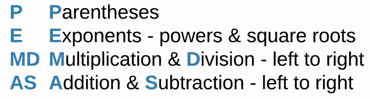

# Lab: Arithmetic Operators

## Tutorial Lab 1: Arithmetic Operators

Arithmetic operations in C++ are mostly the same as what you learned in math class. However, the symbols used in C++ may be different.

| Operation      | Symbol | Notes
|----------------|--------|----------------------------------------------------|
| Addition       | `+`    |                                                    |
| Subtraction    | `-`    |                                                    |
| Multiplication | `*`    |                                                    |
| Division       | `/`    |                                                    |
| Modulo         | `%`    | Returns the remainder after division is performed. |

Try out the following code in a C++ e text editor:
```cpp
cout << 10 + 3 << endl;
cout << 10 - 3 << endl;
cout << 10 * 3 << endl;
cout << 10 / 3 << endl;
cout << 10 % 3 << endl;
```

Program results:
1) Addition works as expected.
2) Subtraction works as expected.
3) Multiplication works as expected.
4) Division with integers will return a truncated integer result.
5) Modulo returns `1` because that is the remainder (not the decimal) after division is performed.

> 
>
> 
>
> 
>
> 


> <b>Identifying Arithmetic Operators</b>
> 
> - ____ is the operator for multiplication.
> - ____ is the operator for modulo.
> - ____ is the operator for division.
> - The ____ operator might return a result different from a calculator’s if both numbers are ____s.
> 
> > <b>Answer:</b> 
> >
> > - <u>*</u> is the operator for multiplication.
> > - <u>%</u> is the operator for modulo.
> > - <u>/</u> is the operator for division.
> > - The <u>/</u> operator might return a result different from a calculator’s if both numbers are <u>int</u>s.
> 
> > <b>Rationale:</b>
> >
> > - `*` is the operator for multiplication.
> > - `%` is the operator for modulo.
> > - `/` is the operator for division.
> > - The `/` operator might return a result different from a calculator’s if both numbers are `int`s.

# Lab: Strings

## Tutorial Lab 2: Strings

You can use the `+` operator with strings, even though the result is not based on math. Using the `+` operator with strings is called _concatenation_.

Try out the following code in a C++ e text editor:
```cpp
string string1 = "hip ";
string string2 = string1 + string1;
string string3 = "hoo";
string string4 = "ray!";
string string5 = string3 + string4;
cout << string2;
cout << string5 << endl;
```

Below are the steps that C++ takes when evaluating the code above.
1) Assign the value `"hip "` to the variable `string1`. Note the inclusion of a space after the word hip.
2) The variable `string2` will have the value of `"hip hip "` because `string1 + string1` repeats the value of `string1` two times.
3) Declare `string3` and assign it the value of `"hoo"`.
4) Declare `string4` and assign it the value of `"ray!"`.
5) Declare `string5` and assign it the value of `string3` combined with the value of `string4` (`"hooray!"`).
6) Print the value of `string2` (`"hip hip "`) without the newline character.
7) Print the value of `string5` (`"hooray!"`) to the end of `string2`.

> <b>String Operator</b>
> 
> Which of the following __operators__ can be used with strings?
>
> - `/`
>
> - `*`
>
> - `-`
>
> - `+`
>
> > <b>Answer:</b>
> > 
> > `+`
> 
> > <b>Rationale:</b>
> >
> > Only the `+` operator can be used with strings. It serves as the concatenation operator by merging two strings together.

# Lab: Order of Operations

## Tutorial Lab 3: Order of Operations

C++ uses PEMDAS when determining the order of operations.



> Modulo and PEMDAS
>
> Since modulo is based on division, modulo operations happen at the time of multiplication and division, going from left to right.

Try out the following code in a C++ e text editor:
```cpp
cout << (5 * 8 / 3 + (18 - 8) % 2 - 25) << endl;
```

Below are the steps that C++ takes when evaluating the code above.
1) 5 * 8 / 3 + (18 - 8) % 2 - 25
2) 5 * 8 / 3 + 10 % 2 - 25
3) 40 / 3 + 10 % 2 - 25
4) 13 + 10 % 2 - 25
5) 13 + 0 - 25
6) 13 - 25
7) -12

> <b>List the Order of Operations</b>
> 
> What is the correct order of the following operations?
> - Parentheses
> - Parentheses and Exponents
> - Exponents
> - Multiplication and Division
> - Multiplication, Division, and Modulo
> - Modulo
> - Addition and Subtraction
> 
> > <b>Answer:</b> 
> >
> > - Parentheses
> > - Exponents
> > - Multiplication, Division, and Modulo
> > - Addition and Subtraction
> 
> > <b>Rationale:</b>
> > 
> > Order of operations starts with any expression(s) in parentheses. Next, the exponent(s) is calculated. Then multiplication, division, and modulo are calculated from left to right. Finally, addition and subtraction are calculated from left to right.

# Lab: Boolean Operators

## Tutorial Lab 4: Boolean Operators

Boolean operators are used within expressions to return either `true` or `false`.

| Operation                | Symbol | Notes
|------------------        |------- |-----------------------------------------------------------
| Equal to                 | ==     | The = operator is the assignment operator, not the equality operator.
| Not equal to             | !=     |
| Less than                | <      |
| Less than or equal to    | <=     |
| Greater than             | >      |
| Greater than or equal to | >=     |
| And                      | &&     | Compares two boolean expressions. Both must be true for the whole to be true. Everything else is false. |
| Or                       | &#124;&#124; | Compares two boolean expressions. Both must be false for the whole to be false. Everything else is true.   |
| Not                      | !      | Returns the opposite result of an evaluated boolean expression.

Try out the following code in a C++ e text editor:
```cpp
cout << boolalpha << ((5 > 7) && (false || 1 < 9) || 4 != 5 && ! (2 >= 3)) << endl;
```

Below are the steps that C++ takes when evaluating the code above.
- __Evaluate all arithmetic operators according to PEMDAS__
1. (5 > 7) && (false || 1 < 9) || 4 != 5 && ! (2 >= 3)
2. __false__ && (false || 1 < 9) || 4 != 5 && ! (2 >= 3)
3. false && (false || __true__) || 4 != 5 && ! (2 >= 3)
4. false && (false || true) || __true__ && ! (2 >= 3)
5. false && (false || true) || true && ! __false__

- __Evaluate all boolean operators according to this order - Parentheses (`()`), Not (`!`), And (`&&`), then Or (`||`)__
6. false && __true__ || true && ! false
7. false && true || true && __true__
8. __false__ || true && true
9. false || __true__
10. __true__

__==Note==__ that __arithmetic__ operators are performed _before_ __boolean__ operators.

> <b>Evaluating Mixed Operations</b>
> 
> What is the results of the following expression?
> 
> ```cpp
> ! (5 != 3) && (5 % 3 >= 2)
> ```
> 
> - true
> - false
> 
> > <b>Answer:</b> 
> > 
> > false
>
> > <b>Rationale:</b>
> > 
> > The first set of parentheses, `(5 != 3)`, evaluates to `true`. The second set of parentheses, `(5 % 3 >= 2)`, also evaluates to `true`. `! true && true` then becomes `false && true` which ultimately evaluates to `false`.

# Lab Challenge: Operators

## Operators Challenge
Given the followinhg starter code:
```cpp
#include <iostream>
using namespace std;

int main() {
  
  //add code below this line
  

  //add code above this line
  
  return 0;
  
}
```

Write a boolean expression that incorporates _ONE_ of the __equality operators__, _ONE_ of the __less than__ operators, _ONE_ of the __greater than__ operators, and _TWO_ of the __logical__ operators. The result of your overall
boolean expression _MUST_ be `false`. Make sure to use `cout << boolalpha <<` in your code. Otherwise, the system will print `0` or `1` instead of `false` or `true`.

| Equality | Less Than | Greater Than | Logical
| :------  |:------    |:------       |:------ 
| ==       | <         | >            | &&
| !=       | <=        | >=           | &#124;&#124;
|          |           |              | !