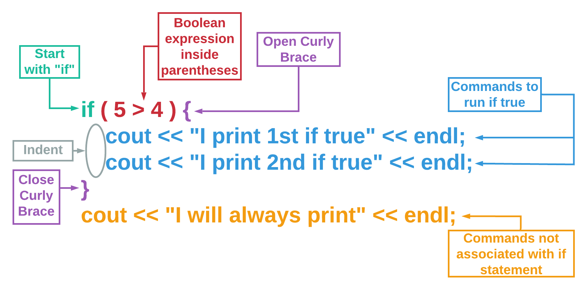
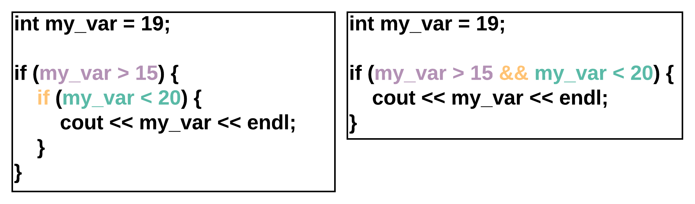

# If Statement

## Learning Objectives: If Statement

- Describe `if` statement syntax
- Use a conditional statement to make decisions
- Use two or more boolean expressions in an `if` statement
- Identify when to use compound conditionals and when not to use them

## If Statement Syntax

### If Statement Syntax

Conditionals are pieces of code that make a decision about what the program is going to do next. The most common conditional is the `if` statement.



If statements in C++ must contain the following items:
- The keyword `if`.
- A boolean expression in parentheses, `()`.
- Curly braces, `{}`, surrounding all lines of code that will run if the boolean expression is true.

It is best practice to also indent the lines of code inside the curly braces to visually differentiate them from the commands that will always run.

Try out the code below
```cpp
if (5 > 4) {
    cout << "I print 1st if true" << endl;
    cout << "I print 2nd if true" << endl;
}   
cout << "I will always print" << endl;  
```

> <b>If Statement Syntax</b>
> 
> Rearrange the code blocks below to create an `if` statement that prints a string if the boolean expression is `true` and then prints __another__ string that’s __not__ associated with the `if` statement.
> 
> - ```cpp
>   ]
>   ```
> - ```cpp
>   if (7 != 4) {
>   ```
> - ```cpp
>   if 7 != 4 {
>   ```
> - ```cpp
>   if 7 != 4 [
>   ```
> - ```cpp
>   cout << "Only print me if true" << endl;
>   ```
> - ```cpp
>   cout << "Always print me" << endl;
>   ```
> - ```cpp
>   }
>   ```
> 
> > <b>Answer:</b>
> > 
> > ```cpp
> > if (7 != 4) {
> >     cout << "Only print me if true" << endl;
> > }
> > cout << "Always print me" << endl;
> > ```
> 
> > <b>Rationale:</b>
> > 
> > Remember that the __three__ main components of an `if` statement are:
> > 1. The keyword `if`.
> > 2. A boolean expression inside `()`.
> > An indented command(s) inside `{}` that runs if the boolean expression is `true`.
> > 
> > __Note__ that commands not associated with an `if` statement should go outside of the `{}` and should not be indented.

## If Statement

### If Statement

`if` statements test to see if a certain condition is true. If yes, then specific commands are run. The simple `if` statement does not do anything if the boolean expression is false.
```cpp
if (7 != 10) {
    cout << "The above statement is true" << endl;
    cout << "The above statement is still true" << endl;
}
cout << "This is not related to the if statement" << endl;
```

> <b>What happens if you:</b>
> 
> - Change `!=` in the code above to `==`?
> - Change `7 != 10` in the code above to `true`?
> - Change `7 != 10` in the code above to `false`?
> - Remove the curly braces `{}` with the condition set to `if (false)`?

### Testing Multiple Cases

You will find yourself needing to test the same variable multiple times. Be sure that you set up your conditionals to test _all_ possible values of the variable.
```cpp
int grade = 90;

if (grade > 70) {
  cout << "Congrats, you passed the class" << endl;
}
    
if (grade < 70) {
  cout << "Condolences, you did not pass the class" << endl;
}
```

> <b>What happens if you:</b>
> 
> - Assign `int grade` to `60`?
> - Assign `int grade` to `70`?
> - Change `grade > 70` in the code above to `grade >= 70`?

> <b>Variable Test Coverage</b>
> 
> Which of the following code segments does NOT test for all possible variable values?
> 
> - ```cpp
>   if (probability < .1) {
>     cout << "That's improbable!" << endl;
>   }
>   if (probability < .5 && probability >= .1) {
>     cout << "That's unlikely!" << endl; 
>   }
>   if (probability >= .5) {
>     cout << "That's a good chance!" << endl; 
>   }
>   ```
> - ```cpp
>   if (age < 18) {
>     cout << "You are too young to vote." << endl; 
>   }
>   if (age > 18) {
>     cout << "You can vote!" << endl;
>   }
>   ```
> - ```cpp
>   if (chartPosition <= 10) {
>     cout << "You made it into the top 10 songs!" << endl; 
>   }
>   if (chartPosition > 10) {
>     cout << "Better luck next week." << endl; 
>   }
>   ```
> 
> > <b>Answer:</b>
> > 
> > ```cpp
> > if (age < 18) {
> >   cout << "You are too young to vote." << endl; 
> > }
> > if (age > 18) {
> >   cout << "You can vote!" << endl;
> > }
> > ```
> 
> > <b>Rationale:</b>
> > 
> > Choice #2 does not account for `age` that’s __equal__ to `18`.
> > ```cpp
> > if (age < 18) {
> >   cout << "You are too young to vote." << endl; 
> > }
> > if (age > 18) {
> >   cout << "You can vote!" << endl;
> > }
> > ```
> > To include all possible values for `age`, revise the fourth line of the code to:
> > ```cpp
> > if (age >= 18) {
> > ```

## Compound Conditional Statements

### Compound Conditional Statements

Conditional statements (`if` statements) are used to match an action with a condition being true. For example, print `Even` if a number is even. If you want to test for a number being even and greater than 10, you will need two conditionals.
```cpp
int num = 16;

if (num % 2 == 0 && num > 10) {
    cout << "Even and greater than 10" << endl;
}
```

> <b>What happens if you:</b>
> 
> - Assign `num` to `8`?
> - Change `&&` in the code above to `||`?
> - Change `==` in the code above to `!=`?

### Why Use Compound Conditionals?

Both code snippets below do the same thing: Ask if `my_var` is greater than 15 and if `my_var` is less than 20. If both of these are true, then C++ will print the value of `my_var`.



The code on the left is a __nested__ `if` statement - which means an `if` statement is _inside_ another `if` statement.

The code with the __compound conditional__ (on the right) has fewer lines of code, and is easier for a human to read. In fact, it almost reads like a sentence.

> <b>Compound If vs. Nested If</b>
> 
> Why might you want to use a __compound conditional__ over a __nested__ if statement?
> - If a conditional has to be false.
> - If there is no boolean expression to evaluate.
> - If you want an `if` statement _inside_ another `if` statement.
> - If you want your code to be more concise and easier to read.
> 
> > <b>Answer:</b>
> > 
> > If you want your code to be more concise and easier to read.
>
> > <b>Rationale:</b>
> > 
> > A __compound conditional__ and a __nested__ `if` statement both allow you to test two or more things to be true. However, compound conditionals tend to have fewer lines of code and are generally easier to read.

## Formative Assessment 1

> <b>If Statement</b>
> 
> Which of the following is __false__ regarding `if` statements?
> - Allows a program to make decisions about what to do.
> - Allows a specific command(s) to run if the boolean expression is true.
> - Allows a specific command(s) to run if the boolean expression is false.
> - Includes the keyword `if`, a boolean expression inside `()`, and a command(s) to run within `{}`.
> 
> > <b>Answer:</b>
> > 
> > Allows a specific command(s) to run if the boolean expression is false.
>
> > <b>Rationale:</b>
> > 
> > Choice #3 is false. The program will skip _all_ commands within `{}` if the boolean expression evaluates to `false`.

## Formative Assessment 2

> <b>Even or Odd?</b>
> 
> Complete the `if` statement below so that it will determine if the variable `num` is even or odd.
> 
> ```cpp
> if ___num%2==0___ ___
>     cout << “Even” << endl;
> ___
> if ___num%2==1___ ___
>     cout << “Odd” << endl;
> ___
> ```
> 
> > <b>Answer:</b>
> > 
> > ```cpp
> > if (num%2==0) {
> >     cout << “Even” << endl;
> > }
> > if (num%2==1) {
> >     cout << “Odd” << endl;
> > }
> > ```
> 
> > <b>Rationale:</b>
> > 
> > The boolean expression is enclosed within `()` while the command is enclosed within `{}`.
> > ```cpp
> > if (num%2==0) {
> >     cout << "Even" << endl;
> > }
> > if (num%2==1) {
> >   cout << "Odd" << endl;
> > }
> > ```