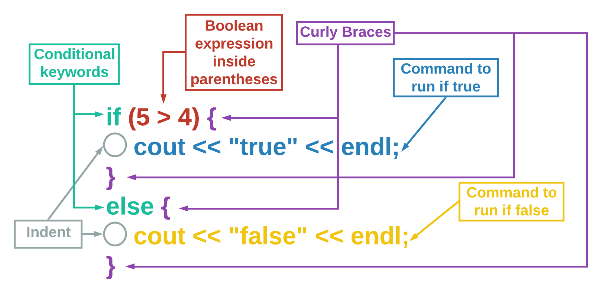
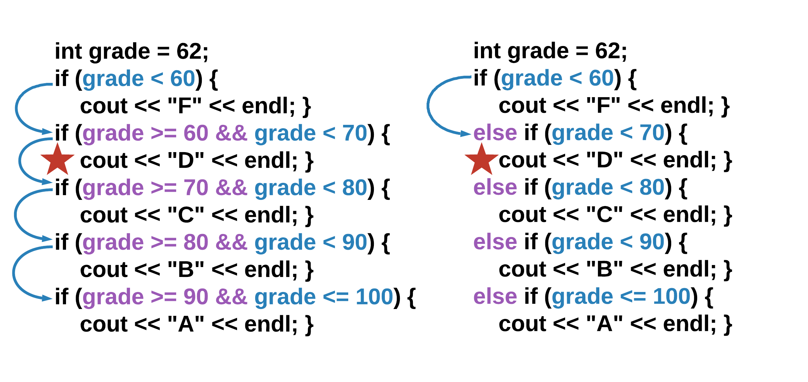

# If Else Statement

## Learning Objectives: If Else Statement

- Describe `if-else` statement syntax
- Explain the difference between an `if` statement and an `if-else` statement

## If Else Statement Syntax

### If Else Syntax

The `if-else` statement checks to see if a condition is true, and then has specific actions that take place. However, it also provides a specific set of actions if the boolean expression is false. Use the `else` keyword to introduce the code to run when false is evaluated. Note that `else` is aligned with the `if` keyword (no indentation) and has its own set of curly braces `{}`. You do not write another boolean expression with `else`.



It is best practice to indent the lines of code within the curly braces to differentiate them but the indention does not affect how the program runs.

```cpp
if (5 > 4) {
    cout << "Print me if true" << endl;
}
else {
    cout << "Print me if false" << endl;
}
```

> <b>What happens if you:</b>
> 
> - Change `4` in the code above to `6`?
> - Remove all the curly braces `{}`?
> - Add `cout << "False" << endl;` under `cout << "Print me if false" << endl;` _without_ any curly braces `{}` in the code?
> - Add `cout << "True" << endl;` under `cout << "Print me if true" << endl;` _without_ any curly braces `{}` in the code?

> <b>IMPORTANT</b>
> 
> - You may have noticed that when there is only __one__ command associated with an `if` or `else` statement the curly braces `{}` become __optional__.

### When Are Curly Braces Mandatory?

Curly braces `{}` are mandatory whenever you have __more than one__ command that is associated with an `if` or `else` statement. Here is a code snippet that will work without curly braces:

```cpp
if (10 % 2 == 0)
    cout << "10 is even" << endl;
else
    cout << "10 is odd" << endl;
```

However, if you add more commands to the `if` or `else` statement, the program will not run properly. The examples below will not print as intended or will produce an error message.

```cpp
if (10 % 2 == 0)
    cout << "10 is even" << endl;
else
    cout << "10 is odd" << endl;
    cout << "False" << endl;
```

```cpp
if (10 % 2 == 0)
    cout << "10 is even" << endl;
    cout << "True" << endl;
else
    cout << "10 is odd" << endl;
```

Like indentations, it is best practice to always include curly braces even if they are optional in certain situations.

```cpp
if (10 % 2 == 0) { // mandatory curly braces
    cout << "10 is even" << endl;
    cout << "True" << endl;
}
else { // optional curly braces
    cout << "10 is odd" << endl;
}
```

> <b>If Else Syntax</b>
> 
> Select all of the following that are true regarding an if-else statement.
> - Indentation affects how the code runs.
> - You need to use curly braces `{}` after both the `if` and the `else` keywords to group more than one command that is conditionally executed.
> - The `else` condition does not have a boolean expression within parentheses `()` following it.
> - The `else` condition has empty parentheses `()` following it.
>
> > <b>Answer:</b>
> > 
> > - You need to use curly braces `{}` after both the `if` and the `else` keywords to group more than one command that is conditionally executed.
> > - The `else` condition does not have a boolean expression within parentheses `()` following it.
>
> > <b>Rationale:</b>
> > 
> > - C++ uses curly braces `{}` to group more than one command of code. While indention is helpful, it does not affect how the program runs. Instead, you need to use curly braces to tell C++ what code to run in both the true condition (after the `if`) and the false condition (after the `else`).
> > - Additionally, because `else` is associated with the `false` condition, it does not need its own boolean expression. Nor does it need parentheses.

## If Else Statement

### If Else Statement

The `if-else` statement is used when you want something _specific_ to happen if the boolean expression is true and something else to happen if it is false.

```cpp
bool my_bool = true;

if (my_bool) {
    cout << "The value of my_bool is true" << endl; }
else {
    cout << "The value of my_bool is false" << endl; }
```

> <b>What happens if you:</b>
> 
> - Assign `my_bool` to `false`?
> - Assign `my_bool` to `! true && ! false`?

> <b>IMPORTANT</b>
> 
> Did you notice that the code above has the closing curly brace `}` after the the semi-colon `;` instead of on the next line? Remember that curly braces `{}` are _optional_ if the `if-else` statement only includes __one__ command within the `if` and `else` bodies. However, they are _mandatory_ when there is __more than one__ command. When using curly braces, the decision of where to place them is entirely up to you. All of the commands below work exactly the same way:
> ```cpp
> if (is_true) {
>     cout << "1" << endl;
>     cout << "2" << endl;
> }
> ```
>
> ```cpp
> if (is_true) {
>     cout << "1" << endl; cout << "2" << endl; }
> ```
>
> ```cpp
>     if (is_true) { cout << "1" << endl; cout << "2" << endl; }
> ```

### Testing Multiple Cases

You will find yourself needing to test the same variable multiple times. To simplify this, you can __nest__ `if-else` statements – which means you can put an `if-else` structure inside of another `if-else` structure (as shown on the right below).



When nesting `if` and `else` __together__, use the keywords `else` and `if` side-by-side (`else if`). This nesting drastically changes the way the program flows once the correct case is found. On the left, the program checks every case no matter the value of the variable. On the right, the __nested__ structure causes the program to jump out of the structure once the correct case is found. This is able to occur because the other `if` cases are inside the `else` statement, which will only run when the previous boolean expression is false.

```cpp
int grade = 62;
if (grade < 60) {
    cout << "F" << endl; }
else if (grade < 70) {
    cout << "D" << endl; }
else if (grade < 80) {
    cout << "C" << endl; }
else if (grade < 90) {
    cout << "B" << endl; }
else if (grade <= 100) {
    cout << "A" << endl; }
```

> <b>If, Else If, and Else</b>
> 
> Construct a program that determines whether the variable `num` is even, odd, or invalid by rearranging the code blocks below.
> - ```cpp
>   }
>   ```
>
> - ```cpp
>   else if (num % 2 == 1) {
>   ```
>
> - ```cpp
>   }
>   ```
>
> - ```cpp
>   cout << "Even" << endl;
>   ```
>
> - ```cpp
>   if (num % 2 == 0) {
>   ```
>
> - ```cpp
>   cout << "Odd" << endl;
>   ```
>
> - ```cpp
>   }
>   ```
>
> - ```cpp
>   else {
>   ```
>
> - ```cpp
>   cout << "Invalid" << endl;
>   ```
> 
> > <b>Answer:</b>
> >
> > ```cpp
> > if (num % 2 == 0) {
> >     cout << "Even" << endl;
> > }
> > else if (num % 2 == 1) {
> >     cout << "Odd" << endl;
> > }
> > else {
> >     cout << "Invalid" << endl;
> > }
> > ```
>
> > <b>Rationale:</b>
> > 
> > Remember to: Arrange `if`, `else if`, and `else` in that correct order.

## Formative Assessment 1

> <b>Debugging If Else</b>
> 
> What is wrong with the code below?
> 
> __Hint:__ There is more than one correct answer.
> ```cpp
> if 3 > 4 {
>     cout << "true" << endl;
> else
>     cout << "false" << endl;
> }
> ```
> - Parentheses `()` are missing around the boolean expression after the `if` keyword.
> - A closing curly brace `}` is missing before the `else` keyword.
> - Parentheses `()` are missing after the `else` keyword.
> - An open curly brace `{` is missing after the `else` keyword.
> 
> > <b>Answer:</b>
> > 
> > - Parentheses `()` are missing around the boolean expression after the `if` keyword.
> > - A closing curly brace `}` is missing before the `else` keyword.
> > - An open curly brace `{` is missing after the `else` keyword.
>
> > <b>Rationale:</b>
> > 
> > The correct code should look like this:
> > ```cpp
> > if (3 > 4) {
> >     cout << "true" << endl;
> > }
> > else {
> >     cout << "false" << endl;
> > }
> > ```

## Formative Assessment 2

> <b>Nested If Else</b>
> 
> Your voice assistant device gives helpful information based on certain weather conditions that are present. The code that programs your voice assistant is below:
> ```cpp
> if (rainy) {
>     if (windy) {
>         cout << "Wear a rain jacket." << endl;
>     }
>     else {
>         cout << "Bring an umbrella!" << endl;
>     }
> }
> else {
>     if (cold) {
>         cout << "You might need a coat." << endl;
>     }
>     else {
>         cout << "Enjoy your day!" << endl;
>     }
> }
> ```
> What would your device say to you if the weather is windy but __not__ rainy and __not__ cold?
> - “Wear a rain jacket.”
> - “You might need a coat.”
> - “Bring an umbrella!”
> - “Enjoy your day!”
> 
> > <b>Answer:</b>
> > 
> > “Enjoy your day!”
>
> > <b>Rationale:</b>
> > 
> > Although the `if (windy)` condition is present in the code, it is nested within the `if (rainy)` condition. That means the `if (windy)` condition can’t be executed unless the `if (rainy)` condition is true. Since `if (rainy)` is false, the system skips down to the _outer_ `else` statement. Also, since the weather is __not__ cold, the second nested _inner_ `else` statement is executed and thus `"Enjoy your day!"` is provided to you by the device.