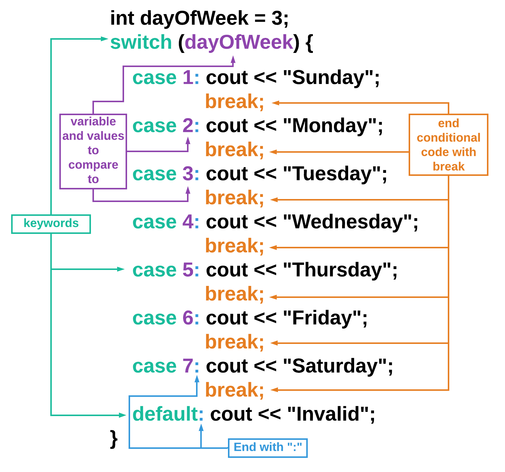
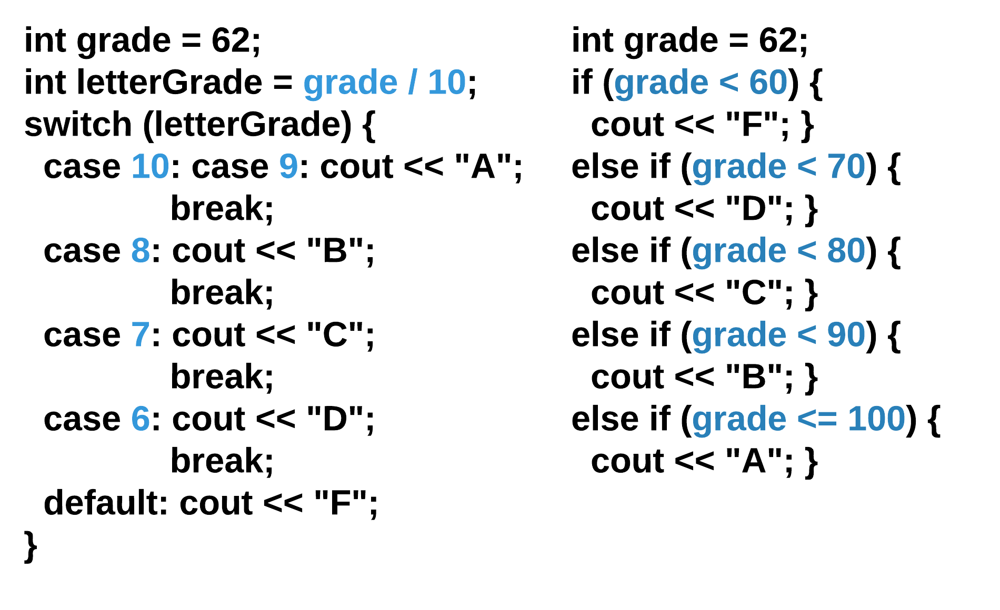

# Switch Case Statement

## Learning Objectives: Switch Case Statement

- Describe the `switch case` syntax
- Identify when to apply `switch case` statements instead of nested `if-else`

## Switch Case Statement Syntax

### Swith Case Statement Syntax

The `switch case` statement is a way to make a decision with multiple possible outcomes. Instead of nesting or sequencing many `if` statements, C++ allows you to write the following:



Here are the rules for writing a switch case statement:
- Start with `switch` followed by the variable that is going to be tested in parentheses `()`.
- All of the `case`s are surrounded by a set of curly braces `{}`.
- Each `case` is followed by a numerical value and a colon `:`.
- After each `:`, write the code that should run if the variable is equal to that case’s value.
- After each section of code per case, include `break;`.
- As the very last case, use `default:` to specify what should happen if none of the above cases are true.

```cpp
int dayOfWeek = 3;

switch (dayOfWeek) {

    case 1: cout << "Sunday"; //only prints if dayOfWeek == 1
        break;
    case 2: cout << "Monday"; //only prints if dayOfWeek == 2
        break;
    case 3: cout << "Tuesday"; //only prints if dayOfWeek == 3
        break;
    case 4: cout << "Wednesday"; //only prints if dayOfWeek == 4
        break;
    case 5: cout << "Thursday"; //only prints if dayOfWeek == 5
        break;
    case 6: cout << "Friday"; //only prints if dayOfWeek == 6
        break;
    case 7: cout << "Saturday"; //only prints if dayOfWeek == 7
        break;
    default: cout << "Invalid"; //only prints if none of the above are true
        
}
```

> <b>What happens if you:</b>
> 
> - Assign `dayOfWeek` to `5`?
> - Assign `dayOfWeek` to `0`?
> - Assign `dayOfWeek` to `3` and remove all of the `break;` statements?

> <b>Switch Case Syntax</b>
> 
> Which of the following code snippets has the correct switch case syntax?
> - ```cpp
>   int num = 2;
>   int number;
>   switch num:
>       case 1: number = 1;
>       case 2: number = 2;
>       case 3: number = 3;
>       default: number = -1;
>   ```
>
> - ```cpp
>   int num = 2;
>   int number;
>   switch num:
>       case 1: number = 1; break;
>       case 2: number = 2; break;
>       case 3: number = 3; break;
>       default: number = -1;
>   ```
> 
> - ```cpp
>   int num = 2;
>   int number;
>   switch (num) {
>       case 1: number = 1;
>       case 2: number = 2;
>       case 3: number = 3;
>       default: number = -1;
>   }
>   ```
> 
> - ```cpp
>   int num = 2;
>   int number;
>   switch (num) {
>       case 1: number = 1; break;
>       case 2: number = 2; break;
>       case 3: number = 3; break;
>       default: number = -1;
>   }
>   ```
> 
> > <b>Answer:</b>
> > 
> > ```cpp
> > int num = 2;
> > int number;
> > switch (num) {
> >     case 1: number = 1; break;
> >     case 2: number = 2; break;
> >     case 3: number = 3; break;
> >     default: number = -1;
> > }
> > ```
>
> > <b>Rationale:</b>
> > 
> > The following rules need to be met:
> > - `switch (num) {`
The `switch` keyword is followed by the variable in parentheses `()`. The `case` statements are surrounded by a set of curly braces `{}`.
> > - `case 1: number = 1; break;`
Each `case` keyword is followed by a value and a colon `:`. A `break;` goes after the command to run if the variable == the case value and before the next case.
> > - `default: number = -1;`
It is best practice to have the final case be `default`. Since it is the final case, it does not need a `break;` statement.

## Switch Case vs. Else If

### Switch Case vs. Else If

C++ allows you to use either `switch case` or a series of `else if` statements to handle decisions with multiple outcomes. There are a couple of reasons why you would use one method over the other.

__#1: Else If is used for ranges of values - Switch Case is for specific values__

`switch case` can only check for equality (e.g. `num == 5`), so if you need to check for a range of values (e.g. `num > 50 && num <= 60`), use `else if` instead.



> <b>What is `case 10: case 9:`?</b>
> 
> Sometimes, the code for multiple cases is the same. Instead of repeating code, you can list multiple cases before the code. Here is another example:
> ```cpp
> int month = 2;
> int year = 2000;
> int numDays = 0;
> 
> switch (month) {
>     case 1: case 3: case 5:
>     ase 7: case 8: case 10:
>     case 12:
>         numDays = 31;
>         break;
>     case 4: case 6:
>     case 9: case 11:
>         numDays = 30;
>         break;
>     case 2:
>         if (((year % 4 == 0) &&
>            ! (year % 100 == 0)) ||
>              (year % 400 == 0))
>             numDays = 29;
>         else
>             numDays = 28;
>             break;
>     default:
>             cout << "Invalid month.";
>             break;
> }
> cout << "Number of Days = " << numDays << endl;
> ```

In some cases, as shown above, you can exploit patterns to force ranges into a switch case, but frequently that is not possible and it also makes the code less readable. For example, above, the user has to realize that `letterGrade` is using integer division to retrieve the tens place of the original grade.

```cpp
int grade = 62;
int letterGrade = grade / 10;
switch (letterGrade) {
    case 10: case 9: cout << "A"; 
        break;
    case 8: cout << "B"; 
        break;
    case 7: cout << "C"; 
        break;
    case 6: cout << "D"; 
        break;
    default: cout << "F";
}
```

__#2: Else If is used for handling multiple variables__

`switch case` can only compare against values - not variables. For example, if you wanted to compare the inputted day of the week with the current day of the week, you would need to use `else if`. `switch case` can handle values (`dayOfWeek == "Sunday"`) but not variables (`dayOfWeek == today`).

__#3: Else If is used for compound conditionals__

To check multiple conditions, an `else if` is needed.

Below is an example of a multiple choice grader using `switch case`:

```cpp
int studentAnswer = 3;
string feedback1 = "This answer is wrong because....";
string feedback2 = "This answer is correct! You know this because...";
string feedback3 = "This answer is wrong. While the first part is correct...";
string feedback;

int correctAnswer = 2;
int points = 0;

switch (studentAnswer) {
    case 1: feedback = feedback1; break;
    case 2: feedback = feedback2; break;
    case 3: feedback = feedback3; break;
    default: feedback = "Invalid answer choice";
}

cout << feedback << endl;
```

> <b>Switch Case to Else If</b>
> 
> - Change the `switch case` statements above into `else if` statements.
> - Add a check to see if `studentAnswer == correctAnswer`.
> - If the student’s answer is correct, increment (`++`) the `points` variable.
> - Print out the student’s earned points at the end of the program using the `points` variable.

> Sample solution
> ```cpp
> if (studentAnswer == 1) {
>     cout << feedback1 << endl;
> }
> else if (studentAnswer == 2) {
>     cout << feedback2 << endl;
> }
> else if (studentAnswer == 3) {
>     cout << feedback3 << endl;
> }
> else {
>     cout << feedback << endl;
> }
> 
> if (studentAnswer == correctAnswer) {
>     points++;
> }
> 
> cout << points << endl;
> ```

> <b>Switch Case Usage</b>
> 
> Which of the following would a switch case statement be best used for?
> - Providing feedback to customers over the phone based on the number they press on their keypad.
> - Generating ranges of ages of people who work within a company.
> - Using a car’s mileage to determine what services it needs.
> 
> > <b>Answer:</b>
> > 
> > Providing feedback to customers over the phone based on the number they press on their keypad.
>
> > <b>Rationale:</b>
> > 
> > Choices #2 and #3 both require ranges of values for a particular variable to be tested. Thus, an `else if` statement is better for those situations.
> > 
> > A `switch case` statement would work well in the phone example (choice #1) since the customers can only press 10 different buttons with values that do not change.

## Formative Assessment 1

> <b>Switch Case Key Words</b>
> 
> Select the correct key words to make the code below a valid `switch case` statement.
> ```cpp
> ______ (years) {
>     ______ 5: cout << "5 year award"; ______;
>     ______ 10: cout << "10 year award"; ______;
>     ______ 20: cout << "20 year award"; ______;
>     ______ 30: cout << "30 year award"; ______;
>     default: cout << "You are not eligible for a longevity award this year";
> }
> ```
> 
> > <b>Answer:</b>
> > 
> > ```cpp
> > switch (years) {
> >     case 5: cout << "5 year award"; break;
> >     case 10: cout << "10 year award"; break;
> >     case 20: cout << "20 year award"; break;
> >     case 30: cout << "30 year award"; break;
> >     default: cout << "You are not eligible for a longevity award this year";
> > }
> > ```
>
> > <b>Rationale:</b>
> > 
> > Here are the rules for writing a `switch case` statement:
> > - Start with `switch` followed by the variable that is going to be tested in parentheses `()`.
> > - All of the `case`s are surrounded by a set of curly braces `{}`.
> > - Each `case` is followed by a numerical value and a colon `:`.
> > - After each `:`, write the code that should run if the variable is equal to that case’s value.
> > - After each section of code per case, include `break;`.
> > - As the very last case, use `default:` to specify what should happen if none of the above cases are true.
> >
> > Following these rules, the correct `switch case` statement should look like this:
> > ```cpp
> > switch (years) {
> >     case 5: cout << "5 year award"; break;
> >     case 10: cout << "10 year award"; break;
> >     case 20: cout << "20 year award"; break;
> >     case 30: cout << "30 year award"; break;
> >     default: cout << "You are not eligible for a longevity award this year";
> > }
> > ```

## Formative Assessment 2

> <b>Switch Case with Pennies</b>
> 
> You are programming a children’s game where the most “money” they can hold is 4 pennies. Select __all__ of the code snippets below that are __valid__ for printing out a full list of store items the player can afford to buy based on the number of `pennies` they have.
> - ```cpp
>   switch (pennies) {
>       case 1: cout << "Marble (1 penny)" << endl; 
>               break;
>       case 2: cout << "Pet rock (2 pennies)" << endl;
>               cout << "Marble (1 penny)" << endl; 
>               break;    
>       case 3: cout << "Jump rope (3 pennies)" << endl;
>               cout << "Pet rock (2 pennies)" << endl;
>               cout << "Marble (1 penny)" << endl; 
>               break; 
>       case 4: cout << "Goldfish (4 pennies)" << endl;
>               cout << "Jump rope (3 pennies)" << endl;
>               cout << "Pet rock (2 pennies)" << endl;
>               cout << "Marble (1 penny)" << endl; 
>               break; 
>       default: cout << "More pennies needed!" << endl;
>   }
>   ```
>
> - ```cpp
>   switch (pennies) {
>       case 1: cout << "Marble (1 penny)" << endl;
>       case 2: cout << "Pet rock (2 pennies)" << endl;
>       case 3: cout << "Jump rope (3 pennies)" << endl;
>       case 4: cout << "Goldfish (4 pennies)" << endl; 
>               break; 
>       default: cout << "More pennies needed!" << endl;
>   }
>   ```
> 
> - ```cpp
>   switch (pennies) {
>       case 4: cout << "Goldfish (4 pennies)" << endl;
>       case 3: cout << "Jump rope (3 pennies)" << endl;
>       case 2: cout << "Pet rock (2 pennies)" << endl;
>       case 1: cout << "Marble (1 penny)" << endl; 
>             break;
>       default: cout << "More pennies needed!" << endl;
>   }
>   ```
> 
> - ```cpp
>   switch (pennies) {
>       case 4: cout << "Goldfish (4 pennies)" << endl; 
>               break;
>       case 3: cout << "Jump rope (3 pennies)" << endl; 
>               break;
>       case 2: cout << "Pet rock (2 pennies)" << endl; 
>               break;
>       case 1: cout << "Marble (1 penny)" << endl; 
>               break;
>       default: cout << "More pennies needed!" << endl;
>   }
>   ```
> 
> > <b>Answer:</b>
> > 
> > - ```cpp
> >   switch (pennies) {
> >       case 1: cout << "Marble (1 penny)" << endl; 
> >               break;
> >       case 2: cout << "Pet rock (2 pennies)" << endl;
> >               cout << "Marble (1 penny)" << endl; 
> >               break;    
> >       case 3: cout << "Jump rope (3 pennies)" << endl;
> >               cout << "Pet rock (2 pennies)" << endl;
> >               cout << "Marble (1 penny)" << endl; 
> >               break; 
> >       case 4: cout << "Goldfish (4 pennies)" << endl;
> >               cout << "Jump rope (3 pennies)" << endl;
> >               cout << "Pet rock (2 pennies)" << endl;
> >               cout << "Marble (1 penny)" << endl; 
> >               break; 
> >       default: cout << "More pennies needed!" << endl;
> >   }
> >   ```
> >
> > - ```cpp
> >   switch (pennies) {
> >       case 4: cout << "Goldfish (4 pennies)" << endl;
> >       case 3: cout << "Jump rope (3 pennies)" << endl;
> >       case 2: cout << "Pet rock (2 pennies)" << endl;
> >       case 1: cout << "Marble (1 penny)" << endl; 
> >             break;
> >       default: cout << "More pennies needed!" << endl;
> >   }
> >   ```
>
> > <b>Rationale:</b>
> > 
> > Choices #1 & #3 will correctly list all of the items that the player is eligible to buy. They produce the exact same results.
> > 
> > Choice #2 will tell the player what they can get with the exact number of pennies in addition to the items that they cannot buy. This happens because there is only 1 `break` statement and it occurs in `case 4`. First the system will match the variable’s value to the case’s value. It will run that case and continue to run until it sees a `break` or it reaches the end of the `switch case`.
> > 
> > Choice #4 will only tell the player the _one_ item they can get with the _exact_ number of pennies that they have.