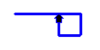
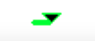
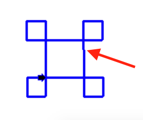

# For Loops

## Learning Objectives: For Loops

- Explain `for` loop syntax
- Identify the causes of an infinite loop
- Identify the relationship between patterns, loops, and output

## For Loops

### For Loop Syntax

Before you can start writing a __loop__, you need to be able to identify recurring patterns. Let’s take something simple:
```cpp
cout << "Hello" << endl;
cout << "Hello" << endl;
cout << "Hello" << endl;
cout << "Hello" << endl;
cout << "Hello" << endl;
```

The pattern is `cout << "Hello" << endl;`, and it is repeated five times. Since we know that the loop needs to run exactly _five_ times, a `for` loop can be used. Here is how you write a `for` loop that repeats five times.
```cpp
for (int i = 0; i < 5; i++) {
    cout << "Hello" << endl;
}
```

Like __conditionals__, `for` loops are code blocks. However, in addition to a __boolean__ statement(s), you also declare, initialize, and increment a __variable__ called the loop __iterator__. All of the code that will be repeated are placed between the curly braces `{}`. It is recommended that you __indent__ the code within the curly braces, but it is not necessary for the loop to run.

### Understanding the Loop Header

Try the code below
```cpp
for (int i = 0; i < 5; i++) {
    cout << "Loop #" << i << endl;
}
```

The loop ran five times, but the variable `i` did not start at `1`. Instead, it started at `0`. C++ , like most programming languages, starts counting from 0 by default. C++ will continue counting up to, but not including, 5. The `i++` tells the system to continue counting up by `1` and the `i < 5` tells the system to stop counting _before_ reaching 5.

> <b>What happens if you:</b>
> 
> - Replace `"Loop #" << i` in the code above to `"Loop #" << i + 1`?
> - Replace `i < 5` with `i < 6` in the loop header and change the print statement back to `"Loop #" << i`?
> - Replace `i < 5` with `i <= 5` in the loop header?
> - Replace `i++` with `i--` in the loop header?

> <b>Infinite Loops</b>
>
> If you aren't careful, you can wind up with an __infinite loop__. This means that you have a loop that never ends. In the example above, if you change `i++` to `i--` then `i` will decrease by 1 after every iteration. This causes the loop iterator to never reach its specified value. The boolean expression continues to be true and the system continues to print until it times out. Always check your loop header to ensure that it does what you intend for it to do.

> <b>For Loop Syntax</b>
> 
> Select __all__ of code snippets below that will print `Loops are awesome!` exactly __10__ times.
> - ```cpp
>   for (int i = 0; i < 9; i++) {
>       cout << "Loops are awesome!" << endl;
>   }
>   ```
> - ```cpp
>   for (int i = 0; i <= 9; i++) {
>       cout << "Loops are awesome!" << endl;
>   }
>   ```
> - ```cpp
>   for (int i = 0; i < 10; i++) {
>       cout << "Loops are awesome!" << endl;
>   }
>   ```
> - ```cpp
>   for (int i = 0; i <= 10; i++) {
>       cout << "Loops are awesome!" << endl;
>   }
>   ```
>
> > <b>Answer:</b>
> >
> > - ```cpp
> >   for (int i = 0; i <= 9; i++) {
> >       cout << "Loops are awesome!" << endl;
> >   }
> >   ```
> >
> > - ```cpp
> >   for (int i = 0; i < 10; i++) {
> >       cout << "Loops are awesome!" << endl;
> >   }
> >   ```
>
> > <b>Rationale:</b>
> >
> > Since all of the loop iterators start at 0, you have to count 0 as the first iteration. You want a total of 10 iterations which is why only choices #2 and #3 are correct. Remember that the operator `<` does not include the end value but the `<=` operator does.

## Turtle Graphics

Before continuing with loops, we are going to learn how to create graphical output with the __Turtle Graphics__ library. Like a pencil on paper, the turtle object leaves a line as it moves around the screen.

### Turtle Syntax

The first step is to create a __screen__ for the turtle to move around in using the command `TurtleScreen` followed by a variable name to call that screen (i.e. `screen`). In parentheses after `screen`, you can specify the dimensions of the screen in terms of __width__ and __height__ respectively (i.e. `400`, `300`). Then we can create our __turtle__ using the command `Turtle` followed by a variable name for that turtle (i.e. `tina`). Finally in parentheses, we put in `screen` to associate the turtle with the screen that we created previously. The code below produces a turtle and a screen for the turtle to move around in.
```cpp
TurtleScreen screen(400, 300); //width 400 pixels and height 300 pixels
Turtle tina(screen); //creates a turtle named tina inside the screen
```

> <b>IMPORTANT</b>
> 
> It is very __IMPORTANT__ that you __DO NOT__ edit the header as that will cause the program to run incorrectly.
> ```cpp
> #include <iostream>
> #include "CTurtle.hpp"
> #include "CImg.h"
> using namespace cturtle;
> using namespace std;
> ```
> The header above enables you to use the Turtle Graphics library as well as the C Image library. Thus, the header should never be altered.

### Turtle Commands

In order to view the turtle object, it is not enough just to create it. You must give instructions to the turtle object in order for it to “move” around the screen. Here is a list of basic turtle commands that you can give to `tina` the turtle object:

| Command	         | Parameter                                  | Description
|--------------------|-----------------                           |--------------------
| `tina.forward(n)`  | Where `n` represents the number of pixels  | Move the turtle forward
| `tina.backward(n)` | Where `n` represents the number of pixels  | Move the turtle backward
| `tina.right(d)`    | Where `d` represents the number of degrees | Turn the turtle to the right
| `tina.left(d)`     | Where `d` represents the number of degrees | Turn the turtle to the left

Let’s try this very simple command below.
```cpp
TurtleScreen screen(400, 300);
Turtle tina(screen);
tina.forward(100);
screen.exitonclick();
```

__What does the `screen.exitonclick()` command do?__

By default, the screen will close itself automatically once the program reaches the end of the code. However, if you want the screen to remain open, you can use `screen.exitonclick()` to tell the program to keep the screen open until the screen is clicked with a cursor. Go ahead and try clicking on the screen.

> <b>Recognizing For Loop Pattern</b>
> 
> Given the following code snippet:
> ```cpp
> tina.forward(100);
> tina.right(90);
> tina.forward(100);
> tina.right(90);
> tina.forward(100);
> tina.right(90);
> tina.forward(100);
> tina.right(90);
> ```
> Select __all__ of the following that will produce the same output as the code above using a for loop?
> - ```cpp
>   for (int i = 0; i < 4; i++) {
>       tina.forward(100);
>       tina.right(90);
>   }
>   ```
> - ```cpp
>   for (int i = 1; i < 4; i++) {
>       tina.forward(100);
>       tina.right(90);
>   }
>   ```
> - ```cpp
>   for (int i = 1; i < 5; i++) {
>       tina.forward(100);
>       tina.right(90);
>   }
>   ```
> - ```cpp
>   for (int i = 20; i < 24; i++) {
>       tina.forward(100);
>       tina.right(90);
>   }
>   ```
>
> > <b>Answer:</b>
> > 
> > - ```cpp
> >   for (int i = 0; i < 4; i++) {
> >       tina.forward(100);
> >       tina.right(90);
> >   }
> >   ```
> > - ```cpp
> >   for (int i = 1; i < 5; i++) {
> >       tina.forward(100);
> >       tina.right(90);
> >   }
> >   ```
> > - ```cpp
> >   for (int i = 20; i < 24; i++) {
> >       tina.forward(100);
> >       tina.right(90);
> >   }
> >   ```
>
> > <b>Rationale:</b>
> > 
> > All of the choices above are correct __except__ choice #2. It’s important to recognize that the `tina.forward(100);` and `tina.right(90);` commands occur exactly __four__ times. Thus, a loop that iterates those commands four times is needed. While all of the choices have a loop header that runs four times, choice #2 has a header that only runs __three__ times and is therefore incorrect.

## Turtle Coding: For Loop

### Customize Your Turtle

You may choose to change the dimensions of your turtle screen whenever you’d like. Also, the following table provides additional commands you can use to customize `tina` the turtle.

| Command                    | Parameter       | Examples
|----------------------------|-------------    |------------
| `tina.pencolor({"COLOR"})` | Where `COLOR` represents the track or line color you want tina to leave behind | red, orange, yellow, green, blue, purple
| `tina.width(W)` | Where `W` represents how wide (in pixels) tina’s track is | any positive integer (e.g. 1, 10, 123, etc.)
| `tina.shape("SHAPE")` | Where `SHAPE` represents the shape tina takes | triangle, indented triangle, square, arrow
| `tina.speed(SPEED)` | Where `SPEED` represents how fast tina moves | TS_FASTEST, TS_FAST, TS_NORMAL, TS_SLOW, 

### Turtle Challenges

Now that you know how to customize tina, try to recreate the images you see below using your knowledge of for loops.

__Challenge 1__


> <b>Hint</b>
> 
> There are multiple ways to accomplish this task but the trick lies within finding the __pattern__ and then repeating it a __specific number of times__. One pattern in particular is to:
> 1. Go forward (creating a long line).
> 2. Make a right turn.
> 3. Go forward (creating a small line).
> 4. Make a right turn.
> 5. Go forward (creating another small line).
> 6. Make a right turn.
> 7. Go forward (creating a final small line).
> 8. Repeat steps #1 through #7 three more times for a total of __four__ iterations.
> 
> The pattern should look something like this:
>
> 

__Challenge 2__


> <b>Hint</b>
> 
> Since a circle has 360 degrees, you will need a loop that repeats 360 times. Be careful about how far the turtle moves forward and turns. The circle can get very big, very quickly.

__Challenge 3__


> <b>Hint</b>
> 
> The pattern here is to move forward and make a right turn.
>
> 
>
> The trick lies within the fact that the distance the turtle moves has to get larger as the loop advances. Think of some operators that you can use to make the loop iterator variable get bigger during each iteration.

> <b>NOTE</b>
> 
> Due to the dynamic and graphical nature of the Turtle Graphics library, __jagged__ lines and __spotty__ pixels may appear randomly as the output is being drawn. This is completely __normal__!
> 
> 

__Sample solutions__

```cpp
tina.pencolor({"blue"});
tina.width(2);
tina.shape("arrow");
tina.speed(TS_SLOWEST);

for (int i = 0; i < 4; i++) {
    tina.forward(75);
    tina.right(90);
    tina.forward(25);
    tina.right(90);
    tina.forward(25);
    tina.right(90);
    tina.forward(25);
}
```

```cpp
tina.pencolor({"red"});
tina.width(2);
tina.shape("square");
tina.speed(TS_FASTEST);

for (int i = 0; i < 360; i++) {
    tina.forward(1);
    tina.right(1);
}
```

```cpp
tina.pencolor({"green"});
tina.width(2);
tina.shape("triangle");
tina.speed(TS_NORMAL);

for (int i = 10; i <= 200; i+=10) {
    tina.forward(i);
    tina.right(90);
}
```

> <b>For Loop Iterator Variable</b>
> 
> Here is the output to a sample program:
> ```cpp
> 2
> 4
> 6
> 8
> 10
> ```
> Fill in the blanks below so that the loop outputs what’s shown above.
> ```cpp
> for (int n=__; n__10; n+=__) {
>     cout << __ << endl;
> }
> ```
>
> > <b>Answer:</b>
> >
> > ```cpp
> > for (int n=2; n<=10; n+=2) {
> >     cout << n << endl;
> > }
> > ```
>
> > <b>Rationale:</b>
> > 
> > First, it is important to determine the pattern of the output. `2` is printed first and `10` is printed last. In addition, the numbers from `2` through `10` are printed in increments of `2`s. Noticing this pattern enables us to fill out the loop header like so:
> > 
> > `for (int n=2; n<=10; n+=2)`
> > 
> > Finally, we need to print the output. Remember that the loop iterator variable `n` is an integer itself so it can be printed like so:
> > 
> > `cout << n << endl;`

## Formative Assessment 1

> <b>Summation Using a For Loop</b>
> 
> Construct a program using the code blocks below that incorporates a `for` loop to find the sum of all numbers between 1 and 100, and then prints that cumulative sum. The program should __include both 1 and 100__ in the sum.
> 
> __Hint:__ You will not need to use all of the blocks
> 
> ```cpp
> for (int i = 1; i < 100; i++) {
> ```
>
> ```cpp
> int sum = 0;
> ```
>
> ```cpp
> for (int i = 0; i < 100; i++) {
> ```
>
> ```cpp
> for (int i = 1; i <= 100; i++) {
> ```
> 
> ```cpp
> }
> ```
>
> ```cpp
> sum += i;
> ```
>
> ```cpp
> cout << sum << endl;
> ```
>
> > <b>Answer:</b>
> >
> > ```cppp
> > int sum = 0;
> > for (int i = 1; i <= 100; i++) {
> >     sum += i;
> > }
> > cout << sum << endl;
> > ```
>
> > <b>Rationale:</b>
> > 
> > Since we want to include the numbers from `1` through `100` in our sum, which starts at `0`, the appropriate loop header to use will be `for (int i = 1; i <= 100; i++)`. Remember that `<` is not inclusive, but `<=` is. The loop iterator variable `i` is then added to the `sum` during each iteration. Finally, the `sum` is printed. Thus, the correct solution is:
> > ```cpp
> > int sum = 0;
> > for (int i = 1; i <= 100; i++) {
> >     sum += i;
> > }
> > cout << sum << endl;
> > ```

## Formative Assessment 2

> <b>For Loop Headers</b>
> 
> Which of the following `for` loop headers will loop __exactly__ 100 times? Ignore the value of the iterating variable and focus on the __number of times__ the loop body will be executed.
> 
> __Note:__ There may be more than one correct answer.
> - ```for (int i = 0; i < 100; i++)```
> - ```for (int i = 0; i <= 100; i++)```
> - ```for (int i = 1; i < 100; i++)```
> - ```for (int i = 1; i <= 100; i++)```
>
> > <b>Answer:</b>
> > 
> > - ```for (int i = 0; i < 100; i++)```
> > - ```for (int i = 1; i <= 100; i++)```
>
> > <b>Rationale:</b>
> > 
> > Only choices #1 and #4 are correct because they are both executed __exactly__ 100 times. `for (int i = 0; i < 100; i++)` goes from 0 to 99 and `for (int i = 1; i <= 100; i++)` goes from 1 to 100. Both of those ranges include 100 iterations.
> > 
> > `for (int i = 0; i <= 100; i++)` goes from 0 to 100 which is a total of 101 iterations.
> > 
> > `for (int i = 1; i < 100; i++)` goes from 1 to 99 which is only 99 iterations.