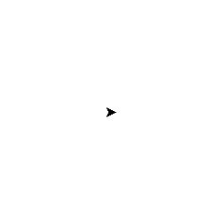
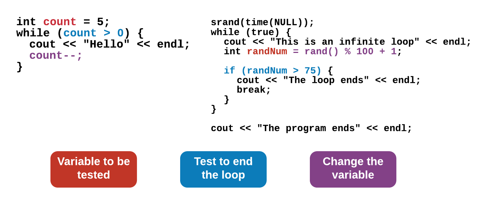

# While Loops

## Learning Objectives: While Loops

- Explain `while` loop syntax
- Identify the causes of an infinite `while` loop
- Describe the `break` statement as it relates to a `while` loop

## While Loops

### While Loop Syntax

`while` loops, like `for` loops, use curly braces `{}` and indents for all commands that should be repeated. However, `for` loops generally contain 3 elements (an initialized variable, a boolean expression involving that variable, and a change in the value of that variable) while a `while` loop usually contains just a boolean expression. The `for` and `while` loops below produce the same results.
```cpp
for (int i = 0; i < 5; i++) {
    cout << "Loop#: " << i << endl;
}
```
```cpp
int i = 0;
while (i < 5) {
    cout << "Loop# " << i << endl;
    i++;
}
```

Note that the variable declaration and initialization happen _before_ the start of the `while` loop and any changes that occur to the variable happen _within_ the body of the curly braces `{}`. On the other hand, everything happens in one step within parentheses `()` when using a `for` loop.

Here is another example of a `while` loop that prints `Hello` based on the value of the variable `count`.
```cpp
int count = 5; // some random number set by user
while (count > 0) {
    cout << "Hello" << endl;
    count--;
}
```

> <b>What happens if you:</b>
> 
> - Change the while statement to `while (count > -1 * count)`?
> - Replace `count--` in the code above with `count = count - 2`?
> - Change the while statement to `while (count < 10)`?

> <b>How does `while (count > -1 * count)` work?</b>
>
> To understand how the loop works, it's best to substitute values in for the variable `count`. In the first iteration, we have `while (5 > -1 * 5)`, this statement is true so the print command is executed. Since `count` gets decremented by 1 with each iteration, the `while` loop condition changes slightly every time like as follow:
> - `while (4 > -1 * 4)`
> - `while (3 > -1 * 3)`
> - `while (2 > -1 * 2)`
> - `while (1 > -1 * 1)`
> 
> Once the condition gets to `while (0 > -1 * 0)`, it no longer holds true and the while loop ends. The result is 5 `Hello`s being printed to the screen.

### Infinite Loops

Infinite loops are loops that do not have a test condition that causes them to stop. The following is a common mistake that results in an infinite loop:
```cpp
int count = 5; // some random number set by user
while (count > 0) {
    cout << "Hello" << endl;
}
```

Since the variable `count` never gets decremented. It remains at 5, and 5 will forever be greater than 0, so the loop will never stop.

> Copy the code above and try running it to see what happens. C++ will eventually stop the loop due to an output limit, but it may take some time before this happens.

### Why Use a While Loop?

If a `while` loop does the same thing as a `for` loop, then what is the purpose of having both? `while` loops are actually more useful when you are waiting for a certain event to occur. Imagine you are making a video game. The game should continue until the player loses all of their lives. You don’t know how long this will take, so a `while` loop is more appropriate. On the other hand, if you have more specific loop parameters, a `for` loop will be better.
```cpp
int player_lives = 3;

while (player_lives > 0) {
    // video game code
    // goes here
}
```

> <b>While vs. For Loops</b>
>
> Fill in the blanks below with either `while` or `for`.
> 
> A _____ loop usually contains a boolean expression(s) in its header and nothing else.
> 
> A _____ loop contains a header that specifies where an iterator variable starts, where it ends, and how it is changed per iteration.
>
> A _____ loop is better if a command needs to be executed a certain number of times.
>
> A counting variable needs to be declared and initialized before a _____ loop can be executed properly.
> 
> > <b>Answer:</b>
> >
> > A <u>while</u> loop usually contains a boolean expression(s) in its header and nothing else.
> >
> > A <u>for</u> loop contains a header that specifies where an iterator variable starts, where it ends, and how it is changed per iteration.
> > 
> > A <u>for</u> loop is better if a command needs to be executed a certain number of times.
> > 
> > A counting variable needs to be declared and initialized before a <u>while</u> loop can be executed properly.
> 
> > <b>Rationale:</b>
> >
> > One big difference between a `while` loop and a `for` loop is that a `while` loop only contains a boolean expression(s) within its header. That means a counting variable must be declared and initialized before a `while` loop can be used properly. On the other hand, the header of a `for` loop contains an iterator variable which helps to determine how many times the `for` loop will run.

## Turtle Coding: While Loop

Instead of a `for` loop, recreate the images below using a `while` loop.

> <b>Turtle Graphics Review</b>
> 
> - `tina.forward(n)` - Where `n` represents the number of pixels.
> - `tina.backward(n)` - Where `n` represents the number of pixels.
> - `tina.right(d)` - Where `d` represents the number of degrees.
> - `tina.left(d)` - Where `d` represents the number of degrees.
> - `tina.pencolor({"COLOR"})` - Where `COLOR` represents the track or line color you want tina to leave behind.
> - `tina.width(W)` - Where `W` represents how wide (in pixels) tina's track is.
> - `tina.shape("SHAPE")` - Where `SHAPE` represents the shape tina takes.
> - `tina.speed(SPEED)` - Where `SPEED` represents how fast tina moves

__Challenge 1__


> <b>Hint</b>
> 
> The pattern is still the same:
> 1. Go forward (creating a long line).
> 2. Make a right turn.
> 3. Go forward (creating a small line).
> 4. Make a right turn.
> 5. Go forward (creating another small line).
> 6. Make a right turn.
> 7. Go forward (creating a final small line).
> 8. Repeat steps #1 through #7 three more times for a total of __four__ iterations.
> 
> However, a `while` loop usually contains only a boolean expression(s) in its header. Thus, you must initialize a __counting variable__ _before_ the start of the `while` loop. Also, that counting variable should be __incremented__ _inside_ the body of the loop. The pattern you are trying to iterate is still the same:
>
> 

__Challenge 2__


> <b>Hint</b>
> 
> Since a circle has 360 degrees, you will need a loop that repeats 360 times. Be careful about how far the turtle moves forward and turns. The circle can get very big, very quickly.

__Challenge 3__



> <b>Hint</b>
> 
> The pattern here is to move forward and make a right turn.
>
> 
>
> The trick lies within the fact that the distance the turtle moves has to get larger as the loop advances. Think of some operators that you can use to make the loop iterator variable get bigger during each iteration.

__Sample solutions__
```cpp
tina.pencolor({"blue"});
tina.width(2);
tina.shape("arrow");
tina.speed(TS_SLOWEST);

int i = 0;
while (i < 4) {
    tina.forward(75);
    tina.right(90);
    tina.forward(25);
    tina.right(90);
    tina.forward(25);
    tina.right(90);
    tina.forward(25);
    i++;
}
```

```cpp
tina.pencolor({"red"});
tina.width(2);
tina.shape("square");
tina.speed(TS_FASTEST);

int i = 0;
while (i < 360) {
    tina.forward(1);
    tina.right(1);
    i++;
}
```

```cpp
tina.pencolor({"green"});
tina.width(2);
tina.shape("triangle");
tina.speed(TS_NORMAL);

int i = 10;
while (i <= 200) {
    tina.forward(i);
    tina.right(90);
    i+=10;
}
```

> <b>Note</b>
> 
> In __most__ cases, `for` loops and `while` loops can be used interchangeably. It is up to you to decide which one is better suited for your task.

> <b>For Loop to While Loop</b>
>
> Here is a sample code that makes use of a `for` loop:
> ```cpp
> for (int i = 10; i <= 100; i+=10) {
>   cout << i << endl;
> }
> ```
> Rearrange the code blocks below to produce the same output as above using a while loop instead.
> ```cpp
> }
> ```
>
> ```cpp
> while (i < = 100) {
> ```
>
> ```cpp
> i += 10;
> ```
>
> ```cpp
> int i = 10;
> ```
>
> ```cpp
> cout << i << endl;
> ```
>
> > <b>Answer:</b>
> >
> > ```cpp
> > int i = 10;
> > while (i < = 100) {
> >     cout << i << endl;
> >     i += 10;
> > }
> > ```
>
> > <b>Rationale:</b>
> >
> > A `while` loop requires the following:
> > 1. An iterator or counting variable _before_ the keyword `while`.
> > 2. A boolean expression in `()` or header _following_ the keyword `while`.
> > 3. A change in the iterator or counting variable _inside_ the body of the `while` loop.
> >
> > Thus, the solution is:
> > ```cpp
> > int i = 10;
> > while (i <= 100) {
> >     cout << i << endl;
> >     i+=10;
> > }
> > ```


## Break Statement

### Infinite Loops Are Bad, Right?

Well, that depends. If an infinite loop is caused because the counting variable isn’t incremented, then it’s a bug. However, some programmers purposely create a condition that will always evaluate to true. Therefore, the loop will always run. In such cases, a `break` statement is used to stop the loop at a particular point in the program.

Take a look at the following program:
```cpp
#include <iostream>
using namespace std;

int main() {

    srand(time(NULL)); // start randomizer every time program runs
    while (true) {
        cout << "This is an infinite loop" << endl;
        int randNum = rand() % 100 + 1; // generate random number between 1 and 100
        
        if (randNum > 75) {
            cout << "The loop ends" << endl;
            break; // stop the loop
        } // end if condition
    } // end while loop
    
    cout << "The program ends" << endl;
    
    return 0;

}
```

Even though `while (true)` will always evaluate as a true statement, the loop never becomes infinite because of the `break` statement.

> <b>What happens if you:</b>
> 
> - Remove `break;` from the program?
> - Add `break;` to the line before `cout << "The loop ends" << endl;`?

__Comparing While Loops__

The `while` loops introduced on the previous pages look different from the `while` loop covered on this page; however, they both have the same components and behave similarly.



> <b>Break Statement Purpose</b>
>
> What purpose does the break statement serve?
> - The `break` statement is used to pause a program so that it can run at a later time.
> - The `break` statement is required in every `while` loop to separate sections of code.
> - The `break` statement is used to end a program.
> - The `break` statement is used to stop and exit a loop.
>
> > <b>Answer:</b>
> >
> > The `break` statement is used to stop and exit a loop.
>
> > <b>Rationale:</b>
> >
> > The `break` statement is used to stop and exit a loop __not__ a program. `break` statements are often used to prevent situations where an infinite loop might be involved; however, `break` statements are not always required.

## Formative Assessment 1

> <b>While Loop Syntax</b>
>
> Fill in the blanks below so that the while loop prints C++ 10 times.
> ```cpp
> int ____ = 0;
> while (count __ 10) {
>     cout << "C++" << endl;
>     count = count __ 1;
> }
> ```
> > <b>Answer:</b>
> >
> > ```cpp
> > int count = 0;
> > while (count < 10) {
> >     cout << "C++" << endl;
> >     count = count + 1;
> > }
> > ```
>
> > <b>Rationale:</b>
> >
> > The counting variable that is being used in the code is called `count`. If `count` is initialized to `0`, then __ten iterations__ will cause it to stop at `9`. Thus, `count < 10` is the correct loop header. `count = count + 1` does the same thing as `count++` and will increment the counting variable by `1` after during each iterations.

## Formative Assessment 2

> <b>Break Statement Syntax</b>
>
> Fill in the blanks such that the loop will __stop and exit__ after it has run __100__ times.
> ```cpp
> int total = 0;
> while (true) {
>     total = _____ + 1;
>     if (total > __) {
>         _____;
>     }
> }
> ```
>
> > <b>Answer:</b>
> >
> > ```cpp
> > int total = 0;
> > while (true) {
> >     total = total + 1;
> >     if (total > 99) {
> >         break;
> >     }
> > }
> > ```
>
> > <b>Rationale:</b>
> >
> > `total` is the counting variable that is used in the code above. To increment `total` so that it iterates __100 times__, `total = total + 1` is needed. Since `total` starts at `0` and we want it to iterate 100 times before stopping, we will insert a `break` statement to stop the loop once `total > 99` becomes true. The range from `0` through `99` is a total of exactly 100 iterations.