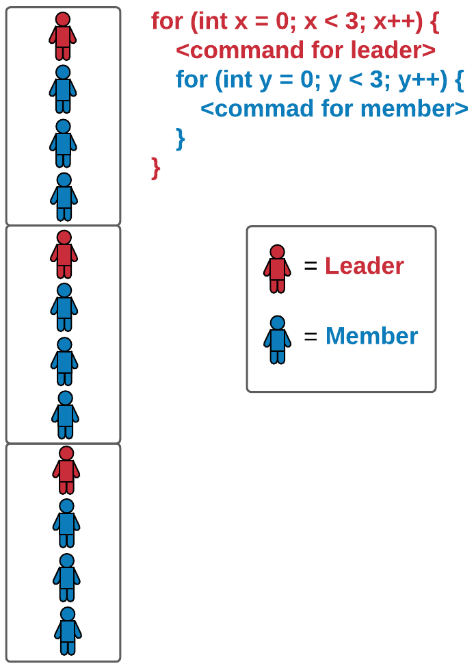

# Lab: For Loop

## Tutorial Lab 1: Using the For Loop

Try out the code below
```cpp
for (int x = 0; x < 11; x++) {
    if (x % 2 == 0) {
        cout << "Even" << endl;
    }
    else {
        cout << "Odd" << endl;
    }
}
```

__Program Summary__

1. The `for` loop runs through all the values of the variable `x` from 0 to 10 as specified in the loop header.
2. For each value of `x`, an expression is evaluated using a conditional `if` statement.
3. If `x` modulo `2` evaluates to 0, then print `Even` followed by a newline character.
4. If `x` modulo `2` does not evaluate to 0, then print `Odd` instead followed by a newline character.

> <b>Conditional For Loop</b>
> 
> Rearrange the code blocks below to create a program that outputs the following:
> ```
> Even Odd Even
> Odd Even Odd
> Even Odd Even
> Odd Even Odd
> Even Odd Even
> ```
> 
> - ```cpp
>   cout << "Even Odd Even" << endl;
>   ```
> - ```cpp
>   }
>   ```
> - ```cpp
>   for (int x = 0; x < 5; x++) {
>   ```
> - ```cpp
>   cout << "Odd Even Odd" << endl;
>   ```
> - ```cpp
>   else {
>   ```
> - ```cpp
>   }
>   ```
> - ```cpp
>   if (x % 2 == 0) {
>   ```
> - ```cpp
>   }
>   ```
> 
> > <b>Answer:</b> 
> > 
> > ```cpp
> > for (int x = 0; x < 5; x++) {
> >     if (x % 2 == 0) {
> >         cout << "Even Odd Even" << endl;
> >     }
> >     else {
> >         cout << "Odd Even Odd" << endl;
> >     }
> > }
> > ```
>
> > <b>Rationale:</b>
> > 
> > In order to produce the provided output, the code blocks with indentations should look like:
> > ```cpp
> > for (int x = 0; x < 5; x++) {
> >     if (x % 2 == 0) {
> >         cout << "Even Odd Even" << endl;
> >     }
> >     else {
> >         cout << "Odd Even Odd" << endl;
> >     }
> > }
> > ```

# Lab: While Loop

## Tutorial Lab 2: The While Loop

Try out the code below
```cpp
int counter = 0;
while (counter < 10) {
    cout << counter << endl;
    counter = counter + 1;
}
cout << "while loop ended" << endl;
```

__Program Summary__

1. A `counter` variable is initialized to keep track of how many times the loop will be executed.
2. The loop will run as long as `counter` is less than 10.
3. Each time the loop runs, the integer value of `counter` is printed to the screen.
4. The value of `counter` is then incremented by 1.
5. When `counter` reaches `10`, the boolean expression no longer evaluates to true and the program will exit the loop.
6. Before the program terminates, a statement is printed to the screen, indicating that the `while` loop has ended.
7. Recall that the `while` loop must have an exit condition. By incrementing the `counter` variable, we ensure that the loop will eventually end. If we do not increment `counter` in this loop, we will create an infinite loop because `counter` will never reach 10 or greater.

> <b>Infinite While Loop</b>
> 
> Which of the following code snippets will result in an __infinite__ `while` loop?
> - ```cpp
>   int lives = 0;
>   while (lives > 10) {
>       cout << "You are still in the game." << endl;
>   }
>   cout << "Game over." << endl;
>   ```
> - ```cpp
>   int lives = 10;
>   while (lives > 0) {
>       cout << "You are still in the game." << endl;
>       lives = lives - 1;
>   }
>   cout << "Game over." << endl;
>   ```
> - ```cpp
>   int lives = 10;
>   while (lives > 0) {
>       cout << "You are still in the game." << endl;
>       lives = lives + 1;
>   }
>   cout << "Game over." << endl;
>   ```
> - ```cpp
>   int lives = 10;
>   while (lives < 0) {
>       cout << "You are still in the game." << endl;
>       lives = lives + 1;
>   }
>   cout << "Game over." << endl;
>   ```
> 
> > <b>Answer:</b> 
> > 
> > ```cpp
> > int lives = 10;
> > while (lives > 0) {
> >     cout << "You are still in the game." << endl;
> >     lives = lives + 1;
> > }
> > cout << "Game over." << endl;
> > ```
>
> > <b>Rationale:</b>
> > 
> > Only choice #3 will result in an infinite `while` loop because `lives` will never reach `0` or less to terminate the loop.
> > 
> > The `while` loops in choices #1 and #4 are not executed because the boolean expression in the loop header never evaluates to true.
> > 
> > The `while` loop in choice #2 executes but is ended once `lives` reaches `0` due to `lives` being decremented after each iteration.

# Lab: Break Statement

## Tutorial Lab 3: Breaking from the While Loop

Try out the code below
```cpp
double result = 0;
double input;

while (true) {
    cout << "Enter a number to add to sum. "; 
    cout << "Or enter a non-number to quit and calculate sum." << endl;
    cin >> input;
    if (cin.good()) {
        result += input;
    }
    if (cin.fail()) {
        cout << "Sum = " << result << endl;
        break;
    }
}
```

> <b>What does `cin >> input;` do?</b>
> 
> The `cin >> input;` command records what a user enters on the screen and stores that information in the variable `input`. Note that `input` is of type `double`.

> <b>What do `cin.good()` and `cin.fail()` do?</b>
> 
> `cin.good()` checks to see if the input entered by the user was successful while `cin.fail()` checks to see if the input failed. Since `input` is of type `double`, only numerical values entered by the user will cause `cin >> input` to be successful, anything else will cause the input to fail.

__Program Summary__

1. Declare the variable `result` and initialize it to `0`. `result` will store the total of the summation.
2. Declare the variable `input`. `input` will store the information that the user enters.
3. Next we set up a `while` loop with `true` as the expression in the loop header. We do this because we want the loop to continue running and storing information from the user. Since we don’t know how much information the user will enter, a `while` loop is best for the situation.
4. The user is prompted to enter some information and that information is stored in the variable `input` which was declared earlier.
5. If the information was stored into `input` successfully, the value in `input` will be added to the value in `result`, our total summation.
6. If the information was not stored into `input` successfully, then the program will print out the total summation `result` and exit the `while` loop.

> <b>Infinite Loop Solution</b>
> 
> The following program results in an infinite loop:
> ```cpp
> string s;
> 
> while (true) {
>     cout << "Enter a lowercase vowel." << endl;
>     cin >> s;
>     if (s=="a" || s=="e" || s=="i" || s=="o" || s=="u") {
>         cout << "You successfully entered a vowel." << endl;
>     }
>     else {
>         cout << "You did not enter a vowel." << endl;
>     }
> }
> ```
> Select __all__ of the solutions below that will enable the program to resolve this infinite loop.
> - Insert a `break;` statement on the line after `cout << "You successfully entered a vowel." << endl;`.
> - Insert a `break;` statement on the line after `cout << "You did not enter a vowel." << endl;`.
> - Replace `while (true)` with `for (true)`.
> - Remove `cin >> s;`
>
> > <b>Answer:</b> 
> > 
> > - Insert a `break;` statement on the line after `cout << "You successfully entered a vowel." << endl;`.
> > - Insert a `break;` statement on the line after `cout << "You did not enter a vowel." << endl;`.
>
> > <b>Rationale:</b>
> > 
> > By definition, an __infinite loop__ occurs when a program has no test conditions to cause a loop to stop. The program above will indefinitely ask the user for input and store that input regardless of what the user enters.
> > 
> > Choices #1 and #2 are correct because they will offer a condition for the loop to stop depending on what the user enters.
> > 
> > Choice #3 will result in an error because the `for` loop syntax is incorrect.
> > 
> > Choice #4 will not solve the infinite loop and will keep printing the prompt without storing any information from the user.

# Lab Challenge: Loop Patterns

## Nested Loop Example

One of the benefits of nested loops is that they can be used to construct complex patterns. Imagine a classroom full of students and they are distributed evenly into smaller groups and asked to form a single line with their groups. The outer loop is like the group leader (represent in __red__ and `L`) and the inner loop is like the rest of the group members (represented in __blue__ and `M`.



```cpp
for (int x = 0; x < 3; x++) {
    cout << "L" << endl;
    for (int y = 0; y < 3; y++) {
        cout << "M" << endl;
    }
}
```

What is the pattern described by the above example? There are 3 leaders and __each__ leader has 3 members. However, note that the example shows the students standing in a _vertical_ line. What if you want to arrange the students in a _horizontal_ line like this instead?


By removing the `<< endl` commands from the code above, you can accomplish this task. Alternatively, you can also make use of an `if` and `else` statement instead of a nested loop. Both ways will produce the same result.

```cpp
for (int x = 0; x < 3; x++) {
    cout << "L";
    for (int y = 0; y < 3; y++) {
        cout << "M";
    }
}
```

```cpp
for (int x = 0; x < 12; x++) {
    if ((x == 0) || (x == 4) || (x == 8)) {
        cout << "L";
    }
    else {
        cout << "M";
    }
}
```

__Nested For Loop Challenge__

> <b>Assignment:</b>
> 
> For this challenge, you will use your knowledge of __patterns__, __conditionals__, and __nested__ `for` __loops__ to produce the following output:
> ```
> XOXOXOXOX
> OXO
> OXO
> XOXOXOXOX
> OXO
> OXO
> XOXOXOXOX
> OXO
> OXO
> ```
> 
> <b>Requirement:</b>
> 
> Your program __must__ include __at least two__ `for` loops, one nested within another, in order to receive credit. In addition, you are only allowed to use, __at most, two__ cout statements.
>
> > <b>Hint</b>
> > 
> > You should start by determining a pattern that repeats itself. One noticeable pattern is:
> > ```
> > XOXOXOXOX
> > OXO
> > OXO
> > ```
> > 
> > Try creating that particular pattern first, then iterate that pattern by modifying the existing loop(s).