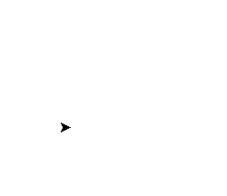

# Coding Exercises

## Exercise 1
Given the code below
```cpp
////////// DO NOT EDIT HEADER! //////////
#include <iostream>                    //
#include "CTurtle.hpp"                 //
#include "CImg.h"                      //
using namespace cturtle;               //
using namespace std;                   //
/////////////////////////////////////////

int main(int argc, char** argv) {
    
    TurtleScreen screen(400, 300); //You may edit the dimensions to fit your window
    Turtle tina(screen);
    tina.speed(TS_SLOWEST);
    
    //add code below this line
    


    //add code above this line
    
    screen.exitonclick();
    return 0;
    
}
```

### Follow the Turtle

Imagine that you have a Turtle object called `tina`. You want `tina` to move around on a screen and leave a trail that draws a triangle like below.



> <b>Turtle Graphics Review</b>
>
> - `tina.forward(n)` - Where `n` represents the number of pixels.
> - `tina.backward(n)` - Where `n` represents the number of pixels.
> - `tina.right(d)` - Where `d` represents the number of degrees.
> - `tina.left(d)` - Where `d` represents the number of degrees.
> - `tina.pencolor({"COLOR"})` - Where `COLOR` represents the track or line color you want tina to leave behind.
> - `tina.width(W)` - Where `W` represents how wide (in pixels) tina's track is.
> - `tina.shape("SHAPE")` - Where `SHAPE` represents the shape tina takes.
> - `tina.speed(SPEED)` - Where `SPEED` represents how fast tina moves

Using a `for` loop, direct `tina` to follow the __exact__ same path as above. Your code __must__ include the following in order for you to receive credit for your work.

__Requirements:__

- `tina` must move exactly as shown in the graphic above.
- You must include a `for` loop.
- You must declare an iterating variable `i` and initialize it to __zero__ (e.g. `int i = 0`).
- Your loop __header__ must include `i++`. In other words, `i` gets incremented by `1` after each iteration.
- You __must__ include the following __two__ commands in your code:
    - `tina.left(120);`
    - `tina.forward(100);`

## Exercise 2
Given the code below
```cpp
#include <iostream>
using namespace std;

int main(int argc, char** argv) {
  
  string x = argv[1];
  
  //add code below this line
  


  //add code above this line
  
  return 0;
  
}
```

### Print Ten Times

Write a program that takes in a string `x` from the user as an argument and then prints that information __ten__ times using a loop.

__Requirements:__

- You must include a `for` or `while` loop in your code.
- You must include __one and only one__ `cout` and `endl` statement in your code.
- For example, your output should look like this:
    ```
    10
    10
    10
    10
    10
    10
    10
    10
    10
    10
    ```
  instead of this:
    ```
    10101010101010101010
    ```

__Compile and test your code with a few different values__

- Compile and test with `10`
    ```
    10
    10
    10
    10
    10
    10
    10
    10
    10
    10
    ```
- Compile and test with `hello`
    ```
    hello
    hello
    hello
    hello
    hello
    hello
    hello
    hello
    hello
    hello
    ```
- Compile and test with `C++`
    ```
    C++
    C++
    C++
    C++
    C++
    C++
    C++
    C++
    C++
    C++
    ```

## Exercise 3
Given the code below
```cpp
#include <iostream>
using namespace std;

int main(int argc, char** argv) {
  
  int a = stoi(argv[1]);
  int b = stoi(argv[2]);
  
  if (a > b) {
    int c = b;
    b = a;
    a = c;
  }
  
  //add code below this line
  


  //add code above this line
  
  return 0;
  
}
```

### Consecutive Sums

You are trying to produce a program that takes in two __integer__ arguments from the user and then prints the __consecutive sum__ of all numbers between those integers inclusively. For example, arguments `5` and `8` will result in a sum of `26` (5 + 6 + 7 + 8 = 26). If the integer arguments are the same value, the program will simply print that value as the sum.

__Requirements:__

- Declare and initialize a variable to keep tracking of your __sum__.
- Use __any__ loop to find the __consective sum__ between the integer variables `a` and `b`.
- If `a` and `b` are the same integers, then print _either_ `a` or `b` as the sum.

> <b>What does the `if (a > b)` conditional in the code do?</b>
>
> The `if` conditional enables the program to sort the arguments from the user from smaller to larger. For example, if the user types `8` and `5`, the conditional will rearrange the arguments so that `a` takes on the smaller argument of `5` and `b` takes on the larger argument of `8`.

__Compile and test your code with a few different values__

- Compile and test with `5` & `8`
    ```
    26
    ```
- Compile and test with `1` & `1`
    ```
    1
    ```
- Compile and test with `9` & `3`
    ```
    42
    ```
- Compile and test with `-3` & `-4`
    ```
    -7
    ```

## Exercise 4

### Breaking the Loop

The following program contains one or more infinite loops that prevent the program from printing the desired output.
```cpp
#include <iostream>
using namespace std;

int main() {

    for (int i = 100; i <= 100; i--) {
        if (i == 0) {
            cout << "Print me!" << endl;
        }
        else {
            while (true) {
                i++;
                cout << "Don't print me!" << endl;
            }
        }
    }

    return 0;

}
```

Using what you know about `break` statements, fix the program so that it runs, prints correctly, and terminates successfully.

__Requirements:__

- You __cannot__ make any changes to the code that already exists. If you accidentally delete any existing code, you can copy and paste the entire program from above.
- You need to add __two and only two__ `break;` statements to the program.
- The program’s expected output is: `Print me!`

## Exercise 5
Given the code below
```cpp
#include <iostream>
using namespace std;

int main() {
    
    //add code below this line
    


    //add code above this line
    
    return 0;
    
}
```

### “Count-Up”

For this assignment, you will use a nested loop to produce the unique output below.
```
....1
...2
..3
.4
5
```

> <b>Hint</b>
> 
> As you move down the output, the numerical value increases, but the number of `.` decreases. Think about the relationship between the number of `.` printed and the numerical value printed on each line.

__Requirements:__

- You must include __two and only two__ loops in your code, one nested inside of another.
- You must include __two and only two__ `cout` statements, one for each of your loop.