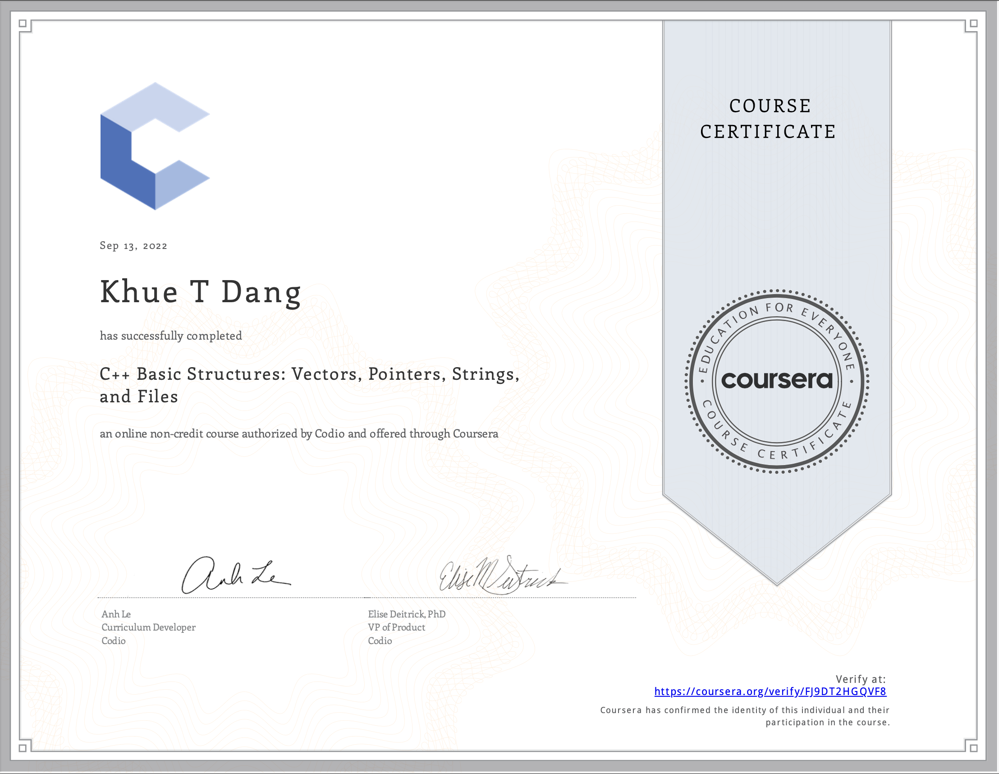

# C++ Basic Structures: Vectors, Pointers, Strings, and Files

- This directory contains all of my assignments from the Coursera Course: [C++ Basic Structures: Vectors, Pointers, Strings, and Files](https://www.coursera.org/learn/cpp-basic-structures-vectors-pointers-strings-and-files?specialization=hands-on-cpp)

# Table of Content
- Week 1: [Vectors](https://github.com/ginny100/Programming-in-C-plus-plus-A-Hands-on-Introduction/tree/master/Course%202%20-%20C%2B%2B%20Basic%20Structures%20-%20Vectors%2C%20Pointers%2C%20Strings%2C%20and%20Files/Week%201%20-%20Vectors)
    - Lesson 1: [Array Basics](https://github.com/ginny100/Programming-in-C-plus-plus-A-Hands-on-Introduction/tree/master/Course%202%20-%20C%2B%2B%20Basic%20Structures%20-%20Vectors%2C%20Pointers%2C%20Strings%2C%20and%20Files/Week%201%20-%20Vectors/Lesson%201%20-%20Array%20Basics)
    - Lesson 2: [Vector Basics](https://github.com/ginny100/Programming-in-C-plus-plus-A-Hands-on-Introduction/tree/master/Course%202%20-%20C%2B%2B%20Basic%20Structures%20-%20Vectors%2C%20Pointers%2C%20Strings%2C%20and%20Files/Week%201%20-%20Vectors/Lesson%202%20-%20Vector%20Basics)
    - Lesson 3: [Lab - Review Content and Practice](https://github.com/ginny100/Programming-in-C-plus-plus-A-Hands-on-Introduction/tree/master/Course%202%20-%20C%2B%2B%20Basic%20Structures%20-%20Vectors%2C%20Pointers%2C%20Strings%2C%20and%20Files/Week%201%20-%20Vectors/Lesson%203%20-%20Lab%20-%20Review%20Content%20and%20Practice)
    - Lesson 4: [Lab - Review Content and Practice](https://github.com/ginny100/Programming-in-C-plus-plus-A-Hands-on-Introduction/tree/master/Course%202%20-%20C%2B%2B%20Basic%20Structures%20-%20Vectors%2C%20Pointers%2C%20Strings%2C%20and%20Files/Week%201%20-%20Vectors/Lesson%204%20-%20Lab%20-%20Review%20Content%20and%20Practice)
    - Lesson 5: [Coding Exercises](https://github.com/ginny100/Programming-in-C-plus-plus-A-Hands-on-Introduction/tree/master/Course%202%20-%20C%2B%2B%20Basic%20Structures%20-%20Vectors%2C%20Pointers%2C%20Strings%2C%20and%20Files/Week%201%20-%20Vectors/Lesson%205%20-%20Coding%20Exercises)
- Week 2: [Pointers](https://github.com/ginny100/Programming-in-C-plus-plus-A-Hands-on-Introduction/tree/master/Course%202%20-%20C%2B%2B%20Basic%20Structures%20-%20Vectors%2C%20Pointers%2C%20Strings%2C%20and%20Files/Week%202%20-%20Pointers)
    - Lesson 1: [Pointer Basics](https://github.com/ginny100/Programming-in-C-plus-plus-A-Hands-on-Introduction/tree/master/Course%202%20-%20C%2B%2B%20Basic%20Structures%20-%20Vectors%2C%20Pointers%2C%20Strings%2C%20and%20Files/Week%202%20-%20Pointers/Lesson%201%20-%20Pointer%20Basics)
    - Lesson 2: [Lab - Review Content and Practice](https://github.com/ginny100/Programming-in-C-plus-plus-A-Hands-on-Introduction/tree/master/Course%202%20-%20C%2B%2B%20Basic%20Structures%20-%20Vectors%2C%20Pointers%2C%20Strings%2C%20and%20Files/Week%202%20-%20Pointers/Lesson%202%20-%20Lab%20-%20Review%20Content%20and%20Practice)
    - Lesson 3: [Coding Exercises](https://github.com/ginny100/Programming-in-C-plus-plus-A-Hands-on-Introduction/tree/master/Course%202%20-%20C%2B%2B%20Basic%20Structures%20-%20Vectors%2C%20Pointers%2C%20Strings%2C%20and%20Files/Week%202%20-%20Pointers/Lesson%203%20-%20Coding%20Exercises)
- Week 3: [Strings](https://github.com/ginny100/Programming-in-C-plus-plus-A-Hands-on-Introduction/tree/master/Course%202%20-%20C%2B%2B%20Basic%20Structures%20-%20Vectors%2C%20Pointers%2C%20Strings%2C%20and%20Files/Week%203%20-%20Strings)
    - Lesson 1: [String Basics](https://github.com/ginny100/Programming-in-C-plus-plus-A-Hands-on-Introduction/tree/master/Course%202%20-%20C%2B%2B%20Basic%20Structures%20-%20Vectors%2C%20Pointers%2C%20Strings%2C%20and%20Files/Week%203%20-%20Strings/Lesson%201%20-%20String%20Basics)
    - Lesson 2: [String Functions](https://github.com/ginny100/Programming-in-C-plus-plus-A-Hands-on-Introduction/tree/master/Course%202%20-%20C%2B%2B%20Basic%20Structures%20-%20Vectors%2C%20Pointers%2C%20Strings%2C%20and%20Files/Week%203%20-%20Strings/Lesson%202%20-%20String%20Functions)
    - Lesson 3: [String Iteration](https://github.com/ginny100/Programming-in-C-plus-plus-A-Hands-on-Introduction/tree/master/Course%202%20-%20C%2B%2B%20Basic%20Structures%20-%20Vectors%2C%20Pointers%2C%20Strings%2C%20and%20Files/Week%203%20-%20Strings/Lesson%203%20-%20String%20Iteration)
    - Lesson 4: [String Comparison](https://github.com/ginny100/Programming-in-C-plus-plus-A-Hands-on-Introduction/tree/master/Course%202%20-%20C%2B%2B%20Basic%20Structures%20-%20Vectors%2C%20Pointers%2C%20Strings%2C%20and%20Files/Week%203%20-%20Strings/Lesson%204%20-%20String%20Comparison)
    - Lesson 5: [Lab - Review Content and Practice](https://github.com/ginny100/Programming-in-C-plus-plus-A-Hands-on-Introduction/tree/master/Course%202%20-%20C%2B%2B%20Basic%20Structures%20-%20Vectors%2C%20Pointers%2C%20Strings%2C%20and%20Files/Week%203%20-%20Strings/Lesson%205%20-%20Lab%20-%20Review%20Content%20and%20Practice)
    - Lesson 6: [Coding Exercises](https://github.com/ginny100/Programming-in-C-plus-plus-A-Hands-on-Introduction/tree/master/Course%202%20-%20C%2B%2B%20Basic%20Structures%20-%20Vectors%2C%20Pointers%2C%20Strings%2C%20and%20Files/Week%203%20-%20Strings/Lesson%206%20-%20Coding%20Exercises)
- Week 4: [Files](https://github.com/ginny100/Programming-in-C-plus-plus-A-Hands-on-Introduction/tree/master/Course%202%20-%20C%2B%2B%20Basic%20Structures%20-%20Vectors%2C%20Pointers%2C%20Strings%2C%20and%20Files/Week%204%20-%20Files)
    - Lesson 1: [Reading a File](https://github.com/ginny100/Programming-in-C-plus-plus-A-Hands-on-Introduction/tree/master/Course%202%20-%20C%2B%2B%20Basic%20Structures%20-%20Vectors%2C%20Pointers%2C%20Strings%2C%20and%20Files/Week%204%20-%20Files/Lesson%201%20-%20Reading%20a%20File)
    - Lesson 5: [Coding Exercises](https://github.com/ginny100/Programming-in-C-plus-plus-A-Hands-on-Introduction/tree/master/Course%202%20-%20C%2B%2B%20Basic%20Structures%20-%20Vectors%2C%20Pointers%2C%20Strings%2C%20and%20Files/Week%204%20-%20Files/Lesson%205%20-%20Coding%20Exercises)

# Proof of Completion

