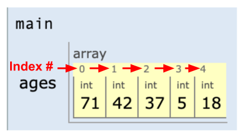
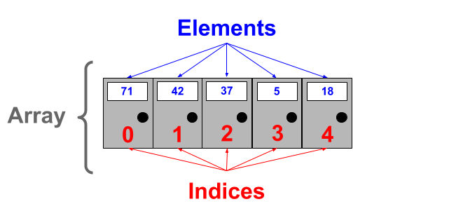
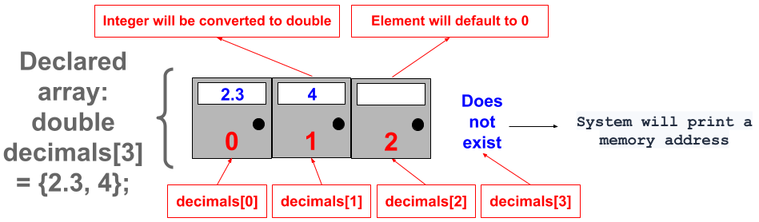

# Array Basics

## Learning Objectives: Array Basics

- Create and initialize an array
- Access and modify array elements
- Iterate through arrays using both a regular `for` loop and an _enhanced_ `for` loop
- Determine array output

## Creating an Array

### What Is an Array?

Before we discuss __vectors__, we will first learn about __arrays__, a simpler form of a vector. An __array__ is a data structure that stores a collection of data such as ints, doubles, strings, etc. This data is often referred to as the array’s __elements__. Being able to store elements into an array helps reduce the amount of time needed to declare and initialize variables. For example, if you wanted to store the ages of all family members in your household, you would typically have to declare and initialize integer variables and values for each family member.
```cpp
int Allan = 71;
int Bob = 42;
int Carol = 37;
int David = 5;
int Ellen = 18;

cout << Allan << endl;
```

> <b>What happens if you:</b>
> 
> - Change `Allan` in `cout << Allan << endl` to `Bob`, `Carol`, `David`, or `Ellen`?

### Array Creation

To avoid the repetitive task of declaring and initializing multiple variables, you can declare an array and directly assign values or elements into that array like below.
```cpp
int ages[] = {71, 42, 37, 5, 18};
```

__Method Syntax with Elements:__

- Specify the data type that the array will store (i.e. `int`).
- Declare the variable name for the array (i.e. `ages`) followed by empty brackets `[]` followed by the assignment symbol `=`.
- Elements assigned to the array are separated by commas `,` and enclosed within curly braces `{}`.

> <b>Additional information</b>
> 
> - If you used the Code Visualizer, you'll notice that the array variable `ages` refers to all of the elements as a collection. An array is considered to be a __collection__ that bundles all of the data that it holds.
>
> 
>
> Note that the first array slot, or __index__, is always `0` so `71` is located at index `0` instead of `1`.

Alternatively, you can create an array without any elements in which you will need to declare and specify the array variable name and size before you can assign elements to the array.
```cpp
int ages[5];
```

__Method Syntax without Elements__

- Specify the data type that the array will store (i.e. `int`).
- Declare the variable name for the array (i.e. `ages`) followed by the number of elements you want the array to hold within brackets (i.e.`[5]`).

> <b>Additional information</b>
> 
> - Note that when you declare an array without initializing any elements, the system will still reserve enough memory for the array to hold the specified number of elements. This means that you can initialize elements within the array later on.

### Array Details

If an element within an array has not been initialized yet, printing it will cause the system to output __random memory data__. Random memory data is often generated when array elements are not initialized.
```cpp
int ages[5];
cout << ages[0] << endl;
```

Note that `ages[0]` in the example above refers the element at __index__ `0`, also known as the first __position__ within the array. Currently, the element at the first position is not initialized so printing the first element will only output random memory data. In fact, the same will happen if you try to print any other elements within the array. Additionally, all elements within the array must be of the same type. If you try to store a string within an integer array, or a double within a boolean array, you will get an error message.
```cpp
int ages[] = {71, 42, 37, 5, "eighteen"};
  
cout << ages[4] << endl;
```

> <b>What happens if you:</b>
> 
> - Change `"eighteen"` in the code above to the integer `18`?
> - Replace all your code with just `int ages[];`

> <b>IMPORTANT</b>
> 
> - When you create an array in C++, you _must_ specify the number of elements that you expect the array to hold. Otherwise, you will get an error.

P.O. Boxes at the postal office are symbolically similar to arrays. Each row of P.O. Boxes is like an array, except each box can only store _one_ item (element) and each item within that row must be of the same type (i.e. integers).



> <b>Array Syntax</b>
> 
> Which of the following correctly contains the syntax for creating a __double__ array called `decimals` that stores elements from __1.00 through 5.00__?
> - ```cpp
>   int decimals[5];
>   ```
> - ```cpp
>   int decimals[] = {1.00, 2.00, 3.00, 4.00, 5.00};
>   ```
> - ```cpp
>   double decimals[5];
>   ```
> - ```cpp
>   double decimals[] = {1.00, 2.00, 3.00, 4.00, 5.00};
>   ```
>
> > <b>Answer:</b>
> > 
> > ```cpp
> > double decimals[] = {1.00, 2.00, 3.00, 4.00, 5.00};
> > ```
> 
> > <b>Rationale:</b>
> > 
> > Choices #1 and #3 only declare the array, no elements are initialized. Choice #2 tries to initialize `double` elements within an `int` array and thus, results in an error message. This leaves choice __#4__ as the correct answer.

## Accessing an Array

### Array Access

To access and print array elements, you need to know their position. The position at which an element is stored is called its __index__. For example, `names[0]` refers to the first element in the array called `names`. Array indices always start at `0` and increment by 1 with each element that comes next. Due to this, `numbers[4]` refers to the _fifth_ element in the array, _not_ the fourth.
```cpp
string names[] = {"Alan", "Bob", "Carol", "David", "Ellen"};

cout << names[0] << endl;
```

> <b>What happens if you:</b>
> 
> - Change `names[0]` in the code above to `names[2]`?
> - Change `names[0]` in the code above to `names[3]`?
> - Change `names[0]` in the code above to `names`?

> <b>IMPORTANT</b>
> 
> You may have noticed that printing the `names` array without specifying an index resulted in an output that included a mixture of numbers and letters. This occurs because printing an array actually prints its memory location, not its elements. You’ll learn how to print all elements in an array without having to specify all of their indices on a later page.

### Array Key Points
```cpp
bool bools[] = {true, false, true};
double decimals[] = {2.3, 4};
int integers[1];

cout << bools[0] << endl;
```

> <b>What happens if you:</b>
> 
> - Change `bools[0]` in the original code to `bools[1]`?
>
> > <b>Hint</b>
> > The system will print `0` because `bools[1]` refers to the second element in the `bools` array. Remember that `0` is the integer equivalent to `false` and `1` is the integer equivalent to `true`. To print their respective boolean equivalent, use `cout << boolalpha << bools[1] << endl;` instead.
> 
> - Change `bools[0]` in the original code to `decimals[1]`?
>
> > <b>Hint</b>
> > The system will print `4` because `decimals[1]` refers to the second element in the `decimals` array.
>
> - Change `bools[0]` in the original code to `integers[1]`?
> 
> > <b>Hint</b>
> > The system will print random memory data because `integers[1]` is not valid within the `integers` array. Currently there is only one element at the first index which has not been formally initialized yet.
>
> - Change `int integers[1];` in the original code to `int integers[1] = {1.2};` and `cout << bools[0] << endl;` to `cout << integers[0] << endl;`?
>
> > <b>Hint</b>
> > The system will return an error message. Though you have tried to initialize the first element within the `integers` array to `1.2`, the system will not allow you to put a double element into an integer array. However, it is possible to put an integer element into a double array because integers can be expressed as doubles but not vice versa.

> <b>IMPORTANT</b>
> 
> Here are some key points to keep in mind when working with arrays:
> - When you declare an array, you must specify the number of elements you wish the array to hold before you can initialize any elements. One exception is if you declare and initialize the array and elements at the same time. Doing so means you do not need to specify the number of elements in brackets `[]` since the system will determine that based on the number of elements you have initialized.
>
> - If you do not initialize any elements, printing the elements will only result in random memory data.
>
> - If you try to access an element position that is not valid (i.e. the second element in the `integers` array), the system will also output random memory data.
>
> - Elements must be of the same type as the array. The only exception is that integers can be expressed as doubles and can therefore be put into a double array.



> <b>Array Indices</b>
> 
> Given the following code:
> ```cpp
> double tenths[] = {1.2, 2.3, 3.4, 4.5};
> ```
> Determine what will be printed for each of the following print statements.
> 1. `cout << tenths[0] << endl;` will print ___.
> 2. `cout << tenths[2] << endl;` will print ___.
> 3. `cout << tenths[4] << endl;` will print ___.
> 
> > <b>Answer:</b>
> > 
> > 1. `cout << tenths[0] << endl;` will print <u>1.2</u>.
> > 2. `cout << tenths[2] << endl;` will print <u>3.4</u>.
> > 3. `cout << tenths[4] << endl;` will print <u>a memory address</u>.
> 
> > <b>Rationale:</b>
> > 
> > Remember that array indices always start at `0`. Thus, `tenths[0]` refers to the first element, `tenths[2]` refers to the third element, and `tenths[4]` refers to the fifth element. The first element is `1.2`, the third element is `3.4`, and the fifth element does not exist. Therefore, the system will return a memory address.

## Modifying an Array

### Array Modification

To modify an element within an array, simply find the index at which that element is stored and assign a new value to it.
```cpp
int grades[] = {85, 95, 48, 100, 92};
cout << grades[2] << endl;

grades[2] = 88; //88 will replace 48 at index 2
cout << grades[2] << endl;
```

> <b>What happens if you:</b>
> 
> - Change `int grades[] = {85, 95, 48, 100, 92};` in the code above to `int grades[5];`?
> - Copy the original code but change all `cout << grades[2] << endl;` to `cout << grades[3] << endl;`?
> - Change `grades[2] = 88;` in your current code to `grades[3] = 88;`?

### Modifying Multiple Arrays

You can create and modify as many arrays as you’d like. For example, you can create an array to store your family members and another array to store their age.
```cpp
string family[] = {"Dad", "Mom", "Brother", "Sister"};
int age[4];

cout << family[0] << " " << age[0] << endl;
cout << family[1] << " " << age[1] << endl;
cout << family[2] << " " << age[2] << endl;
cout << family[3] << " " << age[3] << endl;
```

> <b>What happens if you:</b>
> 
> - Add `age[0] = 50;` directly below the line `int age[4];`?
> - Add `age[1] = 45;` below the line `int age[4];` but before the cout statements?
> - Add `age[2] = 25;` below the line `int age[4];` but before the cout statements?
> - Add `age[3] = 20;` below the line `int age[4];` but before the cout statements?
> - Change `"Sister"` within the string array to `"Brother2"`?

> <b>IMPORTANT</b>
> 
> Since the integer array above was created without any initialization, random memory data were populated as elements within the array at first. Then by setting the array indices to specific values, you were able to modify the array to include the appropriate age for each family member.

> <b>Modifying Array Elements</b>
> 
> After outputting your code, you noticed that `Friday` is printed twice. Your code is shown below:
> ```cpp
> string weekdays[] = {"Monday", "Tuesday", "Wednesday", "Friday", "Friday"};
> ```
> Which of the following code snippets correctly modifies the array so that `Thursday` is printed __after__ `Wednesday` but __before__ the second `Friday`?
> - ```cpp
>   weekdays = "Thursday";
>   ```
> - ```cpp
>   weekdays[3] = "Thursday";
>   ```
> - ```cpp
>   weekdays[4] = "Thursday";
>   ```
> - ```cpp
>   weekdays[5] = "Thursday";
>   ```
>
> > <b>Answer:</b>
> > 
> > ```cpp
> > weekdays[3] = "Thursday";
> > ```
> 
> > <b>Rationale:</b>
> > 
> > In order to modify an array element, you must specify the index at which that element is located within brackets `[]`. Also, remember that array indices start at `0` for the first element, then `1` for the second element, etc. Since we want to replace the first `Friday` with `Thursday`, which is the fourth element in the array, we need to access index number `3`. Thus, the correct answer is choice __#2__: `weekdays[3] = "Thursday";`.

## Iterating an Array

### Array Iteration

Though we can add many elements to our array, printing each of them can get quite tedious. For example, if we have 10 names of friends in our array, we would need to specify each of their array index to print them.
```cpp
string friends[] = {"Alan", "Bob", "Carol", "David", "Ellen", "Fred", "Grace", "Henry", "Ian", "Jen"};

cout << friends[0] << endl;
cout << friends[1] << endl;
cout << friends[2] << endl;
cout << friends[3] << endl;
cout << friends[4] << endl;
cout << friends[5] << endl;
cout << friends[6] << endl;
cout << friends[7] << endl;
cout << friends[8] << endl;
cout << friends[9] << endl;
```

Luckily, we can use loops which we had learned previously to help us with this process. To print out all of our friends’ names without repeating the print statement ten times, we can use a `for` loop to iterate `10` times.

```cpp
string friends[] = {"Alan", "Bob", "Carol", "David", "Ellen", "Fred", "Grace", "Henry", "Ian", "Jen"};

for (int i = 0; i < 10; i++) {
    cout << friends[i] << endl;
}
```

> <b>What happens if you:</b>
> 
> - Change `cout << friends[i] << endl;` in the code above to `cout << friends[0] << endl;`?
> - Change the cout statement to `cout << friends[10] << endl;`?

> <b>IMPORTANT</b>
> 
> Did you notice that the print statement above includes `i` as the index for `friends`? We do this because `i` will take on the values specified by the `for` loop. The loop starts at `0` and increments by 1 until it reaches `9` (not including 10). Thus, `friends[0]` will print, then friends[1], so on and so forth until `friends[9]` is printed. Then the loop ends.

### Array Size

To make the iteration process easier, we can use the `sizeof()` operator to determine how many elements are in our array. To use `sizeof()`, just call it by using the keyword `sizeof` followed by the array name within parentheses `()`.
```cpp
string friends[] = {"Alan", "Bob", "Carol", "David", "Ellen", "Fred", "Grace", "Henry", "Ian", "Jen"};

cout << sizeof(friends) << endl;
```

__Why Does `sizeof(friends)` output `320`?__

Unfortunately, the `sizeof()` operator does not determine the _number_ of the elements within an array. Instead, `sizeof()` calculates the size of the array in _bytes_. In C++, a string takes up 32 bytes and since there are 10 string elements in the array, the _size_ of the array in bytes is _320_.

To calculate the _number of elements_ within an array, we will need to use `sizeof()` twice.
```cpp
string friends[] = {"Alan", "Bob", "Carol", "David", "Ellen", "Fred", "Grace", "Henry", "Ian", "Jen"};

cout << sizeof(friends) / sizeof(friends[0]) << endl;
```

`sizeof(friends)` calculates the array’s size in bytes and `sizeof(friends[0])` calculates the first element’s size in bytes. By dividing the array size by the element’s size, we were able to determine the number of elements that exist within the array. Note that it doesn’t matter whether we calculate the first element’s size or the second’s since all of the elements are of the same size (32 bytes each).

### Looping Through the Elements

Now that you can determine number of elements within an array, you can loop through the array to output each element individually.
```cpp
string friends[] = {"Alan", "Bob", "Carol", "David", "Ellen", "Fred", "Grace", "Henry", "Ian", "Jen"};

for (int i = 0; i < sizeof(friends) / sizeof(friends[0]); i++) {
    cout << friends[i] << endl;
}
```

> <b>What happens if you:</b>
> 
> - add `"Kate"` as an element to the array right after `"Jen"`?
> - remove `"Alan"` and `"Bob"` from the array?

Notice how `sizeof(friends) / sizeof(friends[0])` continues to keep track of how many elements are in our array even though we’ve made several changes.

> <b>Iterating Array Elements</b>
> 
> Construct a program using the code blocks below that iterates through the array and prints every element inside.
>
> __Hint:__ You will not need to use all of the blocks
> - ```cpp
>   double debt[] = {"23.67", "82.96", "34.51"};
>   ```
> - ```cpp
>   for (int i = 0; i <= 3; i++) {
>   ```
> - ```cpp
>   cout << debt[i] << endl;
>   ```
> - ```cpp
>   for (int i = 0; i < sizeof(debt)/sizeof(debt[0]); i++) {
>   ```
> - ```cpp
>   }
>   ```
> - ```cpp
>   System.out.println(debt);
>   ```
> - ```cpp
>   double debt[] = {23.67, 82.96, 34.51};
>   ```
>
> > <b>Answer:</b>
> > 
> > ```cpp
> > double debt[] = {23.67, 82.96, 34.51};
> > for (int i = 0; i < sizeof(debt) / sizeof(debt[0]); i++) {
> >     cout << debt[i] << endl;
> > }
> > ```
> 
> > <b>Rationale:</b>
> > 
> > The first step is to initialize all of the elements inside the array. The array type is __double__, therefore you cannot initialize the elements as strings (i.e `"23.67"`, etc.).
> >
> > Next, the `for` loop needs to run exactly __three__ times to iterate through the three elements that we have. You cannot use `for (int i = 0; i <= 3; i++) {` because that will cause the loop to run __four__ times. We do not have a fourth element so the system will end up outputting a memory data. Use `for (int i = 0; i < sizeof(debt)/sizeof(debt[0]); i++) {` instead because `sizeof(debt)/sizeof(debt[0])` will always keep track of how many elements are in our array.
> > 
> > Lastly, we need to print `debt[i]`, not `debt`. Remember, `debt` is the array itself, not the array elements. Printing `debt` will only print its memory address.
> >
> > Solution:
> > ```cpp
> > double debt[] = {23.67, 82.96, 34.51};
> > for (int i = 0; i < sizeof(debt) / sizeof(debt[0]); i++) {
> >     cout << debt[i] << endl;
> > }
> > 

## Enhanced For Loop

### Using an Enhanced For-Loop

There is a special type of `for` loop that can be used with arrays called an __enhanced for loop__. An enhanced `for` loop, also known as a __range-based for loop__, can be used to iterate through array elements without having to refer to any array indices. To use an enhanced `for` loop, you need the following:

- The keyword `for` followed by parentheses `()`.
- A __typed__ iterating variable followed by colon `:` followed by the array name.
    - __Note__ that the iterating variable must be of the _same_ type as the array.
- Any commands that repeat within curly braces `{}`.
    - __Note__ that when using an enhanced `for` loop, you can print the iterating variable itself without using brackets `[]`.

```cpp
string friends[] = {"Alan", "Bob", "Carol", "David", "Ellen", "Fred", "Grace", "Henry", "Ian", "Jen"};

for (string i : friends) {
    cout << i << endl;
}
```

> <b>What happens if you:</b>
> 
> - change `cout << i << endl;` in the code above to `cout << friends[i] << endl;`?
> - copy the original code but change `string i` to `int i`?

> <b>IMPORTANT</b>
> 
> One of the main differences between a regular `for` loop and an enhanced `for` loop is that an enhanced `for` loop does not refer to any index or position of the elements in the array. Thus, if you need to access or modify array elements, you __cannot__ use an enhanced `for` loop. In addition, you __cannot__ use an enhanced `for` loop to iterate through a _part_ of the array. Think of an enhanced `for` loop as an _all-or-nothing_ loop that just prints all of the array elements or nothing at all. Also note that the iterating variable type __must match__ the array type. For example, you cannot use `for (int i : friends)` since `friends` is a string array and `i` is an integer variable. Use `for (string i : friends)` instead.

> <b>Enhanced For-Loop</b>
> 
> Which of the following situations can an enhanced `for` loop be used for?
> - To refer to an array index or position within the array.
> - To modify an element inside the array.
> - To print all of the elements within an array.
> - To print only specific elements of the array.
>
> > <b>Answer:</b>
> > 
> > To print all of the elements within an array.
> 
> > <b>Rationale:</b>
> > 
> > The biggest advantage of an enhanced `for` loop is that it cuts down on the amount of code needed to __print all of the elements__ inside an array. 
> >
> > Unfortunately, it cannot access array indices, modify array elements, nor print specific elements within an array.

## Helpful Array Algorithms

### Array Algorithms

In addition to being used with loops, arrays can also be used with conditionals to help with tasks such as searching for a particular element, finding a minimum or maximum element, or printing elements in reverse order.

__Searching for a Particular Element__
```cpp
string cars[] = {"Corolla", "Camry", "Prius", "RAV4", "Highlander"};
string Camry = "A Camry is not available."; //default string value

for (string s : cars) { //enhanced for loop
    if (s == "Camry") { //if "Camry" is in array
        Camry = "A Camry is available."; //variable changes if "Camry" exists
    }
}
    
cout << Camry << endl; //print whether Camry exists or not
```

> <b>What happens if you:</b>
> 
> - delete `"Camry"` from the `cars` array?
> - try to modify the code above so that the algorithm will look for `Prius` in the array and will print `A Prius is available.` if `Prius` is an element and `A Prius is not available.` if it is not an element.

> <b>Sample Solution</b>
> 
> ```cpp
> string cars[] = {"Corolla", "Camry", "Prius", "RAV4", "Highlander"};
> string Prius = "A Prius is not available.";
> 
> for (string s : cars) {
>     if (s == "Prius") {
>         Prius = "A Prius is available.";
>     }
> }
>     
> cout << Prius << endl; 
> ```

__Finding a Minimum or Maximum Value__

```cpp
int grades[] = {72, 84, 63, 55, 98};
int min = grades[0]; //set min to the first element in the array

for (int i : grades) { //enhanced for loop
    if (i < min) { //if element is less than min
        min = i; //set min to element that is less
    }
}
//elements are not modified so enhanced for loop can be used

cout << "The lowest grade is " << min << endl; //print lowest element
```

> <b>What happens if you:</b>
> 
> - replace `72` in the int array with `42`?
> - try to modify the code so that the algorithm will look for the __maximum__ element instead?

> <b>Sample Solution</b>
> 
> ```cpp
> int grades[] = {72, 84, 63, 55, 98};
> int max = grades[0];
> 
> for (int i : grades) {
>     if (i > max) {
>         max = i;
>     }
> }
> 
> cout << "The highest grade is " << max << endl;
> ```

__Printing Elements in Reverse Order__

```cpp
string letters[] = {"A", "B", "C", "D", "E"};
int elements = sizeof(letters) / sizeof(letters[0]); //number of elements

//start at index 4, then decrement by 1 until i < 0, then stop
for (int i = elements - 1; i >= 0; i--) {
    cout << letters[i] << endl;
}

//regular for loop needed to access each element index
```

> <b>Arrays, Loops, and Conditionals</b>
> 
> Complete the program below with code so that the program will print `Even` if the array element is an even number and `Odd` if it is odd.
> ```cpp
> int numbers[] = {15, 48, 22, 93, 75};
> 
> ___ (___ i : numbers) {
>     __ (i % 2 == _) {
>         cout << "Even" << endl;
>     }
>     else {
>         cout << "___" << endl;
>     }
> }
> ```
>
> > <b>Answer:</b>
> > 
> > ```cpp
> > int numbers[] = {15, 48, 22, 93, 75};
> > 
> > for (int i : numbers) {
> >     if (i % 2 == 0) {
> >         cout << "Even" << endl;
> >     }
> >     else {
> >         cout << "Odd" << endl;
> >     }
> > }
> > ```
> 
> > <b>Rationale:</b>
> > 
> > The code implements an enhanced for loop, thus you need to specify the type for `i` which is `int`. A conditional `if` is needed to direct the program to print `Even` if the element has no remainder when dividing by 2, `if (i % 2 == 0)`. Otherwise, the element is an odd number and the program will print `Odd`.
> >
> > __Solution:__
> > ```cpp
> > int numbers[] = {15, 48, 22, 93, 75};
> > 
> > for (int i : numbers) {
> >     if (i % 2 == 0) {
> >         cout << "Even" << endl;
> >     }
> >     else {
> >         cout << "Odd" << endl;
> >     }
> > }
> > ```

## Formative Assessment 1

> <b>Modifying Test Scores</b>
> 
> Given the following output:
> ```
> First test: 84
> Second test: 76
> Third test: 97
> ```
> Fill in the blanks below with code to produce the output mentioned above.
> ```cpp
> ______ test[] = {"______ test: ", "Second test: ", "Third test: "};
> int scores[_];
> 
> scores[_] = 84;
> ______[1] = 76;
> scores[2] = __;
> 
> cout << ____[0] << scores[_] << endl;
> cout << test[_] << scores[_] << endl;
> cout << test[_] << ______[2] << endl;
> ```
>
> > <b>Answer:</b>
> > 
> > ```cpp
> > string test[] = {"First test: ", "Second test: ", "Third test: "};
> > int scores[3];
> > 
> > scores[0] = 84;
> > scores[1] = 76;
> > scores[2] = 97;
> > 
> > cout << test[0] << scores[0] << endl;
> > cout << test[1] << scores[1] << endl;
> > cout << test[2] << scores[2] << endl;
> > ```
> 
> > <b>Rationale:</b>
> > 
> > The first array is declared and several strings are populated into the array. Thus, `string` is needed as the array type. While initializing the string array, the first element should be initialized to "`First` test: ".
> > 
> > The second array is only declared, not initialized. Thus, `3` is needed in brackets in order to store 3 elements.
> > 
> > At first, the second array will only contain memory address values. To change the elements, you must specify the indices at which they are located and assign them the appropriate values. For example, `scores[0] = 84;` will replace the first element in the array with `84`.
> > 
> > The cout statements should refer to the elements’ indices starting from `0` and going through `2`. You need to use both arrays in your print statements. For example, `cout << test[0] << scores[0]) << endl;`
> > 
> > __Solution:__
> > ```cpp
> > string test[] = {"First test: ", "Second test: ", "Third test: "};
> > int scores[3];
> > 
> > scores[0] = 84;
> > scores[1] = 76;
> > scores[2] = 97;
> > 
> > cout << test[0] << scores[0] << endl;
> > cout << test[1] << scores[1] << endl;
> > cout << test[2] << scores[2] << endl;
> > ```

## Formative Assessment 2

> <b>Conditional Array Output</b>
> 
> Given the following code snippet:
> ```cpp
> int ages[] = {18, 21, 15, 2, 68};
> 
> for (int i : ages) {
>     if (i >= 18) {
>         cout << "Eligible" << endl;
>     }
>     else {
>         cout << "Ineligible" << endl;
>     }
> }
> ```
> Determine the output that will be produced by the program above.
> - ```
>   Eligible
>   Eligible
>   Ineligible
>   Ineligible
>   Eligible
>   ```
> - ```
>   Ineligible
>   Ineligible
>   Eligible
>   Eligible
>   Ineligible
>   ```
> - ```
>   18
>   21
>   15
>   2
>   68
>   ```
> - ```
>   68
>   2
>   15
>   21
>   18
>   ```
>
> > <b>Answer:</b>
> > 
> > ```
> > Eligible
> > Eligible
> > Ineligible
> > Ineligible
> > Eligible
> > ```
> 
> > <b>Rationale:</b>
> > 
> > __Guide:__
> > - The elements `18`, `21`, `15`, `2`, and `68` are added to the array called `ages`.
> > - An enhanced `for` loop is used which causes `i` to take on the value of each element.
> > - If `i` is greater than or equal to `18`, then the system prints `Eligible`.
> > - Otherwise, the system will print `Ineligible`.
> > - `18`, `21`, and `68` will result in `Eligible` since they are greater than or equal to `18`.
> > - `15` and `2` are less than `18` so they will result in `Ineligible`.
> >
> > __Solution:__
> > ```
> > Eligible
> > Eligible
> > Ineligible
> > Ineligible
> > Eligible
> > ```