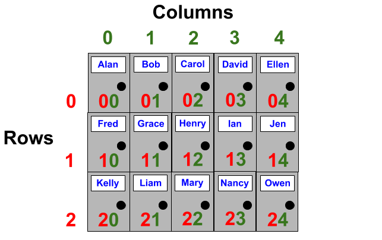
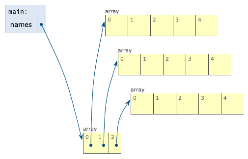

# 2D Arrays

## Learning Objectives: 2D Arrays

- Create and initialize a 2D array
- Access and modify 2D array elements
- Iterate through 2D arrays using both a regular `for` loop and an _enhanced_ `for` loop
- Determine 2D array output

## Creating a 2D Array

### An Array Inside Another Array

An array inside another array is called a __2D array__. A 2D arrays is symbolic of a table where there are rows and columns. The first index number represents the __row__ position and the second index number represents the __column__ position. Together, the row and column indices enable elements to be stored at specific locations.



```cpp
string names[3][5];
```

__2D Array Syntax__

- Array type followed by a name for the 2D array followed by __two__ empty pairs of brackets `[][]`.
- The number of __rows__ goes inside the __first__ pair of brackets and the number of __columns__ goes inside the __second__ pair of brackets.

### Why Array Inside Array?

The way 2D arrays store elements is a little unique. Rather than creating an actual table like shown above, each initial _row_ of the 2D array actually refers to another _column_ array. This is why a 2D array is considered to be _an array inside of another array_.



To determine the number of rows and columns in the 2D array, we can use the `sizeof()` operator like we did for arrays.

```cpp
string names[3][5];

cout << sizeof(names) / sizeof(names[0]) << " rows" << endl;
cout << sizeof(names[0]) / sizeof(string) << " columns" << endl;
```

> <b>IMPORTANT</b>
>
> Note that when determining column length, you must refer to the 2D array’s 0th row index. For example, `names[0]` doesn’t just refer to the first element in the row, it also refers to the entire column of elements. See image above.
>
> `sizeof(names[0])` calculates the size of the entire column while `sizeof(string)` calculates the size of one string. Thus, dividing the two, `sizeof(names[0]) / sizeof(string)`, will calculate how many string elements there are.

> <b>2D Array Creation</b>
>
> If you want to create a 2D array with `2` rows and `4` columns that stores __integer__ elements, which of the following syntax should you use?
> - ```cpp
>   integer elements[1][3];
>   ```
> - ```cpp
>   integer elements[2][4];
>   ```
> - ```cpp
>   int elements[1][3];
>   ```
> - ```cpp
>   int elements[2][4];
>   ```
>
> > <b>Answer:</b>
> >
> > ```cpp
> >   int elements[2][4];
> >   ```
> 
> > <b>Rationale:</b>
> >
> > `integer` is neither a valid keyword nor a type in C++. You must use `int` instead. When creating a 2D array, the numbers that go into the brackets represent how many rows and columns will be created, not the row and column indices.

## Accessing and Modifying a 2D Array

### 2D Array Access

To access and modify elements inside a 2D array, you need to specify the _row_ and _column_ indices at which the elements are located. For example `names[1][2]` refers to the element that’s at row index 1 and column index 2.


Below is a code block showcasing a 2D array that contains fifteen P.O. Box names from a postal office. Note that you can initialize the elements inside your 2D array just like how you initialize elements inside a regular array. Each `column` array is separated by curly braces `{}` as well as a comma `,`.

```cpp
string names[ ][5] = { {"Alan", "Bob", "Carol", "David", "Ellen"},
                       {"Fred", "Grace", "Henry", "Ian", "Jen"},
                       {"Kelly", "Liam", "Mary", "Nancy", "Owen"} };
    
cout << names[1][2] << endl;
```

> <b>What happens if you:</b>
> 
> - change `names[1][2]` from the original code to `names[2][1]`?
> - change `names[1][2]` from the original code to `names[3][0]`?

> <b>IMPORTANT</b>
> 
> - Note that you must declare the number of elements within the column brackets. You can leave the row brackets empty, but you __cannot__ leave the column brackets empty. Also, when you try to print an element that is __outside__ of the row/column range, the system will either print random memory data or nothing at all.

### 2D Array Modification

To modify elements within a 2D array, simply access the element and assign another element to it.

```cpp
string names[3][5] = { {"Alan", "Bob", "Carol", "David", "Ellen"},
                       {"Fred", "Grace", "Henry", "Ian", "Jen"},
                       {"Kelly", "Liam", "Mary", "Nancy", "Owen"} };
    
cout << names[1][2] << endl;

names[1][2] = "Harry";
cout << names[1][2] << endl;
```

> <b>What happens if you:</b>
> 
> - change all `names[1][2]` within the code above to `names[0][0]`?
> - change `"Harry"` within your current code to `"Amy"`?

> <b>2D Array Modification</b>
> 
> Given the following 2D array:
> ```cpp
> double sqroots[2][3] = { {1.00, 1.41, 1.73}, {2.00, 2.2, 2.45} };
> ```
> Which of the following code snippets will enable you to change `2.2` within the 2D array to `2.24`?
> - ```cpp
>   sqroots[2][2] = 2.24;
>   ```
> - ```cpp
>   sqroots[1][1] = 2.24;
>   ```
> - ```cpp
>   sqroots[2, 2] = 2.24;
>   ```
> - ```cpp
>   sqroots[1, 1] = 2.24;
>   ```
>
> > <b>Answer:</b>
> > 
> > ```cpp
> > sqroots[1][1] = 2.24;
> > ```
>
> > <b>Rationale:</b>
> >
> > Remember that array indices start at `0`, __not__ at `1`. Thus, `2.2` is located at row index 1 and column index 1. To access an element inside a 2D array, the row and column indices must go into brackets `[][]`.

## Iterating a 2D Array

### 2D Array Iteration

To iterate through a 2D array, we can use two `for` loops, one __nested__ inside another. The outer `for` loop is for the rows while the inner `for` is for the columns.

```cpp
int digits[3][3] = { {1, 2, 3},
                     {4, 5, 6}, 
                     {7, 8, 9} };

int row = sizeof(digits) / sizeof(digits[0]); //number of rows
int col = sizeof(digits[0]) / sizeof(int); // number of columns

for (int i = 0; i < row; i++) {
    for (int j = 0; j < col; j++) {
        cout << digits[i][j] << endl;
    }
}
```

> <b>What happens if you:</b>
> 
> - change all `sizeof(digits[0])` from the code above to `sizeof(digits[1])`?
> - remove `<< endl` from the code?

Note that all of the columns’ lengths are the same, there are 3 columns for each _row_. Therefore, it doesn’t matter if we use `digits[0]`, `digits[1]`, or `digits[2]` when calculating the number of elements in each row and column. Also note that using `<< endl` prints the elements vertically while removing it prints the elements horizontally. To print the elements so that the columns stay together but the rows separate, we can try something like this:

```cpp
int digits[3][3] = { {1, 2, 3},
                     {4, 5, 6}, 
                     {7, 8, 9} };

int row = sizeof(digits) / sizeof(digits[0]);
int col = sizeof(digits[0]) / sizeof(int);

for (int i = 0; i < row; i++) {
    for (int j = 0; j < col; j++) {
        if (j == col - 1) {
            cout << digits[i][j] << endl;
        }
        else {
            cout << digits[i][j] << " ";
        }
    }
}
```

The `if` conditional forces the elements to be printed with a newline every time the iterating variable reaches the end of the column index. Otherwise, the elements will be printed with a space instead.

### 2D Array with Enhanced For Loop

Like arrays and vectors, 2D arrays can also make use of the __enhanced__ `for` loop.

```cpp
int digits[3][3] = { {1, 2, 3},
                     {4, 5, 6}, 
                     {7, 8, 9} };

for (auto &i : digits) {
    for (int j : i) {
        if ((j == 3) | (j == 6) | (j == 9)) {
            cout << j << endl;
        }
        else {
            cout << j << " ";
        }
    }
}
```

You may have noticed that the outer loop contains `for (auto &i : digits)`. Unlike a regular array where we can access the first element by locating just one index, we need two indices in order to access elements within a 2D array. The `&i` creates a __reference__ iterating variable that can refer to the 2D array. We type it as `auto` because doing so will cause the system to force the variable to match the 2D array type. In fact, we can always use `auto` to type variables to cause them to match the data that they refer to. For example, we can use `for (auto j : i)` for the inner loop instead of using `int`.

Also note that we cannot use an enhanced `for` loop to __manipulate__ array indices. Our iterating variable goes through the 2D array and takes on each element value rather than each element index. This is why we have the conditional statement `if ((j == 3) | (j == 6) | (j == 9))` rather than `if (j == col - 1)`.

> <b>Iterating 2D Array Elements</b>
> 
> Fill in the blanks below with code so that the program will iterate through a 2D array called family and print the following output:
> ```
> Grandpa Grandma
> Dad Mom
> Brother Sister
> ```
> __Note__ that there should only be __ONE__ space in between the elements!
> ```cpp
>   ______ family[3][2] = { {"Grandpa", "Grandma"},
>                           {"Dad", "Mom"},
>                           {"Brother", "Sister"} };
>   
>   int row = sizeof(______) / sizeof(family[0]);
>   int col = sizeof(family[0]) / sizeof(______);
>   
>   for (int i = 0; i < row; i++) {
>       ___ (int j = 0; j < col; j++) {
>           __ (j == col - _) {
>               cout << family[i][j] << ____;
>           }
>           else {
>               cout << family[i][j] << ___;
>           }
>       }
>   }
> ```
>
> > <b>Answer:</b>
> > 
> > ```cpp
> > string family[3][2] = { {"Grandpa", "Grandma"},
> >                         {"Dad", "Mom"},
> >                         {"Brother", "Sister"} };
> > 
> > int row = sizeof(family) / sizeof(family[0]);
> > int col = sizeof(family[0]) / sizeof(string);
> > 
> > for (int i = 0; i < row; i++) {
> >     for (int j = 0; j < col; j++) {
> >         if (j == col - 1) {
> >             cout << family[i][j] << endl;
> >         }
> >         else {
> >             cout << family[i][j] << " "; //or cout << family[i][j] << ' ';
> >         }
> >     }
> > }
> > ```
>
> > <b>Rationale:</b>
> >
> > - The 2D array is of type `string`.
> > - To determine `int row`, calculate the size of the array `family` and divide it by the size of one element `family[0]`.
> > - To determine `int col`, calculate the size of one element `family[0]` and divide it by the size of one `string`.
> > - The `for` loops include the iterating variable `i` that ends before `row` and the iterating variable `j` that ends before `col`.
> > - `if` `j` gets to the end of the column index, `col - 1`, print the element with `endl`, else, print the element without `endl` and just one empty space.

## Formative Assessment 1

> <b>Printing a Squares 2D Array</b>
> 
> Construct a program using the code blocks below that iterates through the 2D array and prints the following output:
> ```
> 1 4
> 9 16
> ```
> - ```cpp
>   }
>   ```
> - ```cpp
>   for (int i : squares) {
>   ```
> - ```cpp
>   for (auto j : i) {
>   ```
> - ```cpp
>   }
>   ```
> - ```cpp
>   int squares[][] = {{1, 4},{9, 16}};
>   ```
> - ```cpp
>   if (j == 4 | j == 16) {
>   ```
> - ```cpp
>   cout << j << endl;
>   ```
> - ```cpp
>   }
>   ```
> - ```cpp
>   cout << j << " ";
>   ```
> - ```cpp
>   if (j == (sizeof(squares[0])/sizeof(int)) - 1)
>   {
>   ```
> - ```cpp
>   for (auto &i : squares) {
>   ```
> - ```cpp
>   int squares[2][2] = {{1, 4},{9, 16}};
>   ```
> - ```cpp
>   }
>   ```
> - ```cpp
>   else {
>   ```
>
> > <b>Answer:</b>
> > 
> > ```cpp
> > int squares[2][2] = {{1, 4},{9, 16}};
> > for (auto &i : squares) {
> >     for (auto j : i) {
> >         if (j == 4 | j == 16) {
> >             cout << j << endl;
> >         }
> >         else {
> >             cout << j << " ";
> >         }
> >     }
> > }
> > ```
> > 
> > <b>Rationale:</b>
> >
> > - You cannot leave the second 2D array bracket empty, thus `int squares[2][2] = {{1, 4},{9, 16}};` is needed.
> > - To use an enhanced `for` loop, you need a reference iterating variable `&i` that is typed as `auto`, not a regular `int` variable. Note that any variable can be typed as `auto`, thus `for (auto j : i)` is possible.
> > - The iterating variables in an enhanced `for` loop cannot manipulate element indices, only element values, thus `if (j == 4 | j == 16)` is needed rather than `if (j == (sizeof(squares[0])/sizeof(int)) - 1)`.
> > - Print using `endl` for when `j` is `4` or `16`.
> > - Print without using `endl` for when `j` is anything else with a space.

## Formative Assessment 2

> <b>2D Array Table</b>
> 
> Given the following code snippet:
> ```cpp
>   string names[3][2];
>   names[0][1] = "First name";
>   names[0][0] = "Last name";
>   names[2][0] = "Man";
>   names[1][1] = "Peter";
>   names[1][0] = "Parker";
>   names[2][1] = "Spider";
> 
>   int row = sizeof(names) / sizeof(names[0]);
>   int col = sizeof(names[0]) / sizeof(string);
> 
>   for (int i = 0; i < row; i++) {
>       for (int j = 0; j < col; j++) {
>           if (j == col - 1) {
>               cout << names[i][j] << endl;
>           }
>           else {
>               cout << names[i][j] << " ";
>           }
>       }
>   }
> ```
> Determine the output that is produced by the program.
> - ```
>   FirstnameLastnameManPeterParkerSpider
>   ```
> - ```
>   First name Last name
>   Peter Parker
>   Spider Man
>   ```
> - ```
>   Last name First name
>   Parker Peter
>   Man Spider
>   ```
> - ```
>   Last name
>   First name
>   Parker
>   Peter
>   Man
>   Spider
>   ```
>
> > <b>Answer:</b>
> > 
> > ```
> > Last name First name
> > Parker Peter
> > Man Spider
> > ```
> > 
> > <b>Rationale:</b>
> >
> > The program creates a 2D array and populates each index with strings. Then some elements are printed with a newline while others are printed with a space. The solution guide below shows the sequence in which the elements are populated. Note that the `x`'s represent placeholders.
> >
> > <b>Solution Guide:</b>
> > 
> > - Empty 2D array:
> > ```
> > x x
> > x x
> > x x
> > ```
> > - `names[0][1] = "First name";`
> > ```
> > x First name
> > x x
> > x x
> > ```
> > - `names[0][0] = "Last name";`
> > ```
> > Last name First name
> > x x
> > x x
> > ```
> > - `names[2][0] = "Man";`
> > ```
> > Last name First name
> > x x
> > Man x
> > ```
> > - `names[1][1] = "Peter";`
> > ```
> > Last name First name
> > x Peter
> > Man x
> > ```
> > - `names[1][0] = "Parker";`
> > ```
> > Last name First name
> > Parker Peter
> > Man x
> > ```
> > - `names[2][1] = "Spider";`
> > ```
> > Last name First name
> > Parker Peter
> > Man Spider
> > ```