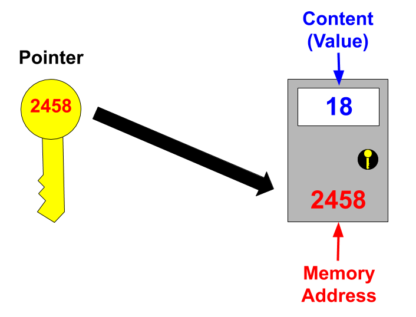
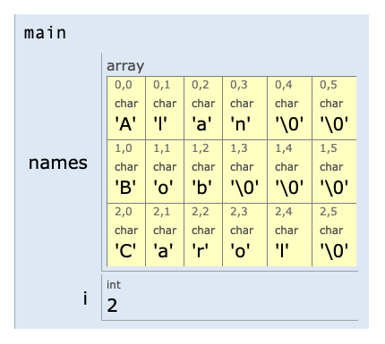
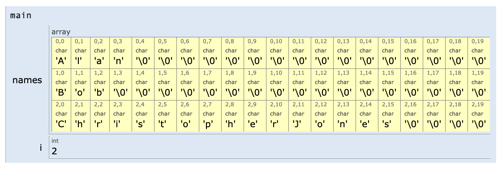
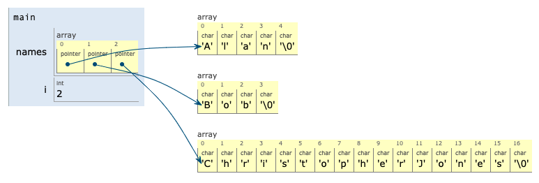

# Pointer Basics

## Learning Objectives: Pointer Basics

- Define what a pointer is
- Declare a pointer
- Apply the reference or address operator “`&`”
- Apply the dereference or content operator “`*`”

## What Is a Pointer?

### Pointer Introduction

A __pointer__ is a data type that stores a memory address of another piece of data. Much like how an __array__ _points_ to all of its elements as a collection, pointers _point_ to the memory address of the data that they are associated with.



The picture above shows how pointers work. A pointer is like a key that stores the address of the locker that it is associated with. This association also enables the pointer to gain access to the content of what’s inside the locker.

The advantage of using a pointer is that you do not need to worry about the value of the data that the pointer is pointing to. Thus, if the data ever changes its value, the pointer will still be able to access the new data as long as the pointer still points to the data’s memory address.

> <b>Pointer Definition</b>
> 
> Select __all__ of the following statements that are __false__ regarding pointers.
> - Pointers store the memory address of the data they are associated with.
> - Pointers work by associating themselves with other data.
> - Pointers store the value of the data they are associated with.
> - If the value of the data a pointer points to changes, the pointer will point to another type of data.
>
> > <b>Answer:</b>
> > 
> > - Pointers store the value of the data they are associated with.
> > - If the value of the data a pointer points to changes, the pointer will point to another type of data.
> 
> > <b>Rationale:</b>
> > 
> > Pointers work by associating themselves to other data. However, pointers only store the data’s memory address, __not__ the data’s value. As long as the pointer continues to be associated with the data’s memory address, it will be able to access the value of the data even if the value changes later on.

## Declaring a Pointer

### Pointer Declaration

All pointers have a data type and a name that they are referred to. To declare a pointer, you need to have the following syntax in order:

- The data type of the pointer (e.g. int, string, etc.).
- An asterisk symbol `*`.
- A name for the pointer.

```cpp
int* p;

cout << p << endl;
```

> <b>What happens if you:</b>
> 
> - change `int* p;` in the original code to `double* p;`, `bool* p;`, or `string* p;`?
> - change `int* p;` in the original code to `int *p;`?
> - change `int* p;` in the original code to `int *p = 2;`?

> <b>IMPORTANT</b>
> 
> - The asterisk symbol can be placed anywhere between the end of the data type (i.e. `int`) and the variable name (i.e. `p`). `int* p;`, `int *p`, and `int * p` all work the same way.
> - Pointers can only be assigned a memory address, which is why trying to assign `2` to a pointer will result in an error.
> - Pointers that are not assigned a memory address will have a default output of `0`, also referred to as `null` pointers.

> <b>Pointer Syntax</b>
> 
> Select __all__ of the following pointer declaration that are syntactically correct.
> - `bool p*;`
> - `bool *p;`
> - `bool* p;`
> - `*bool p;`
>
> > <b>Answer:</b>
> > 
> > `bool *p;`, `bool* p;`
> 
> > <b>Rationale:</b>
> > 
> > Only `bool *p;` and `bool* p;` are correct because the asterisk `*` falls between the data type `bool` and the variable `p`.

## Reference Operator

### Pointer Reference

A pointer can only be assigned a __memory address__. They cannot be assigned values that are `int`, `double`, `string`, etc. A memory address is denoted with the `&` symbol, called the __reference__ operator, and they go in front of the variable that the address is associated with.

```cpp
int a = 2;
int* p = &a;

cout << p << endl;
```

> <b>What happens if you:</b>
> 
> - run the same exact code again?
> - change `int* p = &a;;` in the original code to `int* p = & a;`?

> <b>IMPORTANT</b>
> 
> - Memory is dynamic in C++ so whenever programs are compiled or executed again, they will often output memory addresses that are different from before.
> - Though memory address is dynamic, once a pointer has been assigned a memory address, that association remains until the program is re-compiled or re-executed.

> <b>Referencing a Memory Address</b>
> 
> Which of the following pointer assignment syntax is correct?
> - `int *p = &a;`
> - `int p* = &a;`
> - `int *p = 10;`
> - `int* p = 10;`
> 
> > <b>Answer:</b>
> > 
> > `int *p = &a;`
> 
> > <b>Rationale:</b>
> > 
> > The asterisk `*` for pointers must fall between the end of the data type and before the pointer variable. Pointers can only be assigned a memory address, thus assigning a value of `10` to a pointer will cause an error. Memory address is denoted by the reference operator `&`. Only `int *p = &a;` follows all of the requirements and is the correct answer.

## Dereference Operator

### Pointer Dereference

Every memory address holds a value and that value can be accessed by using the __dereference operator__. The dereference operator is denoted by the asterisk symbol `*`.

```cpp
int a = 5; //regular int variable set to 5
int* p = &a; //int pointer points to a's memory address

cout << *p << endl; //dereference p to print its content
```

> <b>What happens if you:</b>
> 
> change `int a = 5;` in the original code to `int a = 50;`?
> change `int* p = &a;` in the original code to `string* p = &a;`?

> <b>IMPORTANT</b>
> 
> - A pointer can only be assigned a memory address of a variable that holds a value of the same type as the pointer. For example, if `&a` is the memory address of an `int` variable, then you cannot assign it to a `string` pointer (`string* p = &a`).
> - Though memory address is dynamic, once a pointer has been assigned a memory address, that association remains until the program is re-compiled or re-executed.

### Pointer to another Pointer

It is possible to have a pointer point to another pointer. To assign the memory address of a pointer to a new pointer, that new pointer must be denoted with two asterisk symbols `**`.

```cpp
int a = 5;
int* p = &a;
int** p2 = &p;

cout << *p << endl;
cout << **p2 << endl;
```

> <b>What happens if you:</b>
> 
> - change `int a = 5;` in the original code to `int a = 100;`?
> - change `cout << **p2 << endl;` in the original code to `cout << *p2 << endl;`?

> <b>IMPORTANT</b>
> 
> Dereferencing a new pointer to an old pointer will return the memory address of the old pointer. If that pointer is dereferenced again, then the value of the variable that the old pointer pointed to will be returned. For example, `**p2` and `*p` both returned `5` because `p2` points to `p` which points to `a` which equals `5`.


> <b>Fun Fact:</b>
> 
> If you dereference an array, it will return only the first element in the array.
> ```cpp
> int array[] = {24, 52, 97};
> 
> cout << *array << endl;
> ```

> <b>Dereferencing Pointers</b>
> 
> Given the following code snippet:
> ```cpp
> int a = 123;
> int b = 456;
> int* p1 = &a;
> int* p2 = &b;
> int** p3 = &p1;
> ```
> Determine what the output will be for each of the following.
> 1. `cout << b;` will return ___.
> 2. `cout << *p1;` will return ___.
> 3. `cout << *p2;` will return ___.
> 4. `cout << *p3;` will return _______________.
> 5. `cout << **p3;` will return ___.
> 
> > <b>Answer:</b>
> > 
> > 1. `cout << b;` will return <u>456</u>.
> > 2. `cout << *p1;` will return <u>123</u>.
> > 3. `cout << *p2;` will return <u>456</u>.
> > 4. `cout << *p3;` will return <u>a's memory address</u>.
> > 5. `cout << **p3;` will return <u>123</u>.
> 
> > <b>Rationale:</b>
> > 
> > 1. `b` is not a pointer and will simply return `456`.
> > 2. `*p1` will return `123` because `p1` —> `a` whose value is `123`.
> > 3. `*p2` will return `456` because `p2` —> `b` whose value is `456`.
> > 4. `*p3` will return `a's memory address` because `p3` —> `p1` whose value is a’s memory address.
> > 5. `**p3` will return `123` because `p3` —> `p1` —> `a` whose value is `123`.

## Why Use Pointers?

### Array Memory Usage

Before we can see how useful pointers can be, let’s take a look at how memory is used within an array:

```cpp
char names[3][6] = { "Alan", 
                     "Bob", 
                     "Carol" };
                     
for (int i = 0; i < sizeof(names) / sizeof(names[0]); i++) {
    cout << names[i] << endl;
}
```

__Remember:__ The row index `[3]` is _optional_ but the _column_ index `[6]` is _mandatory_.

> <b>Why is the column index 6 instead of 5?</b>
> 
> When working with a string of characters, the last character is always a special character known as a null character. This character is often referred as `NUL` or `\0`. Therefore, the maximum character length within this array is `'C','a','r','o','l','\0'`, which has 6 characters. This is why to be able to store all of the characters, the column index must be set to `6`.

The code above creates an array of characters where the row index `[3]` refers to the three starting characters `A` for `Alan`, `B` for `Bob`, and `C` for `Carol`, and the column index `6` refers to how many character each of the rows can hold which also includes the null characters (`NUL` or `\0`). Notice how the null characters also take up memory space.



Here, we know how long the names would be, so we were able to budget the right amount memory for them. However, what if we didn’t? In such a case, we would have to assign additional space for our characters, something larger, like `20` for example. That way, if the name `Carol` was a mistake and it was actually supposed to be `ChristopherJones`, we can feel more confident that the array will still be able to hold all of the characters. Unfortunately, this causes more memory to be wasted as depicted in the image below.



### Pointer Usage

This is where pointers come in handy because they can help the system save memory. When using pointers for character arrays, the pointers will only point to the 3 leading characters `A`, `B`, and `C`. You do not need to specify the column index. __Note__ that C++ requires the keyword `const` for pointers that point to characters within an array. This forces the characters to remain intact and prevents the pointer from potentially pointing elsewhere.

```cpp
const char* names[] = { "Alan", 
                         "Bob", 
                         "ChristopherJones" };
                     
for (int i = 0; i < sizeof(names) / sizeof(names[0]); i++) {
    cout << names[i] << endl;
}
```



Notice how we did not have to include any index values, which means the potential for wasting memory can be avoided. All we needed was to reserve enough memory for the creation of 3 pointers.

> <b>Conserving Memory with Pointers</b>
> 
> Which of the following situations will it be __best__ to use pointers over arrays?
> - To store the names of one’s family members.
> - To store daily weather temperature readings.
> - To store daily market stock values.
> - To store the ages of students within a classroom.
> 
> > <b>Answer:</b>
> > 
> > To store daily market stock values.
> 
> > <b>Rationale:</b>
> > 
> > Pointers might be __most__ helpful when used to `store daily stock market values`. Since stock market values can be unpredictable, there is no way to accurately determine how much memory should be reserved for the array in order for it to comfortably hold the stock values.
> >
> > The other options are more predictable since a person tends to know the names of their family members already, temperature readings usually stay within a range, and the ages of students within a class are mostly similar.

## Formative Assessment 1

> <b>Dereference the Message</b>
> 
> Fill in the blanks below so that when printed, the output message will be:
> ```
> ILoveComputerScience
> ```
> 
> ```cpp
> string a = "I";
> string b = "Love";
> string c = "Computer";
> string d = "Science";
> 
> string* p1 = &c;
> string* p2 = &b;
> string* p3 = &d;
> string* p4 = &a;
> 
> cout << *__;
> cout << *__;
> cout << *__;
> cout << *__;
> ```
> 
> > <b>Answer:</b>
> > 
> > ```cpp
> > cout << *p4;
> > cout << *p2;
> > cout << *p1;
> > cout << *p3;
> > ```
> 
> > <b>Rationale:</b>
> > 
> > To print the desired message, simply follow the association between the pointers and string variables by working backwards:
> > - `I` <— `a` <— `p4`
> > - `Love` <— `b` <— `p2`
> > - `Computer` <— `c` <— `p1`
> > - `Science` <— `d` <— `p3`

## Formative Assessment 2

> <b>Pi Message</b>
> 
> Construct a program using the code blocks below so that `3.14` will be printed.
> 
> __Hint:__ You may not need to use all of the code blocks to construct your program.
> 
> ```cpp
> cout << *p;
> ```
> ```cpp
> cout << p;
> ```
> ```cpp
> double pi = 3.14;
> ```
> ```cpp
> cout << &p;
> ```
> ```cpp
> double* p = & pi;
> ```
> ```cpp
> double* p = pi;
> ```
>
> > <b>Answer:</b>
> > 
> > ```cpp
> > double pi = 3.14;
> > double* p = & pi;
> > cout << *p;
> > ```
> 
> > <b>Rationale:</b>
> > 
> > The goal is to print the number `3.14` to the console. `3.14` is a double value, thus we need a print statement that will print the content of a particular variable. Only `*p`, which contains the content of `pi`, is appropriate. Knowing that, the next step is to associate the pointer to the variable that is assigned `3.14`. `double pi = 3.14;` must be used first because a pointer cannot point to something that does not exist. Once `pi` has been initialized, the pointer `p` can finally point to `pi`'s memory address which then contains the value of `3.14`. Note that pointers can only be assigned a memory address, `double* p = & pi;`.