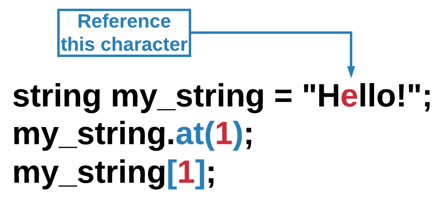
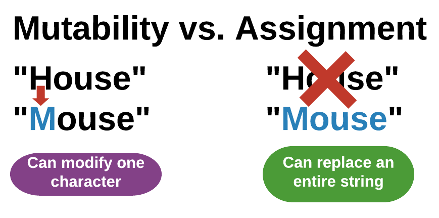
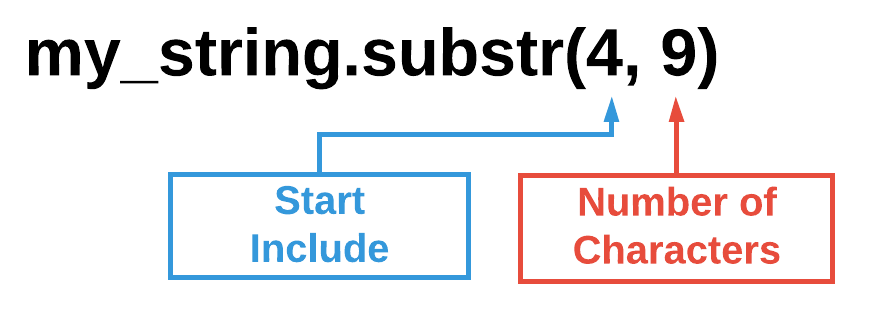
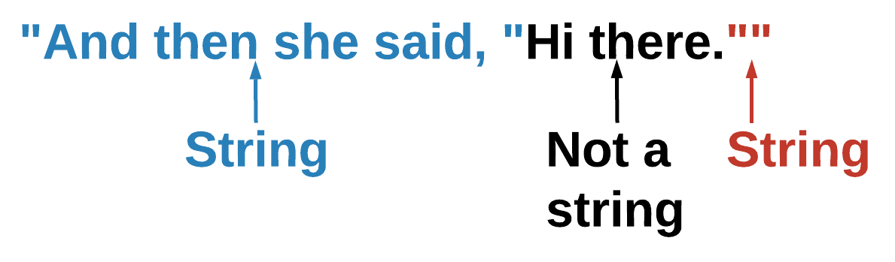

# String Basics

## Learning Objectives: String Basics

- Identify the three properties of strings
- Understand the meaning of mutability
- Determine if a string is present in another string and at what index
- Print a string from the start index to end index
- Utilize escape characters to add special characters to a string

## String Properties

### String Length

All strings have the following characteristics:

1. __Characters__ - Strings are made up of characters between quotation marks.
2. __Length__ - Each string has a length (total number of characters).
3. __Index__ - Each character in a string has a position, called an index.

To calculate the length of a string, use the `length()` function. This function will return an integer that is the sum of all of the characters between the quotation marks.

```cpp
string my_string = "Hello";
int len_string = my_string.length();

cout << len_string << endl;
```

> <b>What happens if you:</b>
> 
> - Change `my_string` to `"Hello world!"`?
> - Change `my_string` to `""`?
> - Change `my_string` to `"-1"`?
> - Change `my_string` to `"Привет"`

> <b>IMPORTANT</b>
> 
> - Although each character that you see on a typical keyword usually has a length of `1`, there are other foreign characters that do not follow this convention. For example, `Привет`, which stands for `Hello` in Russian, actually has a length of `12` instead of `6`.

### String Index

Previously in the __vectors__ module, we learned that vectors and arrays have elements that reside in certain positions or __indices__. A string too has indices that correspond to the position where each of its character resides. Like vector and array indices, string indices also start at 0.


> <b>Strings & Quotation Marks</b>
> 
> - Quotation marks are required to declare the value of a string. However, quotation marks are not a part of the string itself. That is why quotation marks are not counted with the length() function and why they do not have an index.

To reference a character, use the string name followed by the `at()` function. Within parentheses `()`, provide the index number of the character you want the system to return. Alternatively, you can also use brackets `[]` to enclose the index number.



```cpp
string my_string = "Hello!";
char character = my_string.at(1);

cout << character << endl;
```

> <b>What happens if you:</b>
> 
> - Change `char character` to `my_string.at(my_string.length())`?
> - Change `char character` to `my_string.at(my_string.length()-1)`?
> - Change `char character` to `my_string.at(5)`?
> - Change `char character` to `my_string.at(-1)`?
> - Change `char character` to `my_string[5]`?
> - Change `char character` to `my_string[my_string.length()]`?

__Note__ that you cannot use `my_string[my_string.length()]`. An index number is needed.

> <b>String Characters</b>
> 
> Answer the following questions about strings by filling in the blanks.
> 
> Strings are composed of a sequence of __________.
> The number of characters can be determined by using ________.
> Individual characters can be referenced by using the _____.
>
> > <b>Answer:</b>
> > 
> > Strings are composed of a sequence of <u>characters</u>.
> > The number of characters can be determined by using <u>length()</u>.
> > Individual characters can be referenced by using the <u>index</u>.
> 
> > <b>Rationale:</b>
> > 
> > Here are the three properties of strings:
> > 1. All strings are a sequence of characters.
> > 2. All strings have a length (the total number of characters).
> > 3. Characters in a string are referenced with an index.

## Mutability

### Mutability

You now know how to reference each character of a string. What do you think the code below will do?

```cpp
string my_string = "House";
my_string.at(0) = "M";

cout << my_string << endl;
```

If you thought the code above would print `Mouse`, that would be a logical guess. However, you see an error. Unlike vectors and arrays where the characters can be manipulated, string literals are immutable. That means you cannot change the string literal itself. You can, however, manipulate a __particular__ character within the string.

```cpp
string my_string = "House";
my_string.at(0) = 'M';

cout << my_string << endl;
```

Can you spot the difference between the two code snippets mentioned above? The difference lies within the double quotes `""` and single quotes `''`. You cannot change the string literal, but you can change a character at a particular index. Thus, `my_string.at(0) = 'M'` changes the string to `Mouse` but `my_string.at(0) = "M"` does not.

### String Re-Assignment

In addition to character manipulation, you can also change the __entire__ string itself by overwriting it with a new value(s).

```cpp
string my_string = "House";
my_string = "Mouse";

cout << my_string << endl;
```

Strings in C++, like other data types, can be re-assigned. The previous examples on this page are about mutability. That is, changing just a part of a whole. The current example is about the assignment operator. Re-assignment replaces the entire value of a variable with a new value. In conclusion, you can either change one character at a time within a string, or change the entire string literal by reassigning it.



> <b>String Immutability</b>
> 
> What does it mean for a string to be __immutable__?
> - You can change the individual characters in a string
> - You can assign a variable a new string value
> - You cannot modify a string literal
> - You cannot assign a variable a new string value
>
> > <b>Answer:</b>
> > 
> > You cannot modify a string literal
> 
> > <b>Rationale:</b>
> > 
> > A string is immutable when you cannot change the string literal. String literals are enclosed within double quotes `""`. You can, however, alter an individual character, enclosed within single quotes `''`, by specifying a particular string index. For example, `my_string.at(0) = "A"` is trying to change the string literal, which is not allowed. But it is possible to change a single character at index `0` to `A` using `my_string.at(0) = 'A'`.

## Find

### The find() Function

The `find()` function tells you if a character or a string is present in another string, and if so, at what index it is at. `find()` returns an integer index if the character or string is present and `18446744073709551615` if not.

> <b>What does `18446744073709551615` mean?</b>
> 
> - `18446744073709551615` is the largest integer value possible in C++. When `find()` is called and `18446744073709551615` is returned, it means the system has searched through all values and cannot locate the specified value. `18446744073709551615` is an unsigned value, but it is equivalent to `-1` as a signed value.

```cpp
string my_string = "The brown dog jumps over the lazy fox.";

cout << my_string.find("dog") << endl;
```

> <b>What happens if you:</b>
> 
> - Change the `cout` statement to be `cout << my_string.find("cat");`?
> - Change the `cout` statement to be `cout << my_string.find("Dog");`?
> - Change the `cout` statement to be `cout << my_string.find(" ");`?
> - Change the `cout` statement to be `cout << my_string.find(my_string);`?

If you want to start searching for a string or character starting at a particular index, you can specify the start index number after the specified string.

```cpp
string my_string = "The brown dog jumps over the lazy fox.";

cout << my_string.find("he", 4) << endl; //start at index 4
```

> <b>What happens if you:</b>
> 
> - Change `my_string.find("he", 4)` to `my_string.find("he", 27)`?
> - Change `my_string.find("he", 4)` from the original code to `my_string.find("he")`?

> <b>The find() Function</b>
> 
> Select __all__ of the statements that are true about the `find()` function and strings.
> - `find()` will return `18446744073709551615` if a character(s) is not found
> - `find()` will return an index if a character(s) is found in a string even if one is lowercase and the other is uppercase
> - `find()` returns an index when a character(s) is present in a string
> - `find()` returns a boolean value
>
> > <b>Answer:</b>
> > 
> > - `find()` will return `18446744073709551615` if a character(s) is not found
> > - `find()` returns an index when a character(s) is present in a string
> 
> > <b>Rationale:</b>
> > 
> > By default, `find()` returns an integer index, not a boolean value, when a character or string is found. If one is not found, `18446744073709551615` will be returned, which is also equivalent to `-1`.

## Substr

### The substr() Function

The `subst()` function returns a portion of the string. Within parentheses `()`, provide the index at which you want the string to start followed by a comma followed by the number of characters you want the string to include. __Note__ that if you don’t specify the _number of characters_, the system will start copying from the start index through to the end of the string. If you don’t specify the _start index_, then the system will copy the entire string. The `subst()` function does not modify the original string. Instead, it returns a partial or entire copy of the original string.



```cpp
string my_string = "The brown dog jumps over the lazy fox.";
string my_slice = my_string.substr(4, 9);

cout << my_slice << endl;
```

> <b>What happens if you:</b>
> 
> - Change `my_slice` to be `my_string.substr(1, 2)`?
> - Change `my_slice` to be `my_string.substr()`?
> - Change `my_slice` to be `my_string.substr(1, 1)`?
> - Change `my_slice` to be `my_string.substr(2)`?

> <b>The substr() Function</b>
> 
> Use the code below to help you answer the following question:
> ```cpp
> string my_string = "Calvin and Hobbes";
> string my_slice = my_string.substr(3, 8);
> ```
> What is the value of `my_slice`?
> - `lvin and`
> - `vin an`
> - `vin and`
> - `lvin a`
>
> > <b>Answer:</b>
> > 
> > `vin and`
> 
> > <b>Rationale:</b>
> > 
> > The `substr()` function has a __start index__ value and a __number of characters__ value. The start index value is inclusive, meaning this index value is a part of the substring. The number of characters value tells the system how many characters to copy over starting from the start index. Since the code reads `string my_slice = my_string.substring(3, 8);`, the substring will include __8__ characters starting from index __3__. Remember that indices start at __0__, this means that the copy will include `v` through the whitespace after `and`. Therefore, the value of `my_slice` will be `vin and`.

## Escape Characters

### Escape Characters

An escape character is a character that has a different interpretation than what you see in a string. Escape characters always start with a backslash (`\`). The most common escape character is the newline character (`\n`) which causes C++ to print on the next line.

```cpp
string my_string = "Hello\nworld";
cout << my_string << endl;
```

| Escape Character | Description | Example |
|------------------|-------------|---------|
| __\\__ | Prints a backslash | `cout << "\\" << endl;` |
| __\’__ | Prints a single quote | `cout << "\'" << endl;` |
| __\"__ | Prints a double quote | `cout << "\"" << endl;` |
| __\t__ | Prints a tab (spacing) | `cout << "Hello\tworld" << endl;` |

> <b>What happens if you:</b>
> 
> - Use `\n\n` instead of `\n` in the original code?
> - Replace `\n\n` in your current code with `\t`?
> - Replace `\t` in your current code with `\"`?

### Quotes Inside Quotes

Imagine that you have this small bit of dialog, `And then she said, "Hi there."` and want to store it as a string. Typing `"And then she said, "Hi there.""` would cause an error.



When you use a `"` to start a string, C++ looks for the next `"` to end it. To avoid syntax errors, you can use a double quote to start your string, single quotes for the inner quote, and end the string with a double quote.

```cpp
string my_string = "And then she said, 'Hi there.'";
cout << my_string << endl;
```

> <b>What happens if you:</b>
> 
> - Replace single quotes (`'`) with double quotes (`"`) and double quotes(`"`) with single quotes (`'`) in the original code?
> - Change all quotes to double quotes (`"`)?
> - Use the escape character `\"` for the inner quotation marks that surround `Hi there`. (e.g. `"And then she said, \"Hi there.\""`)?

> <b>Escape Characters</b>
> 
> Select __all__ of the ways to correctly print the contraction (`It's`) inside a string declaration.
> - ```cpp
>   string my_string = "It\'s my birthday today!";
>   ```
> - ```cpp
>   string my_string = "It's my birthday today!";
>   ```
> - ```cpp
>   string my_string = 'It's my birthday today!';
>   ```
> - ```cpp
>   string my_string = "It/'s my birthday today!";
>   ```
>
> > <b>Answer:</b>
> > 
> > - ```cpp
> >   string my_string = "It\'s my birthday today!";
> >   ```
> > - ```cpp
> >   string my_string = "It's my birthday today!";
> >   ```
> 
> > <b>Rationale:</b>
> > 
> > There are two possible ways to make a contraction such as `It's` inside a string.
> > 1. Use double quotation marks for the string declaration and a single quote `'` for the contraction. `string my_string = "It's my birthday today!";`
> > 2. Use double quotation marks for the string declaration and the escape character `\'` for the contraction. `string my_string = "It\'s my birthday today!";`
> >
> > __Note__ that you cannot use single quotes ' to declare strings. Single quotes can only be used for characters typed as char.

## Formative Assessment 1

> <b>Comparing String Lengths</b>
> 
> Use the code blocks below to help construct a program that checks if `string1` is longer than `string2`. Then prints the message `string1 is longer` if true.
> 
> __Hint:__ not all of the code blocks will be used.
> 
> - ```cpp
>   cout << "string1 is longer" << endl;
>   ```
> - ```cpp
>   if (string1.length() > string2.length()) {
>   ```
> - ```cpp
>   if (length(string1) > length(string2)) {
>   ```
> - ```cpp
>   if (string1.length > string2.length) {
>   ```
> - ```cpp
>   }
>   ```
>
> > <b>Answer:</b>
> > 
> > ```cpp
> > if (string1.length() > string2.length()) {
> >     cout << "string1 is longer" << endl;
> > }
> > ```
> 
> > <b>Rationale:</b>
> > 
> > `length(string1)` and `string1.length` are not valid C++ syntax. `length()`, on the other hand, is a function used to determine string length.

## Formative Assessment 2

> <b>Printing Escape Characters</b>
> 
> Select __all__ of the print statements below that will produce the following output:
> ```cpp
> I am the first line,
> I am the second,
> and I am the third line!
> ```
> - ```cpp
>   cout << "I am the first line,
>   I am the second,
>   and I am the third line!";
>   ```
> - ```cpp
>   cout << "I am the first line," << endl;
>   cout << "I am the second," << endl;
>   cout << "and I am the third line!";
>   ```
> - ```cpp
>   cout << "I am the first line,\nI am the second,\nand I am the third line!";
>   ```
> - ```cpp
>   cout << "I am the first line,\tI am the second,\tand I am the third line!";
>   ```
> 
> > <b>Answer:</b>
> > 
> > - ```cpp
> >   cout << "I am the first line," << endl;
> >   cout << "I am the second," << endl;
> >   cout << "and I am the third line!";
> >   ```
> > - ```cpp
> >   cout << "I am the first line,\nI am the second,\nand I am the third line!";
> >   ```
> 
> > <b>Rationale:</b>
> > 
> > Simply using the `return` or `enter` keys will not produce a newline in C++. You can either use `cout` with `endl` or the escape character `\n` to create the newline character.
> > 
> > __Note__ that `\t` creates white spaces similar to when the `tab` key is pressed. It is not the same as a newline character.