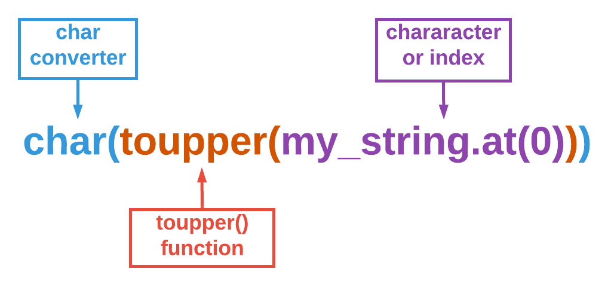

# String Functions

## Learning Objectives: String Functions

- Identify the functions and applications of the following string functions:
  - `find_first_of()` & `find_last_of()`
  - `push_back()` & `insert()`
  - `pop_back()` & `erase()`
  - `replace()`
  - `append()`
  - `toupper()` & `tolower()`

## Find First Of & Last Of

### The find_first_of() Function

The `find_first_of()` function works similarly to how the `find()` function does. However, the `find_first_of()` function will search for __any__ matching characters specified. For example, given the string `"this is his string"`, `my_string.find_first_of("his")` will return `1` because the character `h` within `his` appears first at index number `1`. Like the `find()` function, you can optionally specify an index number to direct the system where to start searching.


> <b>The find_last_of() function</b>
> 
> - You can use the `find_last_of()` function to search for a set of characters in a string that occur last. Here is an example, given the string `"this is his string"`, `my_string.find_last_of("his")` will return `15` because the `i` in `his` occurs last at index `15`. If you don't want the system to search the whole string, you can specify an index as a second parameter to direct the system where to start searching.

```cpp
string string1 = "The brown dog jumps over the lazy fox.";
string string2 = "brown";

cout << string1.find_first_of(string2) << endl;
```

> <b>What happens if you:</b>
> 
> - Set `string2` to `"wornb"`?
> - Change the `cout` statement to `string1.find_first_of(string2, 14)`?
> - Set `string2` to `"axe"` and change the `cout` statement to `string1.find_first_of(string2, 34)`?
> - Set `string2` to `"i"` and change the `cout` statement to `string1.find_first_of(string2)`?

__Remember__ that `18446744073709551615` is equivalent to `-1` which also means `not found`.

> <b>The find_first_of() Function</b>
> 
> Determine the output of the following code snippet:
> ```cpp
> string my_string = "Today is a great day.";
> cout << my_string.find_first_of("aeiou", 11);
> ```
> - `14`
> - `1`
> - `3`
> - `13`
> 
> > <b>Answer:</b>
> > 
> > `13`
> 
> > <b>Rationale:</b>
> > 
> > The code snippet instructs the system to search for any characters in the string `aeiou` within `my_string` starting at index `11`. Thus, any index number before `11` is incorrect. Starting at index `11`, the vowel character that comes up first is `e` at index `13`.

## Push Back & Insert

### The push_back() Function

In a previous module, you were introduced to vectors. The `push_back()` function works the same way in strings as it does in vectors. It adds a specific __character__ to the __end__ of the string.

```cpp
string my_string = "Today is Satur";
my_string.push_back('d');

cout << my_string << endl;
```

> <b>What happens if you:</b>
> 
> - add the code `my_string.push_back("ay");` below `my_string.push_back('d');`?
> - replace `my_string.push_back("ay");` with `my_string.push_back('a');`?
> - add the code `my_string.push_back('y');` below `my_string.push_back('a');`?

### The insert() Function

Unfortunately, the `push_back()` function cannot add multiple characters (string) to an existing string. However, the `insert()` function can. Unlike many functions where specifying the starting index number is optional, doing so is necessary for `insert()` to work.

Note that the index specification comes __before__ the string you want the system to add. For example, `my_string.insert(0, "abc")` will add the string `abc` to the 0th index which is also the beginning of the string. To add to the end of the string, you can use `my_string.length()`. Note that you do not need to subtract `1` from `my_string.length()` because the system will add characters starting at the index __after__ the last character of the string.

```cpp
string my_string = "Today is Satur";
my_string.insert(my_string.length(), "day");

cout << my_string << endl;
```

> <b>What happens if you:</b>
> 
> - replace `my_string.insert(my_string.length(), "day");` with `my_string.insert(0, "day");`?
> - change the code back to `my_string.insert(my_string.length(), "day");` and add `my_string.insert(9, "a good ");` below it?

> <b>push_back() vs. insert()</b>
> 
> You want to add an exclamation point `!` to the end of `my_string`. Select __all__ of the commands below that will allow you to do that.
> - ```cpp
>   my_string.push_back("!");
>   ```
> - ```cpp
>   my_string.push_back('!');
>   ```
> - ```cpp
>   my_string.insert("!");
>   ```
> - ```cpp
>   my_string.insert(my_string.length(), "!");
>   ```
> 
> > <b>Answer:</b>
> > 
> > - ```cpp
> >   my_string.push_back('!');
> >   ```
> > - ```cpp
> >   my_string.insert(my_string.length(), "!");
> >   ```
> 
> > <b>Rationale:</b>
> > 
> > The `push_back()` function can only add __one__ character at a time. Thus, single quotes are necessary `''` when using `push_back()`. `insert()`, on the other hand, can add multiple characters using double quotes `""`. However, you __must__ include an index number or the system will produce an error.

## Pop Back & Erase

### The pop_back() Function

The `pop_back()` function removes a __single__ character from the end of a string. You do not include anything within parentheses `()`.

```cpp
string my_string = "Today is my birthday!";
my_string.pop_back();

cout << my_string << endl;
```

### The erase() Function

The `erase()` function can remove __multiple__ characters from a string or the entire string itself. To remove the whole string, leave the parentheses `()` empty. Alternatively, you can specify __one__ index number to remove all characters starting at that index to the end of the string. Specify __two__ index numbers to start at an index and erase a _certain_ number of characters at that index forward.

```cpp
string my_string = "Today is my birthday!";
my_string.erase(my_string.length()-1);

cout << my_string << endl;
```

> <b>What happens if you:</b>
> 
> - Replace `my_string.erase(my_string.length()-1);` with `my_string.erase(12);`?
> - Replace `my_string.erase(12);` in your current code with `my_string.erase(12, 5);`?
> - Replace `my_string.erase(12, 5);` in your current code with `my_string.erase();`?

> <b>pop_back() vs. erase()</b>
> 
> Given the _before_ and _after_ outputs of the string `my_string`:
> 
> __Before:__
> ```
> The total is $234.45!
> ```
> __After:__
> ```
> The total is $2.45!
> ```
> Which of the following commands would change the output from __before__ to __after__?
> - ```cpp
>   my_string.erase(15)
>   ```
> - ```cpp
>   my_string.pop_back()
>   ```
> - ```cpp
>   my_string.erase(15, 2)
>   ```
> - ```cpp
>   my_string.erase()
>   ```
> 
> > <b>Answer:</b>
> > 
> > ```cpp
> > my_string.erase(15, 2)
> > ```
> 
> > <b>Rationale:</b>
> > 
> > The main difference between `pop_back()` and `erase()` is that `pop_back()` can only remove one character at the end of the string. Thus, `pop_back()` will not help us in this case. `erase()` without any parameters will remove the entire string and we do not want that. `erase(15)` will only remove one character at index `15` but we need to remove two characters. Only `erase(15, 2)` will successfully alter the output to what we want.

## Replace

### The replace() Function

The `replace()` function is really a combination of the `erase()` and `insert()` functions. Let’s take a look at an example.

```cpp
my_string.replace(1, 2, "3")
```

There are three parameters of interest within `replace()` above. The `1` represents the index at which we want to start erasing. The `2` tells the system how many characters to erase starting at index `1`. And the `"3"` is the string that the system will insert into the string at index `1`.

```cpp
string string1 = "Hello world!";
string string2 = "Codio.";
string string3 = string1.replace(6, 5, string2);
// erase all characters from index 6 plus 5 chars to the right in string1
// then insert string2 at index 6 within string1

cout << string3 << endl;
```

> <b>What happens if you:</b>
> 
> - Change `string3` to `string1.replace(6, 6, string2)`?
> - Change `string3` to `string1.replace(2, 3, "y")`?

> <b>The replace() Method</b>
> 
> Fill in the program below so that the output will be `Today is rainy`. __Note__ that not all options will be needed.
> ```cpp
> string sunny = "Today is sunny";
> string rainy = "rainy";
> string output = _____.replace(_, _, _____);
> 
> cout << output << endl;
> ```
> > <b>Answer:</b>
> > 
> > ```cpp
> > string sunny = "Today is sunny";
> > string rainy = "rainy";
> > string output = sunny.replace(9, 5, rainy);
> > 
> > cout << output << endl;
> > ```
> 
> > <b>Rationale:</b>
> > 
> > Remember that the `replace()` function is a combination of the `erase()` and `insert()` functions. First we want to erase `"sunny"` from the `sunny` string. `sunny` starts at index `9` and has `5` characters. Therefore, `9` and `5` are needed as the first two arguments. Then all that’s left is to insert the `rainy` as a third parameter. This will effectively change the string to `Today is rainy`.

## Append

### The append() function

An alternative way to __concatenate__ or combine strings is to use the `append()` function. The `append()` function works in the same way as adding literal strings together using the `+` operator.

```cpp
string a = "High";
string b = " Five";

cout << a.append(b) << endl;
```

> <b>What happens if you:</b>
> 
> - Change the `cout` statement to `a.append(b + "!")`?
> - Change the `cout` statement to `a.append("Five" + "!")`?
> - Change the `cout` statement to `"High" + " Five" + "!"`?
> - Change the `cout` statement to `a + " Five" + "!"`?
> - Change the `cout` statement back to `a.append(b)` and replace `string b = " Five";` with `int b = 5;`?

> <b>IMPORTANT</b>
> 
> - __NOTE__ that the `append()` function is exclusively for strings. Thus, you cannot include other data types like `int`s when using `append()` unless they are converted to strings first. Additionally, when using the `+` operator to combine two strings together, make sure that __at least one__ of the strings is a string variable. Otherwise, the system will think you are trying to manipulate a string literal, which is not allowed.

> <b>Using the append() Function</b>
> 
> Given the following code snippet:
> ```cpp
>   string a = "apple";
>   string b = "*banana";
>   string c = "cherry*";
>   string d = "*durian*";
> ```
> Which of the following pairs of statements produce the same output?
> - `cout << "apple" + b` & `cout << a.append("*" + b)`
> - `cout << b + "banana"` & `cout << b.append(b)`
> - `cout << "cherry" + d` & `cout << c.append(d)`
> - `cout << "*durian*" + a` & `cout << d.append(a)`
>
> > <b>Answer:</b>
> > 
> > `cout << "*durian*" + a` & `cout << d.append(a)`
> 
> > <b>Guide:</b>
> > - `cout << "apple" + b` —> `apple*banana`
> > - `cout << a.append("*" + b)` —> `apple**banana`
> > - `cout << b + "banana"` —> `*bananabanana`
> > - `cout << b.append(b)` —> `*banana*banana`
> > - `cout << "cherry" + d` —> `cherry*durian*`
> > - `cout << c.append(d)` —> `cherry**durian*`
> > - `cout << "*durian*" + a` —> `*durian*apple`
> > - `cout << d.append(a)` —> `*durian*apple`
>
> > <b>Solution:</b>
> > 
> > If you go through and make note of all of the asterisks `*`, you should notice that only `cout << "*durian*" + a` & `cout << d.append(a)` produce the exact same results.


## Uppercase & Lowercase

### The toupper() Function

The `toupper()` function returns the uppercase form of a specified character. Insert the character you wish to convert as a parameter.

__Note__ that by default, `toupper()` returns the __ASCII__ representation of the uppercase letter. Thus, you’ll need `char` to convert the ASCII code into alphabetical.



```cpp
string my_string = "the big brown dog";

cout << char(toupper(my_string.at(0))) << endl;
```

> <b>What happens if you:</b>
> 
> - Change the `cout` statement to `char(toupper(my_string.at(my_string.length()-1)))`?
> - Change the `cout` statement to `char(toupper('t'))`?
> - Change the `cout` statement to `char(toupper(my_string))`?

### The tolower() Function

The `tolower()` function returns the lowercase form of a specified character. It has all of the technicalities that the `toupper()` function has.

```cpp
string my_string = "THE BIG BROWN DOG";

cout << char(tolower(my_string.at(1))) << endl;
```

> <b>What happens if you:</b>
> 
> - Change the `cout` statement to `char(tolower(my_string.at(my_string.length()-1)))`?
> - Change the `cout` statement to `char(tolower('B'))`?
> - Change the `cout` statement to `char(tolower('%'))`?

> <b>toupper() & tolower()</b>
> 
> Select __all__ of the following statements that are __true__ regarding the `toupper()` and `tolower()` functions.
> - `toupper()` and `tolower()` will return an ASCII code unless you convert it to `char`.
> - `toupper()` and `tolower()` can only accept and return one character at a time.
> - `toupper()` and `tolower()` accept a string as a parameter and converts that entire string into uppercase or lowercase.
> - `toupper()` and `tolower()` can only accept a string index as a parameter.
> 
> > <b>Answer:</b>
> > 
> > - `toupper()` and `tolower()` will return an ASCII code unless you convert it to `char`.
> > - `toupper()` and `tolower()` can only accept and return one character at a time.
> 
> > <b>Rationale:</b>
> > 
> > `toupper()` and `tolower()` are functions that only accept and return one character, not entire strings. If you enter more than one character, you will encounter an error. To return a converted uppercase or lowercase character, you will need to specify either the character itself or the index at which that character is at. Each converted character is represented as an ASCII code but you can use `char` to convert it into a character.

## Formative Assessment 1

> <b>String Functions</b>
> 
> Look at the before and after code samples below:
> - __Before:__ `t`
> - __After:__ `T`
> 
> Select __all__ of the function that you can use to change the text from __Before__ to __After__.
> - `tolower()`
> - `replace()`
> - `toupper()`
> - `insert()`
> 
> > <b>Answer:</b>
> > 
> > - `replace()`
> > - `toupper()`
> 
> > <b>Rationale:</b>
> > 
> > The output goes from a lowercase letter to an uppercase letter. Thus, the `toupper()` function is one choice that can be used to change the output. Alternatively, the `replace()` function can be used to replace the lowercase `t` to uppercase `T`. Both `tolower()` and `insert()` will not work in this case.

## Formative Assessment 2

> <b>String Functions & Conditionals</b>
> 
> Imagine you have a string variable `sentence`. Drag and drop the code blocks below to create a program that checks if `sentence` has a whitespace at index `0`. If yes, the program will print `sentence` without that whitespace.
> 
> __Hint:__ You will not need to use all of the code blocks.
> - ```cpp
>   cout << sentence.erase(0, 1);
>   ```
> - ```cpp
>   cout << sentence.erase(' ');
>   ```
> - ```cpp
>   if (sentence.find() == ' ') {
>   ```
> - ```cpp
>   if (sentence.at(0) == ' ') {
>   ```
> - ```cpp
>   }
>   ```
> 
> > <b>Answer:</b>
> > 
> > ```cpp
> > if (sentence.at(0) == ' ') {
> >     cout << sentence.erase(0, 1);
> > }
> > ```
> 
> > <b>Rationale:</b>
> > 
> > Only `if (sentence.at(0) == ' ')` and `cout << sentence.erase(0, 1)` are syntactically correct. Both `if (sentence.find() == ' ')` and `cout << sentence.erase(' ')` will produce an error because the `find()` function requires a string or character parameter and the `erase()` function does not accept a character as a parameter.