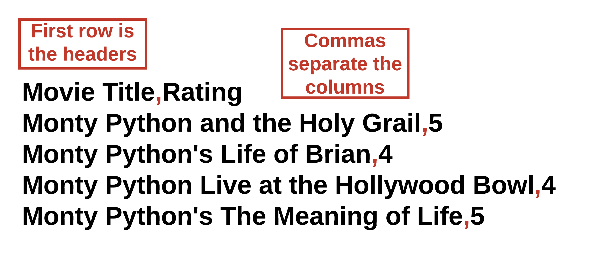

# CSV Files

## Learning Objectives: CSV

- Define CSV
- Read data from a CSV file
- Iterate over a CSV file
- Print data from a CSV file with formatting
- Write data to a CSV file

## CSV Files

### CSV Files

C++ can work with files besides just text files. Comma Separated Value (CSV) files are an example of a commonly used file format for storing data. CSV files are similar to a spreadsheet in that data is stored in rows and columns. Each row of data is on its own line in the file, and commas are used to indicate a new column. Here is an example of a CSV file.



You can read a CSV file in the same way you read a text file. First create an `ifstream` object and then open the CSV file using it.

```cpp
string path = "student/csv/monty_python_movies.csv";

try {
    ifstream file;
    string read;
    file.open(path);
    if (!file) {
        throw runtime_error("File failed to open.");
    }
    while (getline(file, read, ',')) {
        cout << read + ' ';
    }
    file.close();
}
  
catch (exception& e) {
    cerr << e.what() << endl;
}
```

To iterate through the CSV file, we use `while (getline(file, read, ','))`. Since CSV files contain commas that separate information, we set the delimiter to `','`. Then we print the content by using `cout << read + ' '`. We add a space to separate the tokens from each other since it is not apparent that the information is tokenized from using just `cout << read;`.

> <b>Try this variation:</b>
> 
> - Change `cout << read + ' ';` to `cout << read << endl;`?

By using `cout << read << endl;` you can clearly see each token line by line. Depending on your preference, you can choose to arrange the tokens in a variety of different formats.

### Ignoring the Header

The first row of a CSV file is helpful because the header values provide context for the data. However, the first row is not useful if you want to know how many rows of data there are, or to calculate the avg value, etc. Here, you can also use the `ignore()` function to skip a specific number of characters.

```cpp
string path = "student/csv/monty_python_movies.csv";

try {
    ifstream file;
    string read;
    file.open(path);
    if (!file) {
        throw runtime_error("File failed to open.");
    }
    file.ignore(19); //Ignore the first 19 characters from index 0-18
    while (getline(file, read, ',')) {
        cout << read << endl;
    }
    file.close();
}
  
catch (exception& e) {
    cerr << e.what() << endl;
}
```

> <b>Try this variation:</b>
> 
> - Change `file.ignore(19);` to `file.ignore(53);`?
> - Change `file.ignore(53);` to `file.ignore(500);`?
> - Change `file.ignore(500);` to `file.ignore(500, '\n');`?
> - Add another `file.ignore(500, '\n');` below the first `file.ignore(500, '\n');`?

The `file.ignore(500, '\n');` command tells the system to skip the first 500 characters __or__ up through the newline character `\n`. Since there are fewer than 500 characters, the system will skip everything up through the first occurrence of the newline. You can add additional ignore commands to ignore more lines of data if needed.

> <b>Ignoring Lines of Data</b>
> 
> Assuming the maximum number of characters there are per line in a CSV file, `file`, is 20 characters, which of the following commands will ignore the __first three lines__ of data?
> - ```cpp
>   file.ignore(20, '\n');
>   ```
> - ```cpp
>   file.ignore(20, '\n');
>   file.ignore(20, '\n');
>   file.ignore(20, '\n');
>   ```
> - ```cpp
>   file.ignore(0, '\n');
>   ```
> - ```cpp
>   file.ignore(60, '\n');
>   ```
> 
> > <b>Answer:</b>
> > 
> > - ```cpp
> >     file.ignore(20, '\n');
> >     file.ignore(20, '\n');
> >     file.ignore(20, '\n');
> >   ```
> 
> > <b>Rationale:</b>
> > 
> > __Remember__ that newline characters are included in the character count as well. If the maximum number of characters is 20, `file.ignore(20, '\n');` will effectively ignore a single line of text since each line contains `20` or fewer characters. If the line contains fewer than `20` characters, then the newline will be reached. In either case, `file.ignore(20, '\n');` three times will cause 3 lines of text to be ignored.
> > 
> > `file.ignore(0, '\n');` will not ignore any characters since the `0` means that the system will start reading from index `0`. `file.ignore(20, '\n');` only ignores one line of text at most. `file.ignore(60, '\n');` also ignores one line of text because the newline is reached before 60 characters are read.

## Printing CSV Data

Iterating over the CSV file and printing each line does not produce visually pleasing output. The code below produces three columns of data, but there is no consistency in the spacing between columns. When printed, the data looks very disorganized and difficult to read.

```cpp
string path = "student/csv/homeruns.csv";

try {
    ifstream file;
    string read;
    file.open(path);
    if (!file) {
        throw runtime_error("File failed to open.");
    }
    while (getline(file, read, ',')) {
        cout << read + " ";
    }
    file.close();
}
  
catch (exception& e) {
    cerr << e.what() << endl;
}
```

To better organize our CSV data, we can store the data into a vector and then format and print elements in a way that looks more organized.

```cpp
string path = "student/csv/homeruns.csv";
vector<string> data;

try {
    ifstream file;
    string read;
    file.open(path);
    if (!file) {
        throw runtime_error("File failed to open.");
    }
    while (getline(file, read)) {
        stringstream ss(read);
        while (getline(ss, read, ',')) {
            data.push_back(read);
        }
    }
    file.close();
    for (int i = 0; i < data.size(); i++) {
        if (i % 3 == 0) {
            cout << setw(20) << left << data.at(i);
        }
        else if (i % 3 == 1) {
            cout << setw(15) << left << data.at(i);
        }
        else {
            cout << data.at(i) << endl;
        }
    }
}
  
catch (exception& e) {
    cerr << e.what() << endl;
}
```

To organize our data, we use conditionals to split our elements into three columns. `if (i % 3 == 0)` refers to the elements in the first column, `else if (i % 3 == 1)` refers to the second column, and `else` refers to the third. We use the `setw()` function to provide padding for our elements. For example, `setw(20)` means that the system will reserve 20 characters for the elements. If the element does not take up 20 characters, then white spaces will occupy those spaces. To use `setw()`, you’ll need `#include <iomanip>` in the header of your file. The `left` tag forces the element to be aligned to the left side.

> <b>Try this variation:</b>
> 
> - Change `setw(20)` to `setw(16)`?
> - Change `setw(15)` to `setw(10)`?
> - Delete the second `left` tag?
> - Delete the first `left` tag?
> 
> __Note__
> 
> By default, standard streams are set to `right`. This is why deleting all of the `left` tags will effectively align the streams back to the right side. Additionally, you only have to set the `left` tag once for __all__ streams that follow to align left as well.

Notice how the last column `Active Player` is not formatted and is therefore unaffected by the changes.

> <b>IMPORTANT</b>
> 
> - The order or placement of where you use `left` and `setw()` can affect all streams that follow. So it’s important to keep track of the changes that take place as you print. For example outputting

> <b>Formatting Data from File</b>
> 
> Which of the following commands will provide __30__ characters of padding to the variable `var` __without__ shifting its position?
> - ```cpp
>   cout << var << setw(30);
>   ```
> - ```cpp
>   cout << var << set(30);
>   ```
> - ```cpp
>   cout << set.w(30) << var;
>   ```
> - ```cpp
>   cout << setw(30) << var;
>   ```
> 
> > <b>Answer:</b>
> > 
> > - ```cpp
> >   cout << var << setw(30);
> >   ```
> 
> > <b>Rationale:</b>
> > 
> > The correct padding function is `setw()`, not `set.w()` or `set()`. The placement of `setw(30)` is important. `cout << setw(30) << var;` will cause padding to appear on the variable’s left side, causing a shift in var's output placement. On the other hand, `cout << var << setw(30);` will cause padding on the variable’s right side which will not affect its position. Thus, the correct answer is: `cout << var << setw(30);`

## Writing to a CSV File

Writing to a CSV files is similar to writing to a text file. First create an `ofstream` object to open the CSV file. Then you can write to the CSV file using the insertion operator `<<`. To read the CSV file, you can use the same syntax that was previously shown.

```cpp
string path = "student/csv/writepractice.csv";

try {
    ofstream file;
    file.open(path);
    if (!file) {
        throw runtime_error("File failed to open.");
    }
    file << "Greeting,Language" << endl;
    file << "Hello,English" << endl;
    file << "Bonjour,French" << endl;
    file << "Hola,Spanish";
    file.close();
    
    ifstream file2;
    string read;
    file2.open(path);
    while (getline(file2, read, ',')) {
        cout << read + ' ';
    }
    file2.close();
}
  
catch (exception& e) { //catch error
    cerr << e.what() << endl;
}
```

To organize the CSV data, you can add each token into a vector and then use conditionals to format and print the data like before.

```cpp
string path = "student/csv/writepractice.csv";
vector<string> data;

try {
    ifstream file;
    string read;
    file.open(path);
    if (!file) {
        throw runtime_error("File failed to open.");
    }
    while (getline(file, read)) {
        stringstream ss(read);
        while (getline(ss, read, ',')) {
            data.push_back(read);
        }
    }
    file.close();
    for (int i = 0; i < data.size(); i++) {
        if (i % 2 == 0) {
            cout << setw(15) << left << data.at(i);
        }
        else {
            cout << data.at(i) << endl;
        }
    }
}
  
catch (exception& e) {
    cerr << e.what() << endl;
}
```

> <b>Files Vocabulary</b>
> 
> Fill in each blank below with the correct vocabulary term.
> - _______ - An object that can be used to read text or CSV files.
> - _______ - An object that can be used to write to text or CSV files.
> - _______ - A predefined character that separates one piece of data from another.
> - _______ - A piece of data that has been separated from its original content.
> - _______ - The number of character spaces reserved for a piece of data.
> 
> > <b>Answer:</b>
> > 
> > - <u>ifstream</u> - An object that can be used to read text or CSV files.
> > - <u>ofstream</u> - An object that can be used to write to text or CSV files.
> > - <u>delimiter</u> - A predefined character that separates one piece of data from another.
> > - <u>token</u> - A piece of data that has been separated from its original content.
> > - <u>padding</u> - The number of character spaces reserved for a piece of data.
> 
> > <b>Rationale:</b>
> > 
> > `ifstream` and `ofstream` objects can be used to read and write to files respectively. While reading from a file, you can specify a `delimiter` to separate the data into smaller pieces of data called `tokens`. Before printing the data, you can apply `padding` to it in order to organize it in a readable way.

## Formative Assessment 1

> <b>Reading a CSV File</b>
> 
> Assume that the variable `path` contains a file path to a CSV file and that the string variable `read` has already been created. Drag and arrange the code blocks below to open and read the file, tokenize what is read using a comma as a delimiter, and then print each token line by line. Finally, close the file.
> 
> __Note:__ Not all code blocks will be used.
> - ```cpp
>   while (getline(file, read)) {
>   ```
> - ```cpp
>   file.open(path);
>   ```
> - ```cpp
>   }
>   ```
> - ```cpp
>   ofstream file;
>   ```
> - ```cpp
>   ifstream file;
>   ```
> - ```cpp
>   cout << read << endl;
>   ```
> - ```cpp
>   file << read << endl;
>   ```
> - ```cpp
>   file.close();
>   ```
> - ```cpp
>   while (getline(file, read, ',')) {
>   ```
> 
> > <b>Answer:</b>
> > 
> > ```cpp
> > ifstream file;
> > file.open(path);
> > while (getline(file, read, ',')) {
> >     cout << read << endl;
> > }
> > file.close();
> > ```
> 
> > <b>Rationale:</b>
> > 
> > To read a file, you’ll need to create an `ifstream` object first and then open the `file` using that object, `file.open(path)`. Since CSV files usually contain commas, as you iterate through the file, make sure to use a comma as the delimiter (`while (getline(file, read, ','))`). Then output the tokens that are stored within `read` line by line using `cout << read << endl;`. Finally, close the file with `file.close()`.

## Formative Assessment 2

> <b>Find the Reading Error</b>
> 
> While reading from a CSV file, you notice that the output is not tokenized correctly. Given the following code:
> ```cpp
> ifstream file;
> string read;
> file.open("data.csv");
> while (getline(file, read)) {
>     cout << read;
> }
> file.close();
> ```
> Where might the issue be?
> - The delimiter defaults to a newline since its parameter is not specified.
> - An `ofstream` is needed instead of `ifstream`.
> - The CSV file was not closed properly.
> - The output statement should include `endl`.
> 
> > <b>Answer:</b>
> > 
> > The delimiter defaults to a newline since its parameter is not specified.
> 
> > <b>Rationale:</b>
> > 
> > If the data is not tokenized properly, then the delimiter is the source of the issue. Notice how the delimiter parameter is not specified in `while (getline(file, read))`. This means the function will default to a __newline__ delimiter. Since CSV files should be tokenized based on commas, the correct syntax should be `while (getline(file, read, ','))` instead.