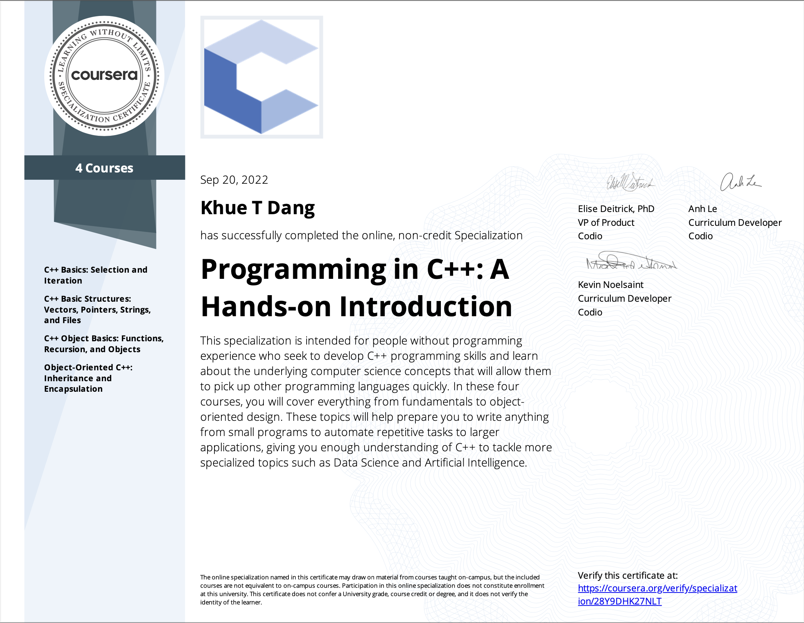

# Programming in C++: A Hands-on Introduction Specialization

- This repo contains all of my assignments from the Coursera Specialization: [Programming in C++: A Hands-on Introduction Specialization](https://www.coursera.org/specializations/hands-on-cpp)

## Table of Content
- Course 1: [C++ Basics: Selection and Iteration](https://github.com/ginny100/Programming-in-C-plus-plus-A-Hands-on-Introduction/tree/master/Course%201%20-%20C%2B%2B%20Basics%20-%20Selection%20and%20Iteration)
  * Week 1: [Basic Skills - Writing your first program!](https://github.com/ginny100/Programming-in-C-plus-plus-A-Hands-on-Introduction/tree/master/Course%201%20-%20C%2B%2B%20Basics%20-%20Selection%20and%20Iteration/Week%201%20-%20Basic%20Skills%20-%20Writing%20your%20first%20program!)
  * Week 2: [Operators](https://github.com/ginny100/Programming-in-C-plus-plus-A-Hands-on-Introduction/tree/master/Course%201%20-%20C%2B%2B%20Basics%20-%20Selection%20and%20Iteration/Week%202%20-%20Operators)
  * Week 3: [Conditionals](https://github.com/ginny100/Programming-in-C-plus-plus-A-Hands-on-Introduction/tree/master/Course%201%20-%20C%2B%2B%20Basics%20-%20Selection%20and%20Iteration/Week%203%20-%20Conditionals)
  * Week 4: [Loops](https://github.com/ginny100/Programming-in-C-plus-plus-A-Hands-on-Introduction/tree/master/Course%201%20-%20C%2B%2B%20Basics%20-%20Selection%20and%20Iteration/Week%204%20-%20Loops)
- Course 2: [C++ Basic Structures: Vectors, Pointers, Strings, and Files](https://github.com/ginny100/Programming-in-C-plus-plus-A-Hands-on-Introduction/tree/master/Course%202%20-%20C%2B%2B%20Basic%20Structures%20-%20Vectors%2C%20Pointers%2C%20Strings%2C%20and%20Files)
  * Week 1: [Vectors](https://github.com/ginny100/Programming-in-C-plus-plus-A-Hands-on-Introduction/tree/master/Course%202%20-%20C%2B%2B%20Basic%20Structures%20-%20Vectors%2C%20Pointers%2C%20Strings%2C%20and%20Files/Week%201%20-%20Vectors)
  * Week 2: [Pointers](https://github.com/ginny100/Programming-in-C-plus-plus-A-Hands-on-Introduction/tree/master/Course%202%20-%20C%2B%2B%20Basic%20Structures%20-%20Vectors%2C%20Pointers%2C%20Strings%2C%20and%20Files/Week%202%20-%20Pointers)
  * Week 3: [Strings](https://github.com/ginny100/Programming-in-C-plus-plus-A-Hands-on-Introduction/tree/master/Course%202%20-%20C%2B%2B%20Basic%20Structures%20-%20Vectors%2C%20Pointers%2C%20Strings%2C%20and%20Files/Week%203%20-%20Strings)
  * Week 4: [Files](https://github.com/ginny100/Programming-in-C-plus-plus-A-Hands-on-Introduction/tree/master/Course%202%20-%20C%2B%2B%20Basic%20Structures%20-%20Vectors%2C%20Pointers%2C%20Strings%2C%20and%20Files/Week%204%20-%20Files)
- Course 3: [C++ Object Basics: Functions, Recursion, and Objects](https://github.com/ginny100/Programming-in-C-plus-plus-A-Hands-on-Introduction/tree/master/Course%203%20-%20C%2B%2B%20Object%20Basics:%20Functions%2C%20Recursion%2C%20and%20Objects)
  * Week 1: [User-Defined Functions](https://github.com/ginny100/Programming-in-C-plus-plus-A-Hands-on-Introduction/tree/master/Course%203%20-%20C%2B%2B%20Object%20Basics:%20Functions%2C%20Recursion%2C%20and%20Objects/Week%201%20-%20User-Defined%20Functions)
  * Week 2: [Recursion](https://github.com/ginny100/Programming-in-C-plus-plus-A-Hands-on-Introduction/tree/master/Course%203%20-%20C%2B%2B%20Object%20Basics:%20Functions%2C%20Recursion%2C%20and%20Objects/Week%202%20-%20Recursion)
  * Week 3: [Introduction to Objects](https://github.com/ginny100/Programming-in-C-plus-plus-A-Hands-on-Introduction/tree/master/Course%203%20-%20C%2B%2B%20Object%20Basics:%20Functions%2C%20Recursion%2C%20and%20Objects/Week%203%20-%20Introduction%20to%20Objects)
  * Week 4: Mutability
- Course 4: [Object-Oriented C++: Inheritance and Encapsulation](https://github.com/ginny100/Programming-in-C-plus-plus-A-Hands-on-Introduction/tree/master/Course%204%20-%20Object-Oriented%20C%2B%2B:%20Inheritance%20and%20Encapsulation)
  * Week 1: [Encapsulation](https://github.com/ginny100/Programming-in-C-plus-plus-A-Hands-on-Introduction/tree/master/Course%204%20-%20Object-Oriented%20C%2B%2B:%20Inheritance%20and%20Encapsulation/Week%201%20-%20Encapsulation%3F)
  * Week 2: [Inheritance](https://github.com/ginny100/Programming-in-C-plus-plus-A-Hands-on-Introduction/tree/master/Course%204%20-%20Object-Oriented%20C%2B%2B:%20Inheritance%20and%20Encapsulation/Week%202%20-%20Inheritance)
  * Week 3: [Polymorphism](https://github.com/ginny100/Programming-in-C-plus-plus-A-Hands-on-Introduction/tree/master/Course%204%20-%20Object-Oriented%20C%2B%2B:%20Inheritance%20and%20Encapsulation/Week%203%20-%20Polymorphism)
  * Week 4: [Advanced Topics](https://github.com/ginny100/Programming-in-C-plus-plus-A-Hands-on-Introduction/tree/master/Course%204%20-%20Object-Oriented%20C%2B%2B:%20Inheritance%20and%20Encapsulation/Week%204%20-%20Advanced%20Topics)

## Proof of Completion

